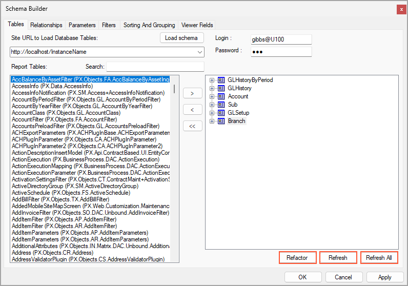
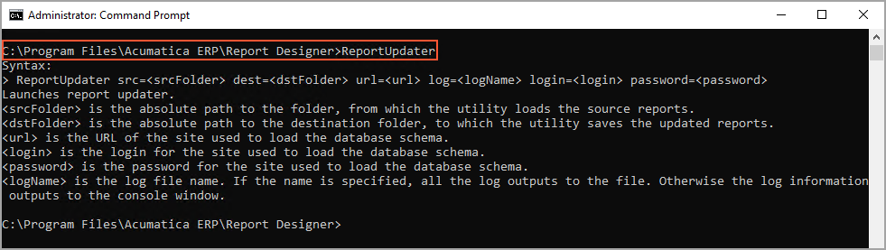
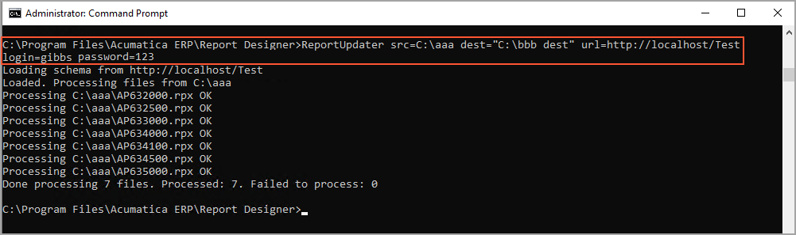

# Report Creation: Update of the Database Schema for Reports {#_bdaf9dfe-c90d-4f6e-afb2-0e1e053ae6fd .concept}

Any report of Acumatica ERP contains a database schema. You load the database schema for a report in the Schema Builder when you create the report in the Acumatica Report Designer. You may need to update the database schema to make new fields and database columns available in the report in the following cases:

-   You have installed a new version of Acumatica ERP.
-   Acumatica ERP has been customized—for example, with the addition of a custom bound field.

You can update the database schema for each report manually, or you can use the ReportUpdater utility to update the database schema for multiple reports at once.

## Update of the Database Schema for One Report { .section}

You use the Schema Builder of the Acumatica Report Designer to update the database schema for a report that is opened. On the **Tables** tab, you click one of the following buttons, which are shown in the screenshot below:

-   **Refactor**: Updates the changed field names for the tables used in the database schema for the report. When you click the button, the Report Designer displays the **Field Refactoring** window with a two-column table. The **Existing Name** column displays the field names that were in use in the previous version of Acumatica ERP. For each field name in the **Existing Name** column, in the **New Name** column, you select the field name from the list of table field names corresponding to the new version of Acumatica ERP.
-   **Refresh**: Updates the table structure you have selected \(by clicking it in the list of tables\) in the database schema for the report.
-   **Refresh All**: Updates the structure of all the tables used in the database schema for the report.



## Update of the Database Schema for Multiple Reports { .section}

You can update the database schema for multiple reports at once by running the ReportUpdater utility, which is located in the same folder that holds the Report Designer. You launch this utility in the command prompt by typing the following.

```
>ReportUpdater src=<srcFolder> dest=<dstFolder> url=<url> 
   log=<logName> login=<login> password=<password>
```

The parameters of the ReportUpdater utility are described in the following table.

|Parameter|Description|
|---------|-----------|
|src|The absolute path to the folder from which the utility loads the source reports.|
|dest|The absolute path to the destination folder to which the utility saves the updated reports.|
|url|The URL of the site used to load the database schema.|
|log|The optional log file name. If you specify a name, the entire log is written to the file. Otherwise, the system displays the log information in the console window.|
|login|The username for the site used to load the database schema.|
|password|The password for the site used to load the database schema.|

When you launch the ReportUpdater, it performs the following actions:

1.  On the specified site, loads the database schema
2.  For each report from the specified source folder, does the following:
    1.  Reads the report
    2.  Refreshes all the tables used in the report, based on the database schema
    3.  Writes the updated report file to the specified destination folder
    4.  Writes the result of the report update to either the system console or the specified log file

When working with the ReportUpdater, use the following tips:

-   If a parameter contains spaces, you must use quotation marks around it.
-   If you need to override existing reports, you use the same path for the source and destination folders.
-   You can get the help information for the ReportUpdater by launching the utility in the command prompt without parameters, as the following screenshot shows.



The following example shows the use of the ReportUpdater utility for the `Test` application, as illustrated in the screenshot below.

```
>ReportUpdater.exe src=C:\aaa dest="C:\bbb dest" url=http://localhost/Test login=gibbs password=123
```



In the example, the command line does not contain the log parameter; therefore, the ReportUpdater utility displays the log information in the command prompt window.

**Parent topic:**[Creating a Report](../UserGuide/RD_Creating_Report_Mapref.md)

