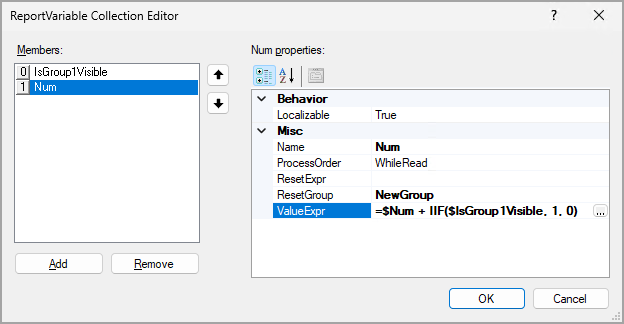
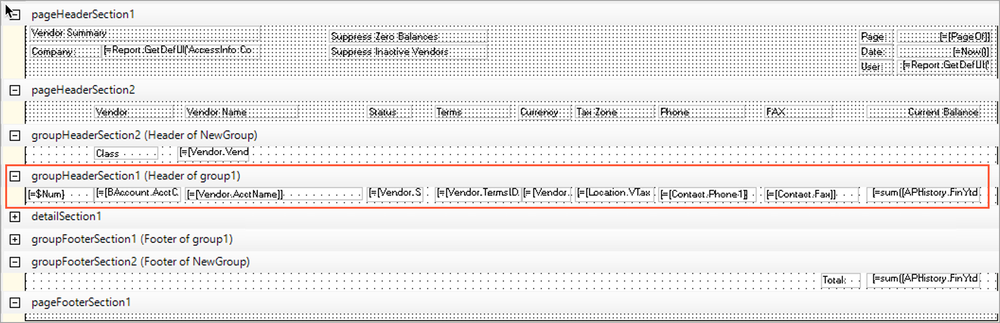

# Variables and Expressions: To Add a Variable and an Expression {#_0fc14f22-748f-47aa-881b-e0ff54c5e6fc .task}

In the following activity, you will learn how to use variables and expressions in a report.

**Attention:** This activity is based on the *U100* dataset. If you are using another dataset or if any system settings have been changed in *U100*, these changes can affect the workflow of the activity and the results of the processing. To avoid issues, restore the *U100* dataset to its initial state.

## Story { .section}

Suppose that you are a technical specialist in your company who is working on simple customizations. A sales manager of your company has requested a report that displays data about vendors, so that vendors are grouped by vendor class. In each class, vendors should be numbered sequentially. You know that a colleague has created such a report, but without numbering. You decide to change the report that your colleague has created.

## Process Overview { .section}

In the Report Designer, you will open the `AP6550C6.RPX` report, which is a modified copy of the [Vendor Summary](AP_65_50_00.md) \(AP6550C6\) report. In the section in which vendors are listed, you will add two variables. The first variable will calculate the visibility of a vendor. The second variable will calculate the sequential number of a vendor in a particular class and will be incremented by one for only the vendors that are visible.

## System Preparation { .section}

Before you perform the steps of this activity, make sure that the following tasks have been performed:

1.  You have installed the Acumatica Report Designer, as described in [Report Designer: To Install the Acumatica Report Designer](../Shared/../UserGuide/RD_Getting_Started_Installing_RD_Activity.md).
2.  You have installed an Acumatica ERP instance with the *U100* dataset, or a system administrator has performed this task for you.
3.  You have signed in to Acumatica ERP as the system administrator by using the *gibbs* username and the *123* password.

    **Tip:** The *gibbs* user is assigned the *Administrator* role and the *Report Designer* role. Thus, this user has sufficient access rights to manage system configuration and to preview, save, and publish reports.

Also, to prepare for use the file that is intended for this activity, do the following:

1.  Download the `AP6550C6.rpx` file.
2.  Open the downloaded file in the Report Designer.
3.  On the Report Designer menu bar, select **File** &gt; **Save To Server**, which opens the **Save Report on Server** dialog box.
4.  In the dialog box, specify the connection string and sign-in credentials of your Acumatica ERP instance, type `AP6550C6` as the report name, and click **OK**.

    The report is saved on the server.

## Step 1: Adding Variables to a Report Section { .section}

To add variables to a section of the *AP6550C6* report, do the following:

1.  In the Report Designer, make sure that the *AP6550C6* report \(which you have saved to the server\) is open.
2.  Select the `groupHeaderSection1 (Header of group1)` section. In the Properties pane, in the **Behavior** &gt; **Variables** property of the **Properties** tab, click the More button.

    The ReportVariable Collection Editor opens, where you can add variables to the report and define their properties.

3.  In the **Members** pane of the ReportVariable Collection Editor, click **Add** to add a new variable.
4.  In the **Misc** &gt; **Name** property on the right pane, type `IsGroup1Visible` to specify the name of the variable. You will use this variable to calculate the visibility of a vendor.
5.  In the **Misc** &gt; **ValueExpr** property, click the More button.

    The Expression Editor opens.

6.  In the bottom pane of the Expression Editor, enter the following expression: `=IIF([@SupressZeroBal]=True AND Sum([APHistory.FinYtdBalance]) = 0, False, True) AND IIF([@SupressInactiveVendors]=True AND [Vendor.Status] = 'I', False, True)`.

    This is a visibility expression of the `groupHeaderSection1 (Header of group1)` section. This expression is true if the summary balance of the vendor is not zero and the status of the vendor is not inactive.

    You can type this expression in the bottom pane of the Expression Editor or you can compose the expression by selecting necessary components from the left, middle, and right panes of the Expression Editor.

7.  Click **OK** to close the Expression Editor.
8.  In the **Members** pane of the ReportVariable Collection Editor, click **Add** to add a new variable.
9.  In the **Misc** &gt; **Name** property on the right pane, type `Num`, which is the name of the second variable.
10. In the **Misc** &gt; **ProcessOrder** property, leave the default option—that is, *WhileRead*. This option directs the system to process the values of variables while reading these variables.
11. In the **Misc** &gt; **ResetGroup** property, select *NewGroup* to reset the value of the `Num` variable.

    This means that in the `NewGroup` group, the variable should be calculated locally. If you have selected this property, for each instance of the specified group, the variable has an independent value. At the end of each group, the variable is reset.

12. In the **Misc** &gt; **ValueExpr** property, type `=$Num + IIF($IsGroup1Visible, 1, 0)`.

    This means that the value of the `Num` variable will be incremented by 1 only if the `IsGroup1Visible` variable is true.

    As with the `IsGroup1Visible` variable, you can compose the expression in the Expression Editor. Notice that you have specified `IsGroup1Visible` first and `Num` second because the `Num` value is calculated by using the `IsGroup1Visible` value.

    The following screenshot shows the variables added to `groupHeaderSection1``(Header of group1)`.

    

13. Click **OK** to save your changes and close the ReportVariable Collection Editor.
14. On the Report Designer window toolbar, click **Save**.

## Step 2: Adding a Text Box to Display Numbers { .section}

To add a text box to display the numbers for the vendors, while you are still working with the *AP6550C6* report in the Report Designer, do the following:

1.  From the Tools pane, drag the *TextBox* element to the left side of the `groupHeaderSection1 (Header of group1)` section, and enter the `=$Num` value for the added text box.
2.  Optional: To set a uniform style for text boxes in the section, while the text box is selected, in the **Appearance** &gt; **StyleName** property on the **Properties** tab, type `Normal`.
3.  On the Report Designer window toolbar, click **Save** to save the report on the server.

The report in design mode is shown in the following screenshot.

## Step 3: Viewing the Report { .section}

To view the report, do the following:

1.  In Acumatica ERP, open the S150 Vendor Summary \(AP6550C6\) report form by searching for its identifier.

    **Tip:** This report, which you have modified in this activity, has been published in the *U100* dataset. That is, it has been added to the [Site Map](SM_20_05_20.md) \(SM200520\) form, and you can access it in Acumatica ERP.

2.  On the report form toolbar, click **Run Report**.

The resulting report is shown in the following screenshot.

 report with vendors numbered in each vendor class")

**Parent topic:**[Using Variables and Expressions](../UserGuide/RD_Using_Variables_and_Expressions_Mapref.md)

