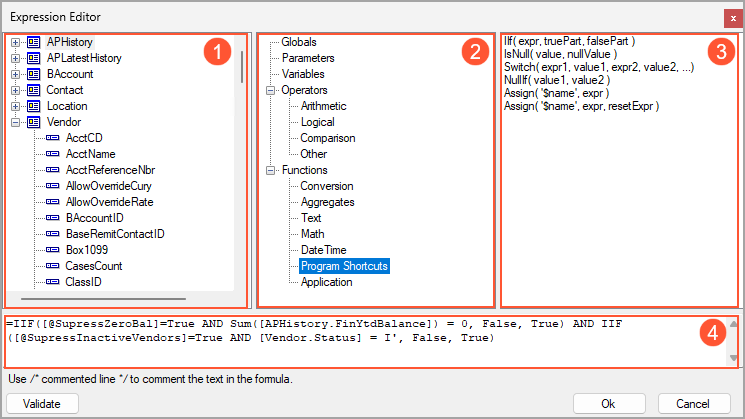

# Variables and Expressions: Expression Editor {#_e0616a90-ae22-4a6f-8faa-3ebc85dbbf80 .concept}

You use the Expression Editor—that is, the **Expression Editor** dialog box—to define expressions in reports and generic inquiries.

## Expression Editor { .section}

In the Report Designer, you can open the Expression Editor in any of the following places:

-   On the **Relationships** tab of the Schema Builder, by clicking the **Parent Formula** or **Child Formula** button
-   On the **Parameters** tab of the Schema Builder, by clicking the More button to the right of any of the following boxes: **Input mask**, **View name**, and **Default Value**
-   On the **Filters** tab of the Schema Builder, by clicking the **Data Field Formula** button
-   On the **Sorting and Grouping** tab of the Schema Builder, by clicking the **Grouping Field Formula** button
-   In the **Appearance** &gt; **Value** property of any *TextBox* element

The **Expression Editor** dialog box consists of the following four panes:

-   The left pane of the dialog box \(see Item 1 in the screenshot below\) displays a list of data access classes and their fields defined for the report.
-   The middle pane of the dialog box \(Item 2\) lists groups of parameters, operators, functions, and variables.
-   The right pane of the dialog box \(Item 3\) contains the parameters, operators, functions, or variables in the group you have selected in the middle pane.
-   The bottom pane of the dialog box \(Item 4\) is used to compose and edit the expression. You can double-click data fields listed in the left pane and items listed in the right pane to add them to the bottom pane.

You perform the following steps \(repeating the steps as needed\) to enter an expression in the Expression Editor:

1.  In the middle pane, you selectively expand the hierarchical structure of existing entities, and select a group of parameters, variables, operators, or functions to display the list of available items in the right pane.
2.  In the right pane, you click the item you want to insert in the bottom pane.
3.  In the expression, you click in the place where you want to insert the selected item.
4.  You double-click the item that you previously selected in the right pane.
5.  In the left pane, you expand the hierarchical structure of classes defined for the report, and select a data field to insert it in the bottom pane.
6.  In the expression, you click in the place where you want to insert the selected data field.
7.  You double-click the item that you previously selected in the left pane.

    You can add as many items and fields to the bottom pane as you need.

8.  You validate the expression.
9.  You save the expression.

**Parent topic:**[Using Variables and Expressions](../UserGuide/RD_Using_Variables_and_Expressions_Mapref.md)

