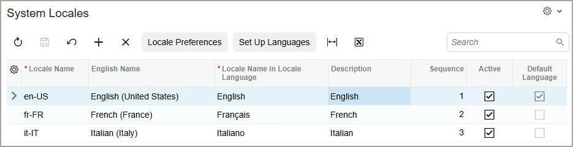

# Variables and Expressions: Data Formats of Values {#_cfce7e40-08bc-4edf-b664-cbf0404b8113 .concept}

You can specify a custom format for the numeric and date values of text boxes on the report layout. The format determines how the values in a text box should be displayed in a report.

To format the value of a text box, you enter one of the following types of format specifiers in the **Format** property of the text box:

-   Format specifiers of any data fields used in a report
-   Standard numeric format specifiers
-   Custom numeric format specifiers
-   Standard date format specifiers
-   Custom date format specifiers

## Application of Standard Format Specifiers { .section}

When a user runs the resulting report, the system applies the standard format specifiers by using the language this user selected when signing in to Acumatica ERP, as shown in the following screenshot. If your instance of Acumatica ERP does not allow the user to select a language, the specifiers are applied by using the default language of the installed application, which is English \(United States\).

The list of the languages available at sign-in is specified on the [System Locales](SM_20_05_50.md) \(SM200550\) form, as shown in the following screenshot.

## Formatting of Values According to the Format of a Data Field {#section_kwj_2tq_jt .section}

You can use any data field as a format specifier for a text box. To do this, you select the **Format** property of this text box, and click the More button to open the Expression Editor. In the dialog box, you select the data field to use as a format specifier, and add `.Format` to the end of the data field name inside brackets, as shown in the following example: `=[ARTran.TranAmt.Format]`.

## Formatting of Numeric Values {#section_fcp_2tq_jt .section}

The following table lists the standard numeric format specifiers, along with a description of each specifier and examples that show the output produced by a particular format specifier.

To use the standard numeric format specifiers, you type a format specifier, such as `N`, into the **Format** property of a text box.

|Format specifier|Description|Examples|
|----------------|-----------|--------|
|`D` or `d`|Result: Integer digits with an optional negative sign

 Supported by: Integral types only

 Precision specifier: The minimum number of digits

|1234 \(`D`\) –&gt;1234

 -1234 \(`D6`\) -&gt; -001234

|
|`F` or `f`|Result: Integral and decimal digits with an optional negative sign

 Supported by: All numeric types

 Precision specifier: The needed number of decimal digits

 Default precision specifier: 2

|1234.567 \(`F`, en-US\) -&gt; 1234.57

 1234.567 \(`F`, fr-FR\) -&gt; 1234,57

 -1234 \(`F1`, en-US\) -&gt; -1234.0

 -1234.56 \(`F4`, fr-FR\) -&gt; -1234,5600

|
|`N` or `n`|Result: Integral and decimal digits, group separators, and a decimal separator with an optional negative sign

 Supported by: All numeric types

 Precision specifier: The needed number of decimal places

 Default precision specifier: 2

|1234.567 \(`N`, en-US\) -&gt; 1,234.57

 1234.567 \(`N`, ru-RU\) -&gt; 1 234,57

 1234 \(`N1`, en-US\) -&gt; 1,234.0

 -1234.56 \(`N3`, en-US\) -&gt; -1,234.560

|
|`P` or `P`|Result: A number multiplied by 100 and immediately followed by a percent symbol

 Supported by: All numeric types

 Precision specifier: The needed number of decimal places

 Default precision specifier: 2

|1 \(`P`, en-US\) -&gt; 100.00 %

 1 \(`P`, fr-FR\) -&gt; 100,00 %

 -0.39678 \(`P1`, en-US\) -&gt; -39.7 %

 -0.39678 \(`P3`, fr-FR\) -&gt; -39,678 %

|

The following table lists the custom numeric format specifiers, along with a description of each specifier and examples that show the output produced by a particular format specifier.

You can combine custom numeric format specifiers, as shown in the following example: `#,#.00`.

|Format specifier|Description|Examples|
|----------------|-----------|--------|
|`0`|Replaces the `0` symbol with the corresponding digit if one is present; otherwise, `0` appears in the resulting string.|1234.5678 \(`00000`\) -&gt; 01235

 0.45678 \(`0.00`, en-US\) -&gt; 0.46

 0.45678 \(`0.00`, fr-FR\) -&gt; 0,46

|
|`#`|Replaces the `#` symbol with the corresponding digit if one is present; otherwise, no digit appears in the resulting string.|1234.5678 \(`#####`\) -&gt; 1235

 0.45678 \(`#.##`, en-US\) -&gt; .46

 0.45678 \(`#.##`, fr-FR\) -&gt; ,46

|
|`.`|Determines the location of the decimal separator in the resulting string.|0.45678 \(`0.00`, en-US\) -&gt; 0.46

 .45 \(`0.0000`, fr-FR\) -&gt; 0,4500

|
|`,`|Inserts a localized group separator character between each group.|1234567 \(`#,##`, en-US\) -&gt; 1,234,567

 1234567 \(`#,##`, fr-FR\) -&gt; 1.234.567

|

For more information on formatting numeric values, see [Microsoft documentation about custom numeric format strings](https://docs.microsoft.com/en-us/dotnet/standard/base-types/custom-numeric-format-strings) in .NET Framework.

## Formatting of Date Values {#section_x5j_ftq_jt .section}

The following table lists the standard date format specifiers, along with a description of each specifier and an example that shows the output produced by a particular format specifier.

To use the standard date format specifiers, you type the format specifier into the **Format** property of a text box, such as `d`.

|Format specifier|Description|Example \(en-US\)|
|----------------|-----------|-----------------|
|`d`|Short date pattern|2009-06-15T13:45:30 -&gt; 6/15/2009|
|`D`|Long date pattern|2009-06-15T13:45:30 -&gt; Monday, June 15, 2009|
|`f`|Full date/time pattern \(short time\)|2009-06-15T13:45:30 -&gt; Monday, June 15, 2009 1:45 PM|
|`F`|Full date/time pattern \(long time\)|2009-06-15T13:45:30 -&gt; Monday, June 15, 2009 1:45:30 PM|
|`g`|General date/time pattern \(short time\)|2009-06-15T13:45:30 -&gt; 6/15/2009 1:45 PM|
|`G`|General date/time pattern \(long time\)|2009-06-15T13:45:30 -&gt; 6/15/2009 1:45:30 PM|
|`M` or `m`|Month/day pattern|2009-06-15T13:45:30 -&gt; June 15|
|`t`|Short time pattern|2009-06-15T13:45:30 -&gt; 1:45 PM|
|`T`|Long time pattern|2009-06-15T13:45:30 -&gt; 1:45:30 PM|
|`Y` or `y`|Year/month pattern|2009-06-15T13:45:30 -&gt; June 2009|

The following table lists the custom date format specifiers, along with a description of each specifier and examples that show the output produced by a particular format specifier.

You can combine custom numeric format specifiers, as shown in the following example: `dddd/MMMM/yyyy hhtt:mm`.

|Format specifier|Description|Examples \(en-US\)|
|----------------|-----------|------------------|
|`d`|The day of the month, from 1 through 31|2009-06-01T13:45:30 -&gt; 1

 2009-06-15T13:45:30 -&gt; 15

|
|`dd`|The day of the month, from 01 through 31|2009-06-01T13:45:30 -&gt; 01

 2009-06-15T13:45:30 -&gt; 15

|
|`ddd`|The abbreviated name of the day of the week|2009-06-15T13:45:30 -&gt; Mon|
|`dddd`|The full name of the day of the week|2009-06-15T13:45:30 -&gt; Monday|
|`h`|The hour \(from 1 to 12\), using a 12-hour clock|2009-06-15T01:45:30 -&gt; 1

 2009-06-15T13:45:30 -&gt; 1

|
|`hh`|The hour \(from 01 to 12\), using a 12-hour clock|2009-06-15T01:45:30 -&gt; 01

 2009-06-15T13:45:30 -&gt; 01

|
|`H`|The hour \(from 0 to 23\), using a 24-hour clock|2009-06-15T01:45:30 -&gt; 1

 2009-06-15T13:45:30 -&gt; 13

|
|`HH`|The hour \(from 00 to 23\), using a 24-hour clock|2009-06-15T01:45:30 -&gt; 01

 2009-06-15T13:45:30 -&gt; 13

|
|`m`|The minute \(from 0 through 59\)|2009-06-15T01:09:30 -&gt; 9

 2009-06-15T13:29:30 -&gt; 29

|
|`mm`|The minute \(from 00 through 59\)|2009-06-15T01:09:30 -&gt; 09

 2009-06-15T01:45:30 -&gt; 45

|
|`M`|The month \(from 1 through 12\)|2009-06-15T13:45:30 -&gt; 6|
|`MM`|The month \(from 01 through 12\)|2009-06-15T13:45:30 -&gt; 06|
|`MMM`|The abbreviated name of the month|2009-06-15T13:45:30 -&gt; Jun|
|`MMMM`|The full name of the month|2009-06-15T13:45:30 -&gt; June|
|`s`|The second \(from 0 through 59\)|2009-06-15T13:45:09 -&gt; 9|
|`ss`|The second \(from 00 through 59\)|2009-06-15T13:45:09 -&gt; 09|
|`t`|The first character of the AM/PM designator|2009-06-15T13:45:30 -&gt; P|
|`tt`|The AM/PM designator|2009-06-15T13:45:30 -&gt; PM|
|`yy`|The year \(from 00 to 99\)|1900-01-01T00:00:00 -&gt; 00

 2019-06-15T13:45:30 -&gt; 19

|
|`yyyy`|The year as a four-digit number|1900-01-01T00:00:00 -&gt; 1900

 2009-06-15T13:45:30 -&gt; 2009

|
|`/`|The date separator|2009-06-15T13:45:30 \(`yyyy/mm/dd`\) -&gt; 2009/06/15|
|`:`|The time separator|2009-06-15T13:45:30 \(`hh:mm:ss`\) -&gt; 13:45:30|

For more information on formatting date values, see [Microsoft documentation about custom date and time format strings](https://docs.microsoft.com/en-us/dotnet/standard/base-types/custom-date-and-time-format-strings) in the .NET Framework.

**Parent topic:**[Using Variables and Expressions](../UserGuide/RD_Using_Variables_and_Expressions_Mapref.md)

