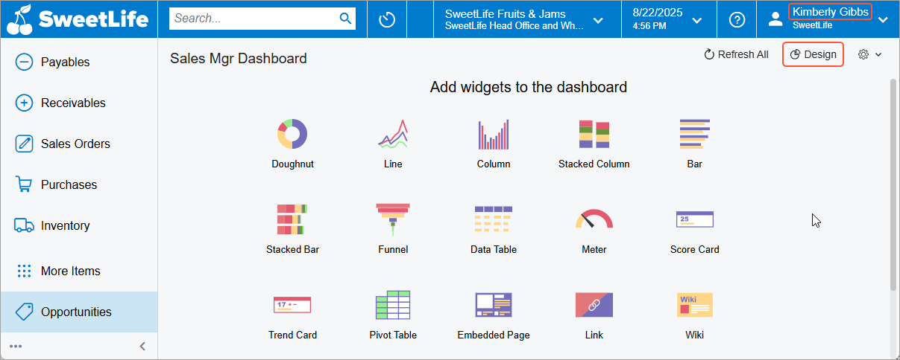

# Dashboards: To Add a Dashboard {#_db5ed0df-1709-4b0b-b36c-d36591ff75e4 .task}

The following activity will show you how to create a dashboard and share it with other users.

**Attention:** This activity is based on the *U100* dataset. If you are using another dataset or if any system settings have been changed in *U100*, these changes can affect the workflow of the activity and the results of the processing. To avoid issues, restore the *U100* dataset to its initial state.

## Story { .section}

Suppose that you are Kimberly Gibbs, a technical specialist in your company who is working on simple customizations. A sales manager of your company has requested a dashboard named *Sales Mgr Dashboard*. Every sales manager would like to have the capability to create a personal copy of the dashboard and populate it with widgets on their own. The dashboard should be visible to sales managers only and made available through a link in the **Opportunities** workspace under the **Dashboards** category.

## Process Overview { .section}

In this activity, you will do the following:

1.  Create a record for the dashboard on the [Dashboards](SM_20_86_10.md) \(SM208610\) form and specify the requested settings. You will specify your role \(*Administrator*\) as the owner role of this dashboard so that you can design the dashboard later if this is requested.
2.  Review how the access rights assigned to the dashboard are working. You will try to view the created dashboard as a technical specialist \(with the *Administrator* role\) and then as a sales manager \(with the *Sales Manager* role\).
3.  Change access rights to the dashboard so that users with the *Administrator* role can open the dashboard in order to begin adding widgets to it.

## System Preparation {#section_xwj_fpr_jrb .section}

Launch the Acumatica ERP website, and sign in to a tenant with the *U100* dataset preloaded as system administrator Kimberly Gibbs. You should sign in by using the *gibbs* username and the *123* password.

**Tip:** The *gibbs* user is assigned the *Administrator* role, which has sufficient access rights to manage the system configuration and to modify generic inquiries, advanced filters, pivot tables, and dashboards.

## Step 1: Creating a Dashboard { .section}

To create the dashboard that the sales managers need, do the following:

1.  Open the [Dashboards](SM_20_86_10.md) \(SM208610\) form.
2.  On the form toolbar, click **Add New Record**.
3.  In the Summary area, in the **Name** box, type the name for the dashboard: `SalesMgrDashboard`.
4.  In the **Owner Role** box, select *Administrator*.
5.  Select the **Allow Users to Personalize** check box.
6.  On the form toolbar, click **Save**.
7.  On the form toolbar, click **Publish to the UI**. In the dialog box that opens, do the following:
    1.  In the **Site Map Title** box, change the system-specified value, which was copied from the **Name** box, to `Sales Mgr Dashboard`.
    2.  In the **Workspace** box, select *Opportunities*.
    3.  In the **Category** box, leave the default value, *Dashboards*.
    4.  In the **Screen ID**, leave the automatically assigned identifier.
    5.  In the **Access Rights** section, select the **Set to Revoked for All Roles** option button.
    6.  Click **Publish** to publish the dashboard and close the dialog box.
8.  On the **Visible To** tab, do the following:
    1.  Locate the row with *Sales Manager* in the **Role** column.

        **Tip:** You can use the search box in the left corner of the table footer.

    2.  In the **Access Rights** column of this row, select *Granted* to assign this level of access rights to the role.
9.  On the form toolbar, click **Save**.

You have created an empty dashboard, which will later be designed and populated with widgets. Because a workspace and category have been specified, a user with the *Sales Manager* role can access the dashboard through the workspace.

## Step 2: Accessing the Dashboard { .section}

To review how the access rights you have specified for the dashboard are working, do the following:

1.  While you are still signed in as *gibbs* \(to which the *Administrator* role is assigned\), navigate to the **Opportunities** workspace.

    **Tip:** If the **Opportunities** menu item is not on the main menu, click the **More Items** menu item and then click the **Opportunities** tile.

2.  On the workspace footer, click the **Show All** button to expand the workspace menu, and look for the *Sales Mgr Dashboard* link under the **Dashboards** category.

    The system does not display a link to the dashboard you have created because you have limited the access to the dashboard to only those who have the *Sales Manager* role. The *Administrator* role does not have access to the dashboard.

    **Tip:** In Step 1, you specified the *Administrator* role as the **Owner Role** of the dashboard, indicating that a user with this role assigned can design the dashboard and edit its settings. This setting does not control, however, whether the *Administrator* role can access the dashboard. The rights of all roles to the dashboard are specified on the **Visible To** tab of the [Dashboards](SM_20_86_10.md) \(SM208610\) form.

3.  Sign out, and then sign in by using the *chubb* username and the *123* password. These are the credentials of David Chubb, whose user account has the *Sales Manager* role.
4.  Navigate to the **Opportunities** workspace, and click the *Sales Mgr Dashboard* link.

    The system opens the dashboard, indicating that users with the *Sales Manager* role can access the dashboard. On the dashboard title toolbar, notice that the **Create User Copy** button is available \(as shown in the following screenshot\). This illustrates that users with the *Sales Manager* role can create a personal copy of the dashboard.

## Step 3: Changing the Assess Rights to the Dashboard { .section}

Now you need to change the access rights of the dashboard so that users with the *Administrator* role can open the dashboard in order to begin adding widgets. To change the access rights to the dashboard, do the following:

1.  Sign out, and sign in by using the *gibbs* username and the *123* password. These are the credentials of the technical specialist with the *Administrator* role \(which you used earlier\).
2.  Open the [Dashboards](SM_20_86_10.md) \(SM208610\) form.
3.  In the Summary area, in the **Name** box, select *SalesMgrDashboard*.
4.  On the **Visible To** tab, do the following:
    1.  Locate the row with *Administrator* selected in the **Role** column.
    2.  In the **Access Rights** column of this row, select *Granted* to assign this level of access rights to the role.
5.  On the form toolbar, click **Save**.
6.  Open the **Opportunities** workspace, and click the *Sales Mgr Dashboard* link.

    **Tip:** If the dashboard link is not displayed in the workspace right away, refresh your browser window.

    The system opens the dashboard, indicating that you have the needed access rights to view the dashboard. On the dashboard title toolbar, notice that the **Design** button is displayed \(as shown in the following screenshot\). This means that as an owner of the dashboard, you can populate it with widgets.

**Parent topic:**[Administering Dashboards](../UserGuide/RPT_Administering_Dashboards_Mapref.md)

