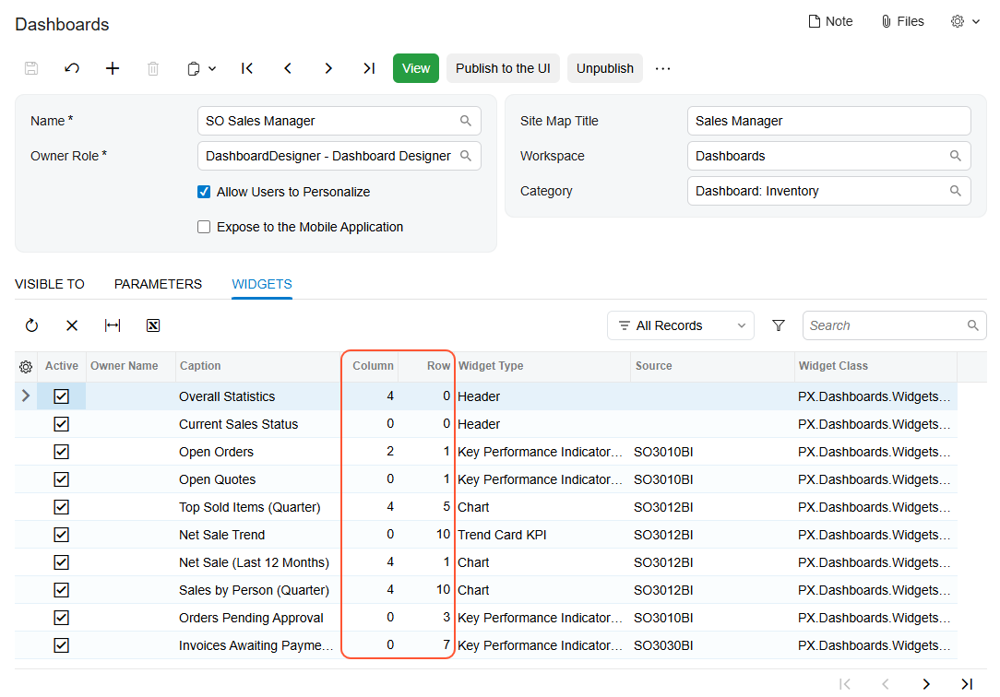

# Dashboards: Widget Location Within a Working Area {#_5801a2d4-dfe0-455d-a19a-fa6152c1fb49 .concept}

You can use widget coordinates to locate a widget on a dashboard.

## Widget Coordinates { .section}

In the Modern UI, dashboards have a flexible layout. The number and position of widget placeholders vary depending on device screen size, resolution, and orientation.

Widgets are organized in rows and columns \(or both\) within a working area. A widget's coordinates represent its location: the number of its row and the number of its column. For example, the widget in the top left corner has a location of 0, 0: the 0 row and the 0 column.

Widget coordinates are shown in the **Row** and **Column** table columns on the **Widgets** tab of the [Dashboards](SM_20_86_10.md) \(SM208610\) form for a dashboard \(see the following screenshot\).

## Finding of Deactivated Widgets { .section}

A widget that has the **Active** check box cleared on the **Widgets** tab of the [Dashboards](SM_20_86_10.md) \(SM208610\) form is not shown on the dashboard in either view mode or design mode. A user with the dashboard owner role or a user that has created a personalized copy of the dashboard can drag another widget into the location of the inactive widget. If you then select the **Active** check box for this inactive widget, it may remain hidden on the dashboard. You can quickly locate the hidden widget by using its coordinates in the **Row** and **Column** table columns on the **Widgets** tab.

If you do not use a widget anymore, you can remove it from the selected dashboard. To do this, click the row with this widget, and then click **Delete Row** on the table toolbar.

**Parent topic:**[Administering Dashboards](../UserGuide/RPT_Administering_Dashboards_Mapref.md)

