# Specific Widgets: Chart Widgets {#_71bfceba-e7d7-4471-bb7c-7ffbd9e4b69d .concept}

You can use various types of charts, which are graphical representations of data, as widgets on dashboards. If a chart is well designed, it can convey ideas, such as trends or comparisons, that might not be apparent if the data were shown in a table or presented as text.

You can easily change the type of a particular chart without changing its properties, such as chart axis values or sort order, as long as the properties are applicable to both chart types. For example, you can create a line chart widget and later convert this widget to another chart type with a couple clicks.

## Applicable Scenarios { .section}

You may need to work with chart widgets when you want to show any of the following:

-   Comparison of multiple items \(comparative ranking\)
-   Comparison of items over time \(trends, accelerations or decelerations, and volatility\)
-   Proportional composition \(part-to-whole relationship\) of a particular variable over a static time frame
-   Changes in composition over time

## Data Source for Chart Widgets { .section}

The source of the information shown in a chart widget is data collected by a generic inquiry from the system database. You can use a predefined generic inquiry or develop one that suits your needs.

Each column of a generic inquiry is a data field configured in the inquiry settings. Data field can be a data field from an existing database table or a custom data field whose value is calculated by the system based on the formula specified for this field in the inquiry.

By using data fields from the generic inquiry specified as a source for a widget, you define the metrics to track with the widget.

## Chart Widget Configuration { .section}

To add a chart widget, you select the desired chart type \(**Doughnut**, **Line**, **Column**, **Stacked Column**, **Bar**, **Stacked Bar**, or **Funnel**\) in the **Add Widget** dialog box, which opens when you click **New Widget** in a widget placeholder. Alternatively, you can change the chart visualization type in the **Chart Type** box of the **Widget Properties** dialog box.

In the **Widget Properties** dialog box, you specify the inquiry to provide data for the widget in the **Inquiry Screen** box \(see Item 1 in the screenshot below\), as well as any other needed settings.

In the **Categories** section of the dialog box, you specify the data field to be the source of the categories into which the data from each series is sorted \(Item 2\). In most charts, the *x* axis displays category names.

Optionally, in the **Series** section, you specify the data field to be the source of the series \(Item 3\), which is a set of related data. A chart can have no series or one series. Each chart type displays series differently. The values of the data field specified as the source of the series compose the chart legend.

Finally, in the **Values** section of the dialog box, you specify the data field to be the source of the business metric calculation and the operation to perform with the value provided by the field \(Item 4\). The following operations are available for metric calculation:

-   *Average*: Calculates the average value in the column.
-   *Count All* \(default\): Determines the number of items in the column.
-   *Count Distinct*: Determines the number of unique items in the column.
-   *Max*: Determines the item with the highest value in the column. For text data, the highest value is the last alphabetic value. This function ignores null values.
-   *Min*: Determines the item with the lowest value in the column. For text data, the lowest value is the first alphabetic value. This function ignores null values.
-   *Sum*: Calculates the sum of the items in the column.
-   *Median*: Finds the middle value among all the values in the column.

The following screenshot shows an example of the configuration settings of the column chart type.

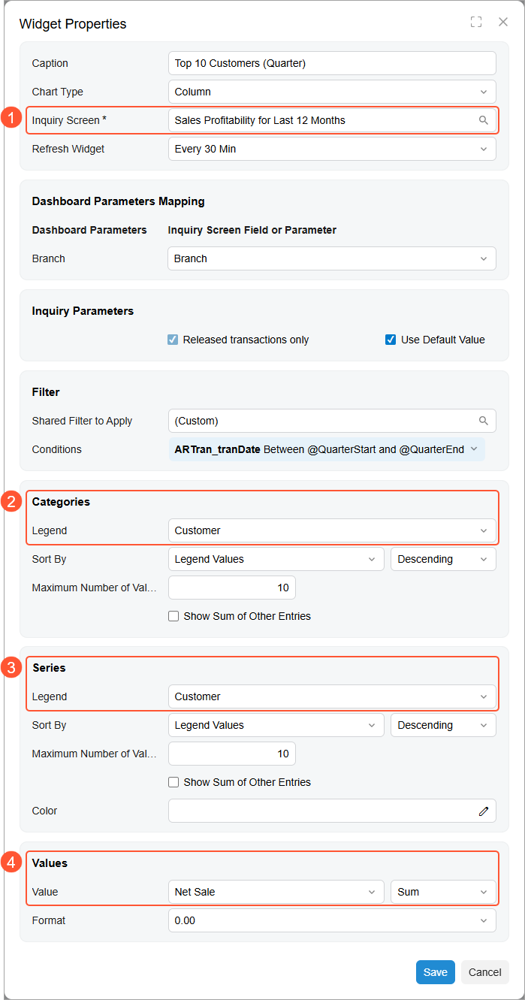

The following screenshot shows the resulting chart on a dashboard.

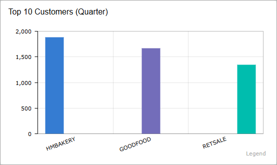

## Legend Position { .section}

If you use a doughnut or funnel chart type or your chart has at least one series defined, the **Legend Position** box appears in the **Widget Properties** dialog box. The value in this box defines the location of the legend in the widget. The following options are available:

-   *None*: The legend is not displayed in the widget.
-   *Left*: The legend is located to the left of the chart.
-   *Right*: The legend is located to the right of the chart.
-   *Top*: The legend is located above the chart.
-   *Bottom*: The legend is located below the chart.
-   *Popup*: The user can open the legend as a pop-up box by clicking the icon in the bottom left corner of the widget. This is the default value.

## Sorting Order of Categories and Series { .section}

In the **Widget Properties** dialog box for a widget, to define the data source for the categories and series of a chart, you specify a data field from the source inquiry in the **Legend** box of the **Categories** and **Series** sections, respectively.

You can define the value by which the values of the data field specified in the **Legend** box are sorted and the sort order. The **Sort By** box defines the sequence to be sorted as follows:

-   *Legend*: The legend data is sorted by the values returned by the data field you select in the **Legend** box.
-   *Legend Values*: The legend data is sorted by the value you select in the **Value** box.
-   *Field*: The legend data is sorted by a data field you select in the **Field to Sort By** box, which appears when you select this option.
-   *Field Value*: The legend data is sorted by the value of the field you select in the **Field to Sort By** box, which appears when you select this option.
-   *Date \(Ascending\)*: The legend data is sorted in the ascending order. The option is available if a data field that represents a date is selected in the **Legend** box.

The box next to **Sort By** defines the sort order—ascending or descending. The way the values are sorted depends on the chart type as well as this selection. The box is not available if the *Date \(Ascending\)* option is selected.

## Limitation of Displayed Values of Categories and Series { .section}

In some cases, you would like to limit the number of values displayed in a widget to get a clearer picture. The elements that control this setting are available in the **Categories** and **Series** sections.

In the **Maximum Number of Values Shown** box, you specify the number of values to be individually shown on the chart. The system always selects the values starting from the largest ones. The default value is *10*; that is, the system will display values for only the 10 largest categories. The maximum allowed value is *150*. If you want the system to individually display all values, set the value of this box to *0*.

You can make the system add up the values that are not among the largest values \(those to be displayed based on the **Maximum Number of Values Shown** setting\) and show the sum on the chart as a single element. To do this, you select the **Show Sum of Other Entries** check box.

## Aligning Adjacent Charts {#section_p5r_nyd_h3c .section}

When two or more chart widgets are displayed, the *x* \(horizontal\) axes of adjacent charts may appear on different levels, as shown below.

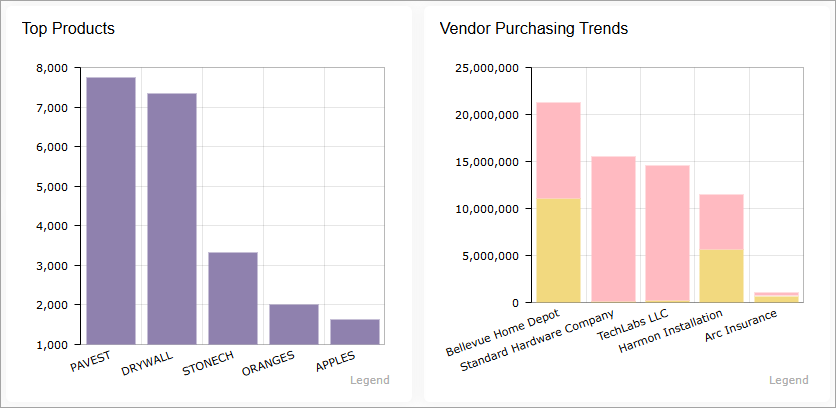

To align the *x* axes of the charts, you can use the **Minimum Label Height** box in the **Categories** section. It defines the minimum height reserved for category labels, expressed as a percentage of the widget height. You specify the same value for each of the adjacent charts to display the *x* axes on the same level , as shown below \(where *20%* was specified for both charts\).

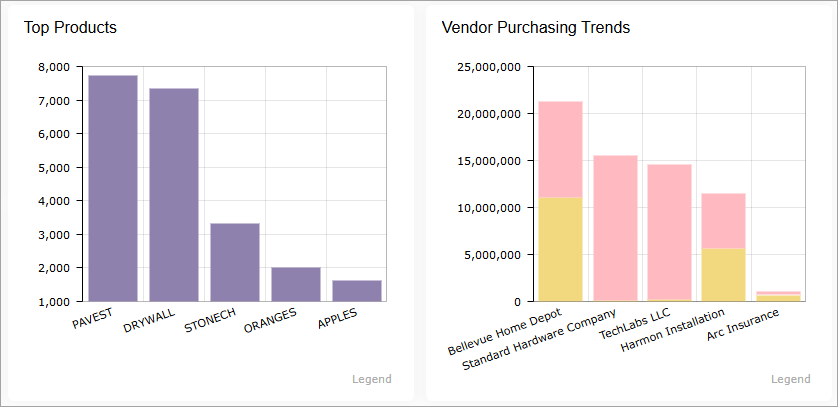

The default value is *0*, meaning that the system allocates the least possible height to category labels and maximizes the plot area.

## Color Configuration for Chart Widgets { .section}

If you configure different charts based on the same inquiry or on inquires that have matching data fields, you should use the same color for matching items across all charts of a dashboard. Doing so will minimize the mental effort required from a users’ perspective, making dashboards more comprehensible.

You can specify custom colors for series in chart widgets. Series can be displayed on the following types of chart widgets: line, column, stacked column, bar, and stacked bar. You may need to change the default colors of series, for example, to make the dashboard correspond to your corporate style.

To specify the colors depending on the series values, you should use expressions in the **Color** box of the **Widget Properties** dialog box. For example, to make a chart element red if the series value is *USD* and blue if the series value is *EUR*, you would specify the following expression: `=Switch(Value = 'USD', '#FF0000', Value = 'EUR', '#0A26FF')`. For details on expressions, see [Variables and Expressions: General Information](RD_Using_Variables_and_Expressions_GeneralInfo.md).

## Line Chart { .section}

A line chart is a type of chart that displays information as a series of data points connected by straight line segments. The purpose of a line chart is to show trends, accelerations \(or decelerations\), and volatility. Line charts display how data changes over a period of time.

The following line chart shows account receivables values by financial period. The *x* axis entity is the quarter, and the *y* axis entity is the sum of period-to-date balance. Each line on the chart corresponds to a customer.

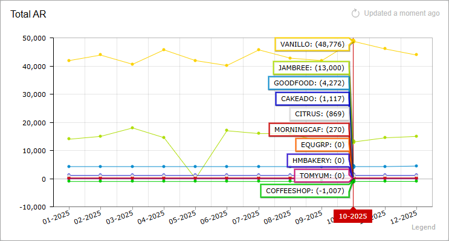

## Column Chart { .section}

A column chart is a chart with bars whose lengths are proportional to the values they represent. Column charts are used for plotting data that has discrete values. They are the standard chart for showing chronological data, such as growth over specific periods, and for comparing data across categories.

The following chart represents sales values calculated by financial period. The*x* axis entity is the month, and the *y* axis entity is the sales amount.

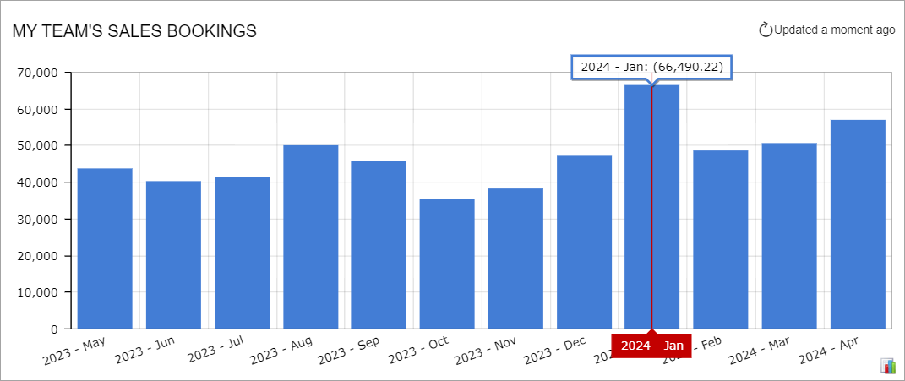

You should generally use column charts instead of doughnut charts when you want to show how parts compare to one another, because it is easier for the viewer to estimate the relative column height than to assess the size of doughnut chart sectors.

The column chart in the following screenshot shows sales amounts for salespeople divided by financial period. The sales amount for each salesperson is displayed as a separate column within each financial period.

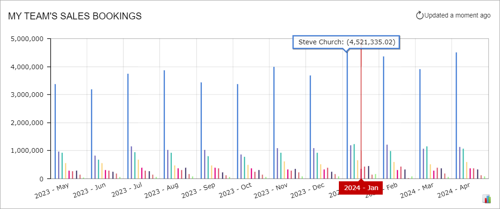

## Bar Chart { .section}

A bar chart is a chart with rectangular bars that are plotted horizontally and have lengths proportional to the values that they represent. Bar charts are used for clearly showing data that has discrete values. Horizontal bar charts are perfect for comparative ranking, as with a top-five list. They are also useful if your data labels are lengthy.

The following bar chart displays sales values calculated for a financial period. The *x* axis entity is the total amount of period-to-date sales, and the *y* axis entity is the financial period.

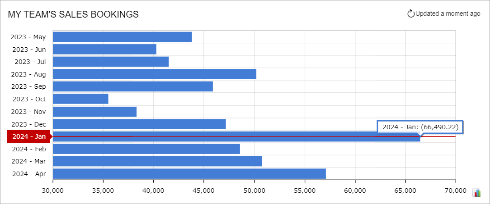

Another example of a bar chart, which you can see below, represents sales amounts, divided by salesperson, for each financial period. The sales amount for each salesperson is displayed as a separate bar within a financial period.

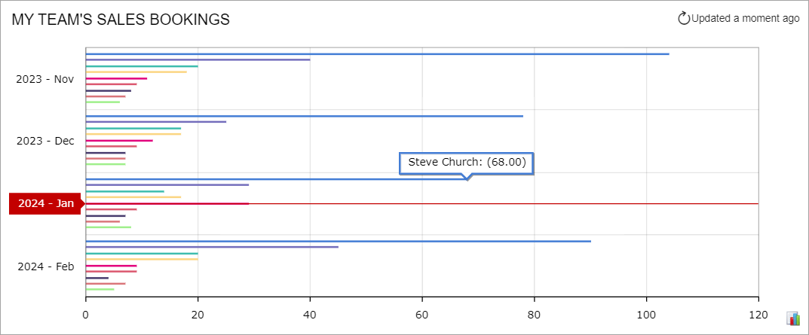

## Stacked Column Chart { .section}

A stacked column chart illustrates the relationship of the parts to the whole. The columns in a stacked column chart are divided into legend categories, and each column represents a total.

The following chart shows the contribution of individual salespeople to the monthly sales totals over time. The *x* axis defines the financial periods within the specified time range, and the *y* axis defines the measurable entity—period-to-date sales totals in the base currency.

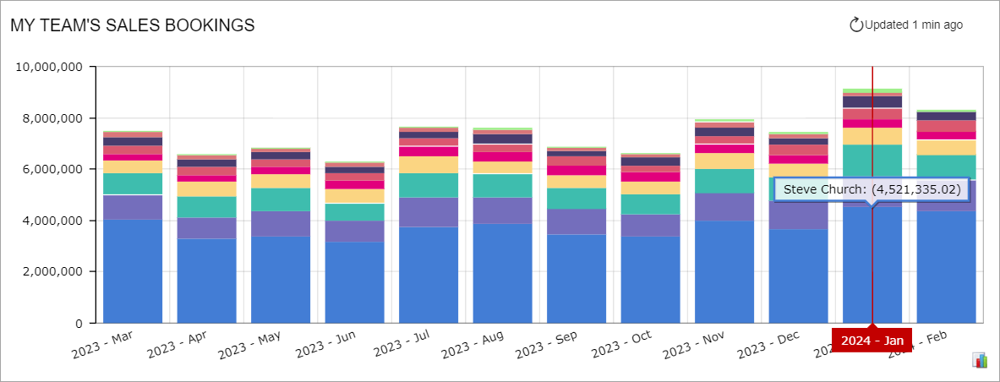

## Stacked Bar Chart { .section}

A stacked bar chart is an inverted stacked column chart in which the horizontal and vertical axes are reversed. A stacked bar chart also illustrates the relationship of the parts to the whole, and its bars are divided into legend categories, with each bar representing a total.

The following chart shows the contribution of salespeople to the monthly sales totals over time. The *y* axis defines a series of financial periods within the specified time range, and the *x* axis defines the measurable entity—period-to-date sales totals. Each stacked bar represents the monthly sales total, with the parts of different colors indicating the different salespeople that contribute to the monthly total.

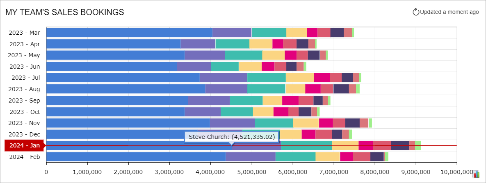

## Doughnut Chart { .section}

A doughnut chart is a circular chart \(with a hole extracted from the middle\) divided into sectors or parts that illustrate proportions. This type of chart works well when you want to show how the parts relate to the whole at a fixed point in time.

This type of chart is particularly effective when the following criteria are met:

-   The parts add up to 100%.
-   You do not need to make precise comparisons.
-   You have a small number of sectors \(three to five\) and smaller sectors are either combined or not shown at all.

A doughnut chart helps its viewers to answer questions like *Who are our two largest vendors?* or *What is the biggest sales driver?*

The following doughnut chart displays the time spent on processing support cases for all employees by period-to-date. Each section represents a portion of the total number of support cases.

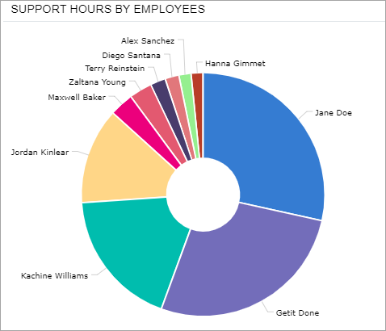

The system displays legend captions around the chart if the legend position is set to *None* or *Popup* in the widget settings.

## Funnel Chart { .section}

A funnel chart is a chart with no axes that shows sectors or slices of data in a funnel shape. Each slice represents a portion of the whole, or the slices may represent a process flow, with each slice \(or part of the process\) having data filtered out from the previous slice. For example, with a sales process, you could use a funnel chart, with each slice corresponding to a stage in the process and showing the amount of potential revenue.

The following funnel chart shows the salespeople by period-to-date sales. Each slice represents a portion of the total amount of sales by a salesperson.

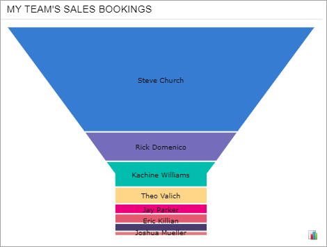

**Parent topic:**[Configuring Widgets](../UserGuide/RPT_Configuring_Widgets_Mapref.md)

