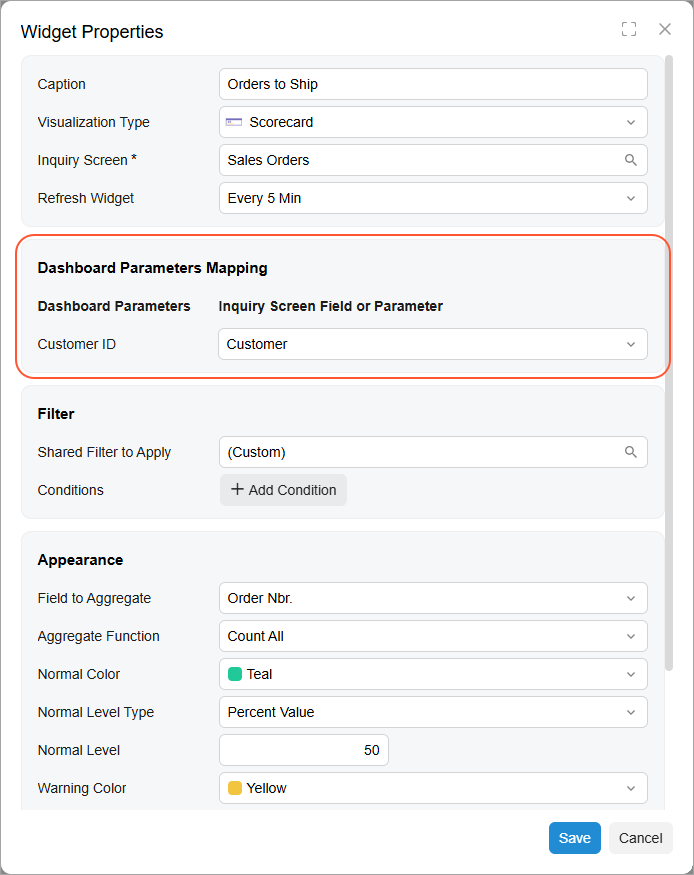
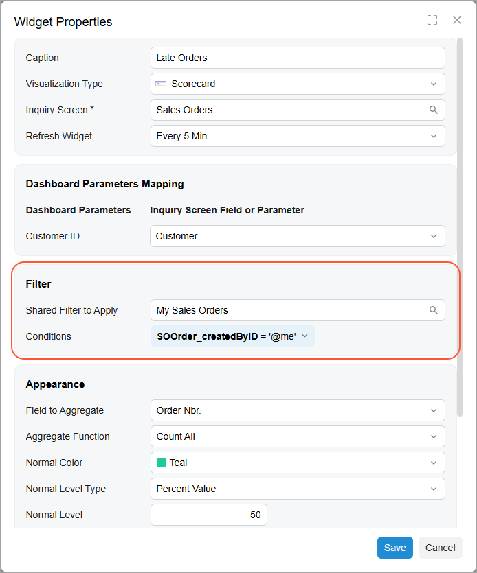
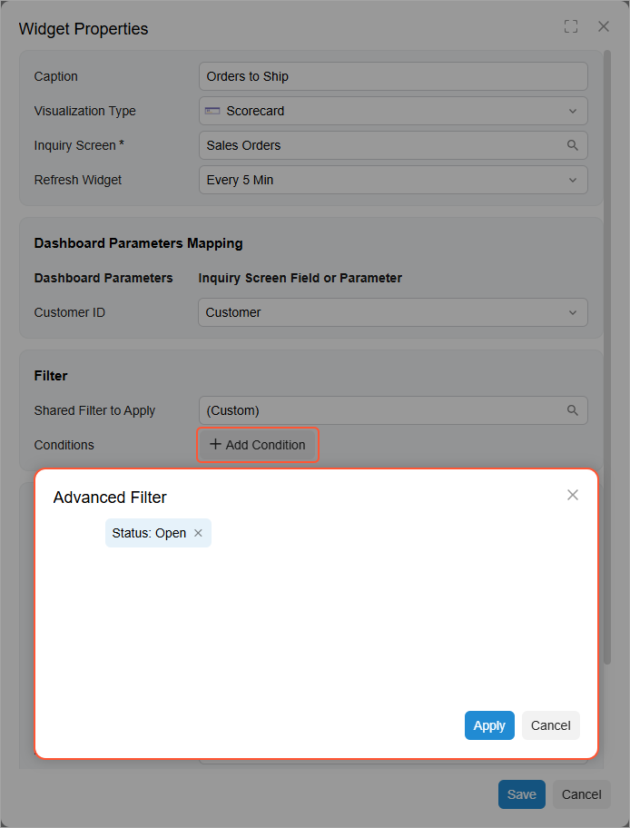

# Specific Widgets: Data Filtering {#_c5f50fa7-0ea9-4d7a-8f37-794d7aa09b02 .concept}

Data filtering can be used for the following types of widgets:

-   Chart widgets \(Doughnut, Line, Column, Stacked Column, Bar, Stacked Bar, Funnel\)
-   Data table widgets
-   Pivot table widgets
-   KPI widgets \(Scorecard, Meter, Trend Card\)

## Dashboard Parameters {#_f0711e28-0735-43e7-ae16-6bbb1be1b451 .section}

If you want to provide dashboard users with the ability to filter widget data on the fly, you can add parameters to the Selection area of a dashboard. The functionality of these parameters is similar to that of the parameters in the Selection area of inquiry forms. When a user selects values in the corresponding UI elements, the system filters the data on all applicable widgets by these values.

**Attention:** Widget data can be filtered by a parameter value only if the inquiry the widget is based on contains the data field used by the parameter. Also, unbound fields used by the generic inquiry are excluded from the filter.

To add parameters to a dashboard, you select the dashboard on the [Dashboards](SM_20_86_10.md) \(SM208610\) form, and on the **Parameters** tab, you add parameters that will be displayed in the Selection area of the dashboard.

For each widget whose data should be filtered by the values of the added parameter or parameters, in the **Widget Properties** dialog box, you add a corresponding filtering condition in the **Dashboard Parameters Mapping** section \(see the following screenshot\).

## Shared Filters of the Source Inquiry { .section}

Shared filters can be created for a generic inquiry form. If this generic inquiry form is used as the data source for a widget, you can select any of these shared filters in the **Shared Filter to Apply** box in the **Widget Properties** dialog box \(see the following screenshot\). This will filter the data in the widget.

The system will display the name of the selected shared filter in the **Shared Filter to Apply** box.

By using the **Advanced Filter** dialog box of the widget, you can further modify the filtering conditions that are copied from the selected shared filter.

## Widget-Specific Filters { .section}

While configuring a widget by using the Acumatica ERP standard **Advanced Filter** dialog box, you can specify filtering conditions that apply to only this widget. You open this dialog box by clicking **Add Condition** or the existing filter condition in the **Filter** section of the **Widget Properties** dialog box \(see the following screenshot\).

If you specify filtering conditions for the widget, the system will insert the *\(Custom\)* value in the **Shared Filter to Apply** box.

**Parent topic:**[Configuring Widgets](../UserGuide/RPT_Configuring_Widgets_Mapref.md)

