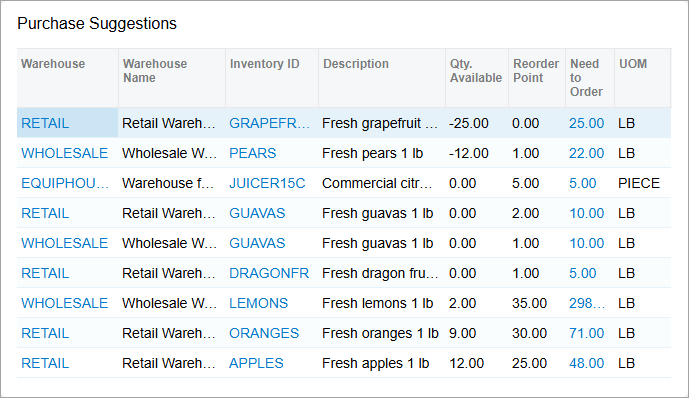
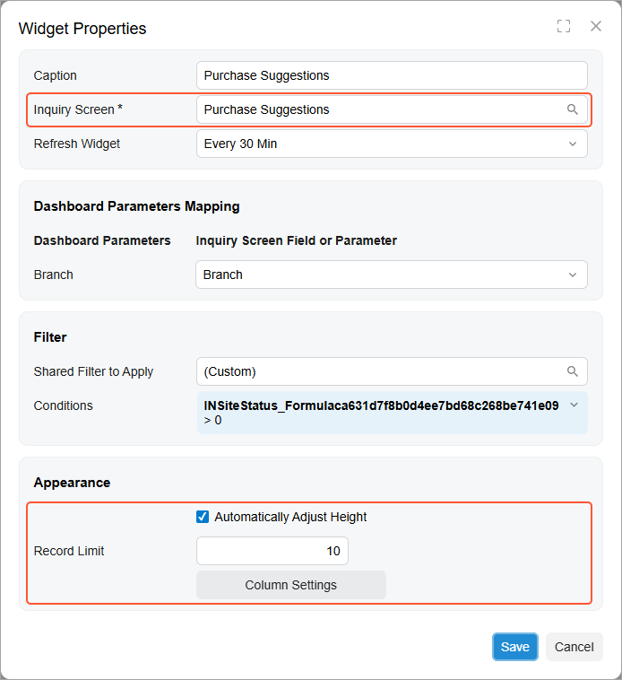
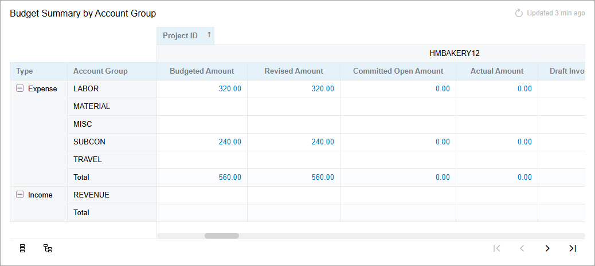
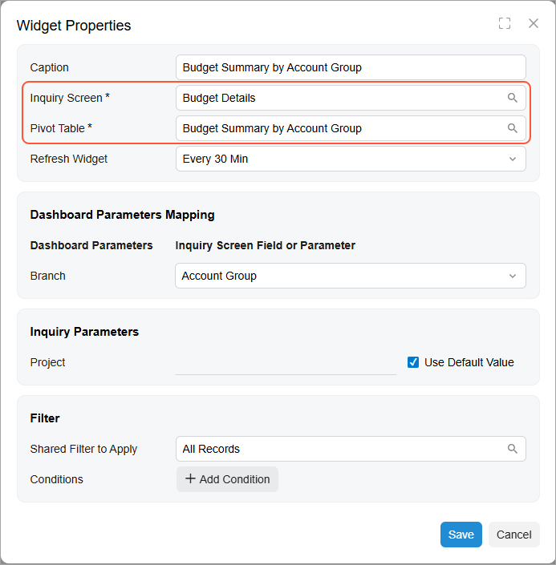

# Specific Widgets: Table Widgets {#_80575e5b-2aa3-4340-9a3b-c2e7d419ddd0 .concept}

You can use tables as widgets on dashboards. Although tables are not as eye-catching as charts, they are often the best way to help the viewer grasp key ideas about the data. Acumatica ERP gives you the ability to add data tables and pivot tables to a dashboard as widgets.

## Applicable Scenario { .section}

You use a data table widget when you want to show multiple types \(columns\) of data for each data record \(row\). To show summarized data of a more extensive table, you use a pivot table widget.

## Data Source for Table Widgets { .section}

Table widgets show the data collected by a generic inquiry from the system database. You can use a predefined generic inquiry or develop one that suits your needs.

Also, you can compose a pivot table based on a generic inquiry on the [Pivot Tables](SM_20_80_10.md) \(SM208010\) form and then use the table as a source for a pivot table widget.

## Data Table Widgets { .section}

A table is an arrangement of numerical data in rows and columns. It is designed to show a set of related facts in a compact yet comprehensive form. For an example of a data table widget, see the following screenshot.

To add a data table widget, you select the **Data Table** widget type in the **Add Widget** dialog box, which opens when you click **New Widget** in a widget placeholder. You select the generic inquiry to use as a source in the **Inquiry Screen** box of the **Widget Properties** dialog box.

By clicking the **Column Settings** button, you open the standard **Column Settings** dialog box, where you can specify which columns to show and in what order. You can select the columns for display from only the set of columns defined for the generic inquiry on the [Generic Inquiry](SM_20_80_00.md) \(SM208000\) form.

Also, you can limit the number of records to show by selecting the **Automatically Adjust Height** check box and specifying the number in the **Record Limit** box. In this case, you will not be able to adjust the widget height manually. The system locks the widget height to accommodate the specified number of rows.

The following screenshot shows an example of the configuration settings of a table widget that lists customer records.

## Pivot Table Widgets { .section}

A pivot table is an arrangement of numerical data in rows and columns. It is designed to show a set of data based on a generic inquiry. The following screenshot shows an example of a pivot table widget.

To add a pivot table widget, you select the **Pivot Table** widget type in the **Add Widget** dialog box, which opens when you click **New Widget** in a widget placeholder. In the **Widget Properties** dialog box, you select the inquiry to use as a source in the **Inquiry Screen** box. Multiple pivot tables can be based on a single inquiry, so in the **Pivot Table** box, you select the table to be displayed.

The following screenshot shows an example of the configuration settings of a pivot table widget that summarizes budget information.

**Parent topic:**[Configuring Widgets](../UserGuide/RPT_Configuring_Widgets_Mapref.md)

