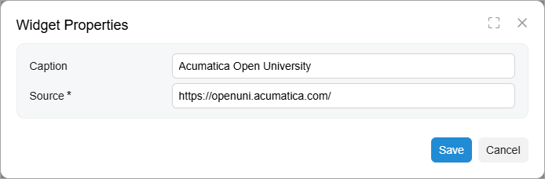

# Specific Widgets: Embedded Page Widgets {#_fae348f5-97bb-47df-bba9-a2af86cbb0db .concept}

You can embed a page from an external website as a widget on a dashboard.

## Applicable Scenario { .section}

You use an embedded page widget to display important information from external systems in Acumatica ERP to provide dashboard users with consolidated information on one dashboard. An embedded page may display, for example, a currency rate, a weather forecast, or a document from an external cloud storage.

## Embedded Page Widgets { .section}

An embedded page widget is a widget that displays a webpage, as shown in the following screenshot.

To add an embedded page widget, you select the **Embedded Page** widget type in the **Add Widget** dialog box, which opens when you click **New Widget** in a widget placeholder. In the **Widget Properties** dialog box, you specify its caption in the **Caption** box and the URL of the webpage to be displayed on the dashboard in the **Source** box.

The following screenshot shows an example of the configuration settings of an embedded page widget.

**Parent topic:**[Configuring Widgets](../UserGuide/RPT_Configuring_Widgets_Mapref.md)

