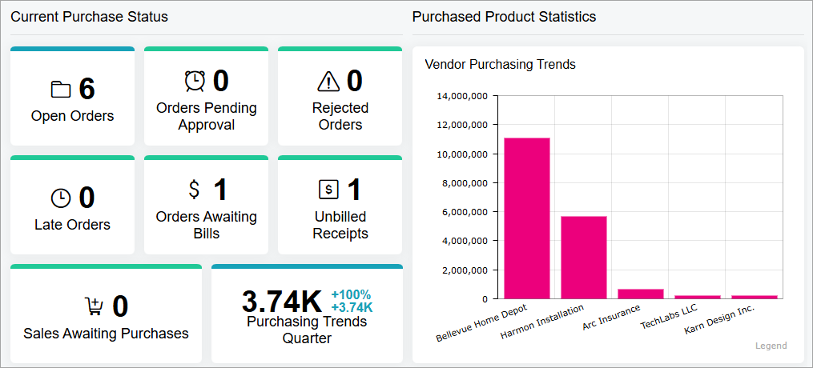
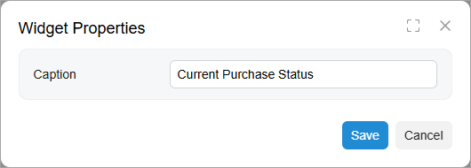

# Specific Widgets: Header Widgets {#_3040429e-3cb1-4e30-ab44-4685cf4fc373 .concept}

We recommend that you place widgets on a dashboard in ways that help users to grasp the information. During the design of a dashboard, you may want to organize widgets into sections and add a header to each section.

## Applicable Scenario { .section}

You use a header widget to group multiple widgets under a caption \(that is, a header\), so that users can find the information they need more quickly.

## Header Widgets { .section}

A header widget is a box with a fixed height, white background, and gray bottom border. For an example of header widgets, see the *Current Purchase Status* and *Purchased Product Statistics* header widgets in the following screenshot.

To add a header widget, you select the **Header** widget type in the **Add Widget** dialog box, which opens when you click **New Widget** in a widget placeholder. In the **Widget Properties** dialog box, you enter the caption you would like to use in the **Caption** box \(see below\).

**Parent topic:**[Configuring Widgets](../UserGuide/RPT_Configuring_Widgets_Mapref.md)

