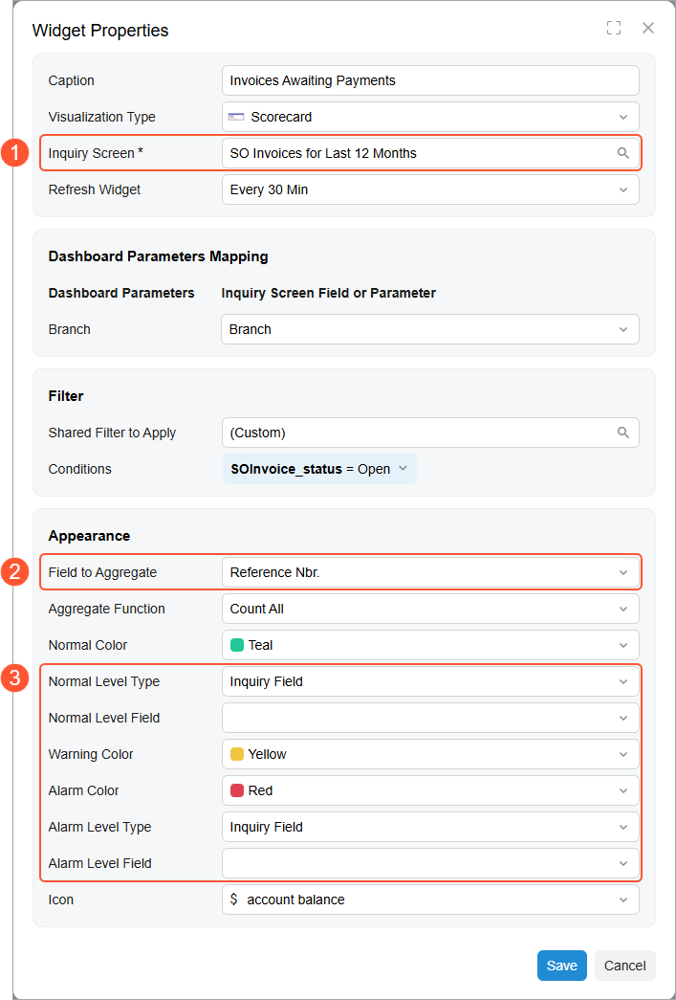
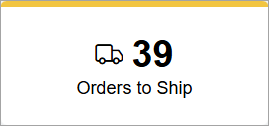
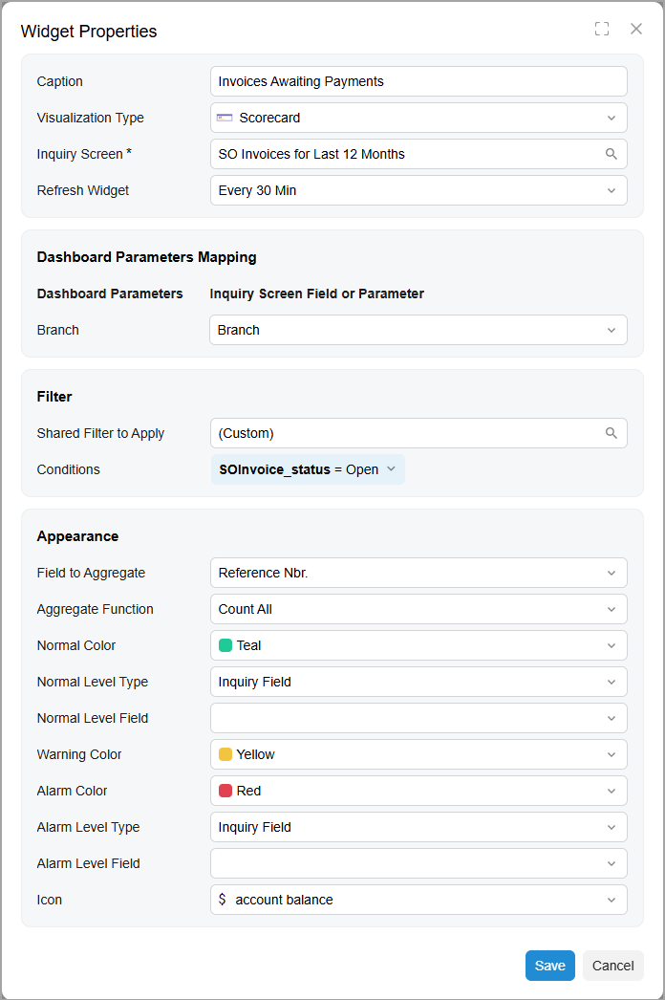
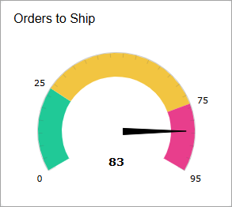
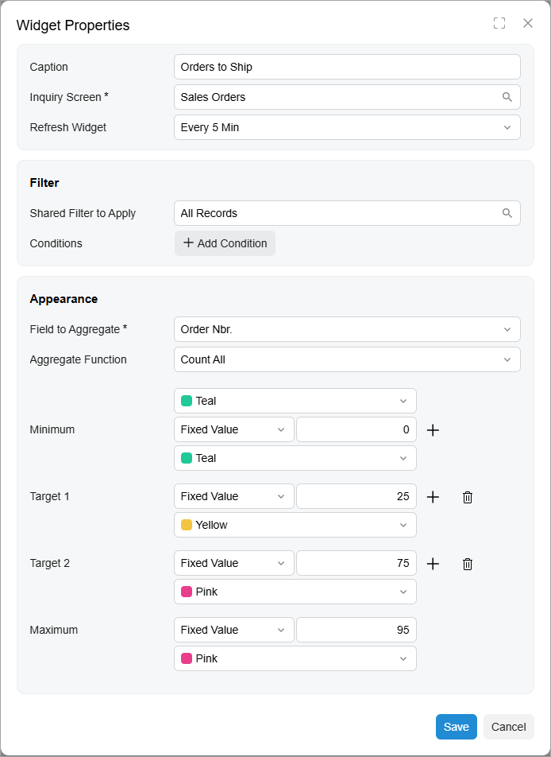
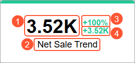
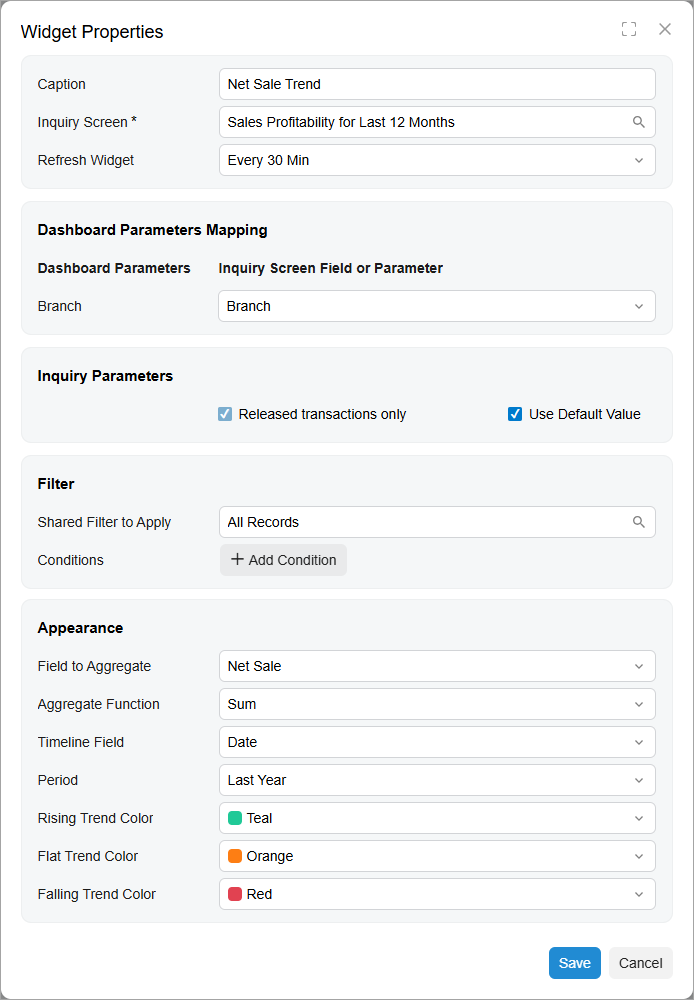

# Specific Widgets: KPI Widgets: Scorecard, Meter, and Trend Card {#_cdccb0cf-5212-472f-8f2c-1155fd594498 .concept}

A KPI widget is a ticker that will give you an immediate overview of a particular key performance indicator \(KPI\). In Acumatica ERP, you can configure a scorecard, meter, or trend card widget to track KPI.

## Applicable Scenarios { .section}

You use KPI widgets to show any of the following:

-   Single parameters that are critical for particular business processes in your organization, such the number of new support cases from customers
-   Progress against a key business indicator, such as the current number of deals against the goal number
-   A trend of metrics that change over time, such as the total sum of closed deals in the current month in comparison to the sum in the previous month, so you can see if it is increasing or decreasing

## Data Source for KPI Widgets { .section}

The source of the calculation of a KPI is data collected by an inquiry from the system database. You select a source inquiry in the **Inquiry Screen** box of the **Widget Properties** dialog box for a KPI widget \(see Item 1 in the screenshot below\). You can use a predefined inquiry or develop one that suits your needs by using the [Generic Inquiry](SM_20_80_00.md) \(SM208000\) form.

Each column of a generic inquiry is a data field configured in the inquiry settings. It can be a data field from an existing database table or a custom data field whose value is calculated by the system based on the formula specified for this field in the generic inquiry.

By using data fields from the generic inquiry specified as a source for the widget you are configuring, you define the metric to track with the widget in the **Field to Aggregate** box \(Item 2\). Also, you can use data fields to define thresholds of KPI if you select the *Inquiry Field* option in the **Normal Level Type** or **Alarm Level Type** box \(Item 3\).

## Operations Used to Calculate a KPI { .section}

A KPI is a measurement that evaluates the performance of a business activity. To measure the business activity, you need to define the data field and the operation to perform upon the values provided by the field.

In the **Widget Properties** dialog box for a KPI widget, you specify a data field by selecting a column from the source generic inquiry in the **Field to Aggregate** box. In the **Aggregate Function** box, you select one of the following operations:

-   *Average*: Calculates the average value in the column.
-   *Count All* \(default value\): Determines the number of unique items in the column.
-   *Max*: Determines the highest individual value in the column. For text data, the highest value is the last alphabetic value. This function ignores null values.
-   *Min*: Determines the lowest individual value in the column. For text data, the lowest value is the first alphabetic value. This function ignores null values.
-   *Sum*: Calculates the sum of the items in the column.

The system performs the selected operation on the data from the specified column and displays the result on the KPI widget.

## Threshold Values of KPI Widgets { .section}

To measure the performance of a business activity, you need to define thresholds that help you gauge success and failure \(that is, what number is considered to be successful performance and what number is considered unsuccessful\).

In Acumatica ERP, a KPI value can be placed in any of the following ranges: normal, warning, and alarm. In the **Widget Properties** dialog box for a KPI widget, you can define the upper bound of the normal range \(the **Normal Level**, **Normal Level Field**, or **Minimum** box\) and the lower bound of the alarm range \(the **Alarm Level**, **Alarm Level Field**, or **Maximum** box\). The system calculates the warning range as the difference between these two values. You can identify the ranges on a widget by the colors assigned to each range.

To define the upper bound of the normal range or the lower bound of the alarm range, you should first select a source type for the thresholds and then specify the values that will indicate bounds. The following source types are available:

-   *Fixed Value*: The value to be specified for the level is any positive or negative integer or decimal number.
-   *Inquiry Field*: The value to be specified for the level is any inquiry field \(that is, any field represented by a column in the results grid of the inquiry form selected in the **Inquiry Screen** box\) that contains numeric values. The system adds up the values in the column of the specified field. That is, it uses the `SUM` operation for the returned results.
-   *Percent Value*: The value to be specified for the level is any positive or negative integer or fractional number that represents the percent value \(without *%*\). If the percent value is specified for the normal level, the system calculates it as the percentage of the value specified for alarm level. If the percent value is specified for the alarm level, the system calculates it as the percentage of the value specified for the normal level. Thus, you can select this option as a source either for the normal level or for the alarm level.

You select a source type for both the normal level \(success\) and the alarm level \(failure\) and then specify the exact values. You can select different source types for both levels if it works for your KPI.

## Background Colors of KPI Widgets { .section}

The background color of the KPI widgets is used to convey the trend of the KPI. The color helps viewers to instantly understand whether immediate action is needed or the KPI is under control.

In Acumatica ERP, you can specify colors for the normal, warning, or alarm levels for the scorecard widgets. Similarly, for a trend card, you can specify the colors that indicate whether a trend is rising, flat, or falling. For the meter widgets, you can have as many levels as you wish and each of them could have its own color.

If a number you are tracking is for informational purposes only and its change does not require any action, you can specify the same color for all three KPI positions.

## Scorecard Widget { .section}

A scorecard is a rectangle with a number and title in the upper right corner. Optionally, it can display an icon of your choice in the upper left corner and a different header color to indicate a change in the value it is showing.

A scorecard widget is useful when you need to monitor single parameters that are critical for particular business processes in your organization. For example, a scorecard can display the number of orders to be shipped \(see the following screenshot\).

To add a scorecard widget, you select the **Scorecard** widget type in the **Add Widget** dialog box, which opens when you click **New Widget** in a widget placeholder. You specify the following information in the **Widget Properties** dialog box:

-   The inquiry to provide data for the widget
-   The column from the inquiry to be used for calculation
-   The operation to perform with the column values
-   The normal and alarm level types
-   The threshold values for normal and alarm levels
-   The colors for the widget background based on the level

The following screenshot shows an example of the configuration of a scorecard that displays the number of open invoices in the system.

## Meter Widget { .section}

A meter widget uses a needle and colors to show data similarly to a reading on a speedometer. Meters are useful when you need to monitor multiple levels of the data \(normal, warning, and alarm\), with the colors and values that the user designing the widget has assigned to each level. For an example of a meter KPI widget, see the following screenshot.

The system builds the view of each widget automatically, based on the properties specified for the widget in the **Widget Properties** dialog box. You can explicitly specify the values for the **Minimum** and **Maximum** levels and add any number of target values between them \(shown below\).

For each level you can select its own color, and how it will be calculated \(fixed value, inquiry field, percentage of other value\).

## Trend Card Widget { .section}

The KPI values to be displayed on the trend card KPI widget are calculated based on the selected period, the aggregate function, and the current business date.

**Attention:** The source inquiry should include a date parameter to be used by the system for the calculation of a trend.

For example, suppose that you want to display the sum of net sales and compare it with the net sales in the previous year on the trend card KPI widget. The inquiry should include the sale date. By using this date, the system will calculate the sum of net sales made during a particular period of time. Further suppose that the current business date is July 14, 2026. To find the current KPI value, the system counts the sum of net sales from January 1, 2026, to July 14, 2026. To find the difference, the system counts the sum of net sales in the previous quarter year—from January 1, 2025, to December 31, 2025—and calculates the difference between the current value and the previous one. Then the absolute difference, the difference expressed as a percent, and the current sum of net sales are displayed in the widget.

The following screenshot shows an example of a trend card KPI widget and its elements.

The trend card widget consists of the following parts:

1.  The current KPI value
2.  The trend card title \(caption\)
3.  The difference in the percent between the current KPI value and the previous one
4.  The difference between the current KPI value and the previous one

The color of the header indicates whether a trend is rising, falling, or flat.

To add a trend card widget, you select the **Trend Card** widget type in the **Add Widget** dialog box, which opens when you click **New Widget** in a widget placeholder. You specify the following settings in the **Widget Properties** dialog box:

-   The inquiry form to provide data for the dashboard
-   The column from the inquiry to be used for calculation
-   The operation to perform with the column values to calculate the KPI
-   The timeline field from the inquiry to provide data about dates
-   The period for comparison
-   The trend name, which is displayed in all capital letters on the card
-   The colors for the widget background based on the trend direction

The following screenshot shows an example of the configuration of the trend card widget to calculate the number of created cases in a month in comparison to the previous month.

**Parent topic:**[Configuring Widgets](../UserGuide/RPT_Configuring_Widgets_Mapref.md)

