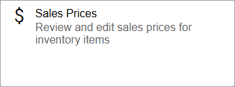
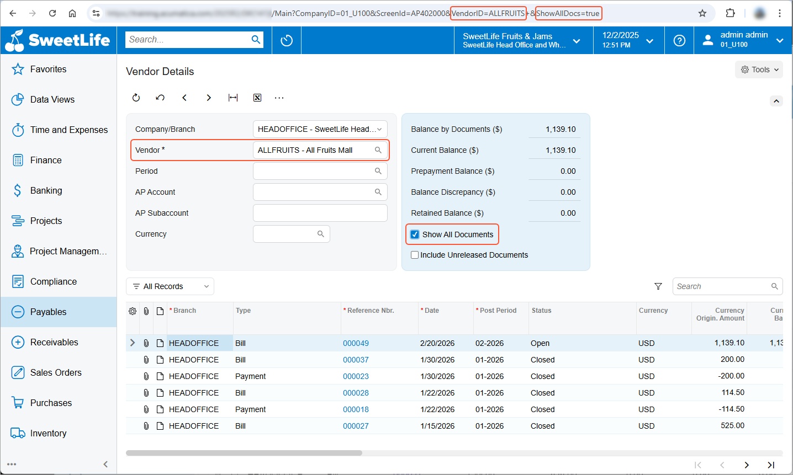
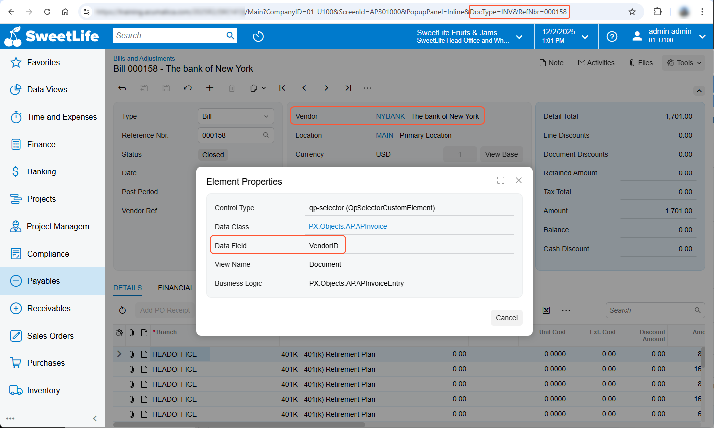
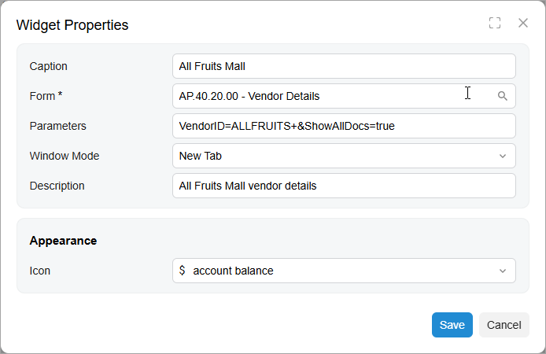

# Specific Widgets: Link Widgets {#_b0a3c38b-9dd7-420c-ad5c-478cae6cb301 .concept}

You can add a link to an Acumatica ERP form as a widget on a dashboard. When a user clicks the link, the system opens the corresponding form in a new tab, in the same tab or in the pop-up window \(depending on the setting you specify\).

## Applicable Scenarios { .section}

You use a link widget to give users the ability to easily navigate to the needed form right from the dashboard. You may need this in either or both of the following cases:

-   You are using a dashboard as a starting point of your day-to-day operations and want to have your most-used forms on one page.
-   You track metrics that require immediate action, so you want to place a link to a form next to the widget that tracks the metrics. For example, if a dashboard has a scorecard that displays the current quantity of some stock item, you can place next to the scorecard a link to the [Purchase Orders](PO_30_10_00.md) \(PO301000\) form.

## Link Widget { .section}

A link widget is a rectangle with the name of a form in blue type on the white background. Optionally, it may display an icon of your choice in the upper left corner and a form description you provide under the form name. The following screenshot shows an example of a link widget.

To add a link widget, you select the **Link** widget type in the **Add Widget** dialog box, which opens when you click **New Widget** in a widget placeholder.

In the **Widget Properties** dialog box, you select the Acumatica ERP form in the **Form** box. In the **Window Mode** box, you select *New Tab*, *Same Tab*, or *Pop-Up Window* to define how the system should open the form. You can use the default form title or use the **Caption** setting to specify another title for the form link on a dashboard. To provide more information about the form, you can also add a description for the form link in the **Description** box. In the **Icon** box, you can select any of the predefined icons to be displayed in the widget.

## Adding Parameters to a Link { .section}

If the employees of your organization frequently create an entity with a particular set of settings, you can make this operation faster by adding a link that includes the needed settings. For example, a link could be added that a user can click to open the [Vendor Details](AP_40_20_00.md) \(AP402000\) form with a particular vendor selected in the **Vendor** box.

To indicate the elements and values that need to be provided to the system when a user clicks the link, you specify fields and their values as URL parameters in the **Widget Parameters** dialog box for the link \(which is opened when you select a widget type in the **Add Widget** dialog box or click Edit on a title bar of an existing widget\). You can add multiple parameters separated by *&amp;*.

To determine the URL parameters, for some boxes located in the Summary or Selection area of a form, you can open the form, select the box value in the area, and look at the form URL. The system adds to the URL the parameter that corresponds to the box on a form with the selected value, as shown in the following screenshot.

Alternatively, to determine the URL parameters for the boxes that the system does not add as URL parameters, you can inspect each form element and find out what data field corresponds to the element. On the form that the link will open, you press Ctrl+Alt and click the needed element. The **Element Properties** dialog box opens. In the dialog box, you copy the value specified in the **Data Field** box, as the following screenshot shows for the **Vendor** box of the [Bills and Adjustments](AP_30_10_00.md) \(AP301000\) form. In the URL shown in the screenshot, notice that the system has added to the URL only the document type and its reference number, because these two values explicitly identify the document, so adding other parameters to the URL is not needed.

After you find out which data fields correspond to all the elements whose settings you want to provide to the system when a user clicks the link, you add the parameters for the link widget. You open the **Widget Properties** dialog box for the needed link widget and specify the parameters in the **Parameters** box. The following screenshot shows an example of the configuration settings of a link widget.

**Parent topic:**[Configuring Widgets](../UserGuide/RPT_Configuring_Widgets_Mapref.md)

