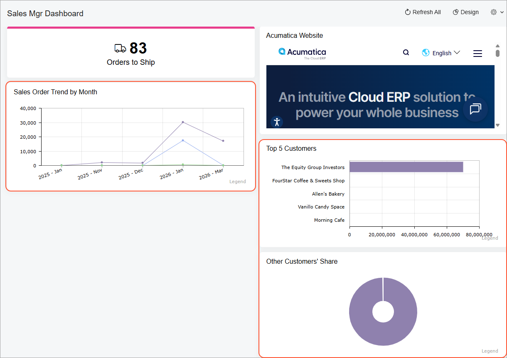

# Specific Widgets: To Add Chart Widgets {#_374bcb0f-2c9f-420f-a3fc-ec788e3d7a81 .task}

The following activity will show you how to add and configure chart widgets.

## Story { .section}

Suppose that you are Kimberly Gibbs, a technical specialist in your company who is working on simple customizations. A sales manager of your company had previously requested a dashboard named *Sales Mgr Dashboard*, and you created the requested dashboard. The sales manager has now requested that you add the following widgets to present the listed data:

-   *Sales Order Trend by Month*: The total amount of the sales orders by month
-   *Top 5 Customers*: The top five customers by invoiced amount
-   *Other Customers' Share*: The share of the total invoiced amount held by customers that are not among the top five customers by invoiced amount

## Process Overview { .section}

In this activity, you will add and configure widgets of the following types: line chart, horizontal bar chart, and doughnut chart.

## System Preparation {#section_g1x_5xn_wrb .section}

Before you start adding the widgets, make sure that the following tasks have been performed:

-   Launch the Acumatica ERP website, and sign in to a tenant with the *U100* dataset preloaded as system administrator Kimberly Gibbs by using the *gibbs* username and the *123* password.

    **Tip:** The *gibbs* user is assigned the *Administrator* role, which has sufficient access rights to manage the system configuration and to modify generic inquiries, advanced filters, pivot tables, and dashboards.

-   You have completed the [Dashboards: To Add a Dashboard](RPT_Administering_Dashboard_Forms_Implem_Activity.md) activity. In this activity, you created the *Sales Mgr Dashboard* dashboard and made sure that a user with the *Administrator* role can populate the dashboard with the widgets.
-   You have completed the [Specific Widgets: To Add Link, Table, and Embedded Page Widgets](RPT_Configuring_Widgets_To_Add_Header_Table_Link_and_Embedded_Page_Widgets_Activity.md) activity.
-   You have completed the [Specific Widgets: To Add KPI Widgets](RPT_Configuring_Widgets_To_Add_KPI_Widgets_Activity.md) activity.
-   In the info area at the upper-right corner of the top pane of the Acumatica ERP screen, make sure that the business date is set to *1/30/2026*. If a different date is displayed, click the Business Date menu button and select *1/30/2026* from the calendar. For simplicity, you'll create and process all documents in this activity using this business date.

## Step 1: Adding a Line Chart Widget { .section}

To add a line chart widget, do the following:

1.  On the main menu, click the **Opportunities** menu item to open the **Opportunities** workspace, and click the *Sales Mgr Dashboard* link.
2.  On the dashboard title bar, click the **Design** button.
3.  In the widget placeholder under the *Orders to Ship* widget, click **New Widget**.
4.  In the **Add Widget** dialog box, which opens, click **Line**.
5.  In the **Widget Properties** dialog box, which opens, specify the following settings:
    -   **Caption**: `Sales Order Trend by Month`
    -   **Inquiry Screen**: *Sales Orders \(SO3010PL\)*
6.  In the **Categories** section, specify the following settings:
    -   **Legend**: *Date*
    -   **Maximum Number of Values Shown**: `12`
    -   **Date Rounding**: *Months*
7.  In the **Series** section, in the **Legend** box, select *Order Type*.
8.  In the **Values** section, in the **Value** boxes, select *Order Total* and *Sum*.
9.  Click **Save** to save your changes and close the **Widget Properties** dialog box.

## Step 2: Adding a Bar Chart Widget { .section}

To add a bar chart widget, do the following:

1.  While you are still in design mode of the *Sales Mgr Dashboard* dashboard, in the widget placeholder under the *Acumatica Website* widget, click **New Widget**.
2.  In the **Add Widget** dialog box, which opens, click **Bar**.
3.  In the **Widget Properties** dialog box, which opens, specify the following settings:
    -   **Caption**: `Top 5 Customers`
    -   **Inquiry Screen**: *Customer Summary \(AR0008DB\)*
4.  In the **Categories** section, specify the following settings:
    -   **Legend**: *Customer Name*
    -   **Maximum Number of Values Shown**: `5`
5.  In the **Values** section, in the **Value** boxes, select *Amount* and *Max*.
6.  Click **Save** to save your changes and close the **Widget Properties** dialog box.

## Step 3: Adding a Doughnut Chart Widget by Copying the Bar Chart Widget { .section}

To add a doughnut chart widget, do the following:

1.  While you are still in design mode of the *Sales Mgr Dashboard* dashboard, on the title bar of the *Top 5 Customers* widget, click the **Copy** button. Notice that **Paste Copied** becomes available in the widget placeholders.
2.  In the widget placeholder under the *Top 5 Customers* widget, click **Paste Copied**.
3.  On the title bar of the pasted widget, click Edit.
4.  In the **Widget Properties** dialog box, which opens, in the **Caption** box, type `Other Customers' Share`.
5.  In the **Chart Type** box, select *Doughnut*.
6.  In the **Categories** section, select the **Show Sum of Other Entries** check box.
7.  Click **Save** to save your changes and close the **Widget Properties** dialog box.
8.  On the dashboard title bar, click the **Design** button.

You have added to the dashboard chart widgets of the following types: line, bar, and doughnut \(see the following screenshot\).

**Parent topic:**[Configuring Widgets](../UserGuide/RPT_Configuring_Widgets_Mapref.md)

