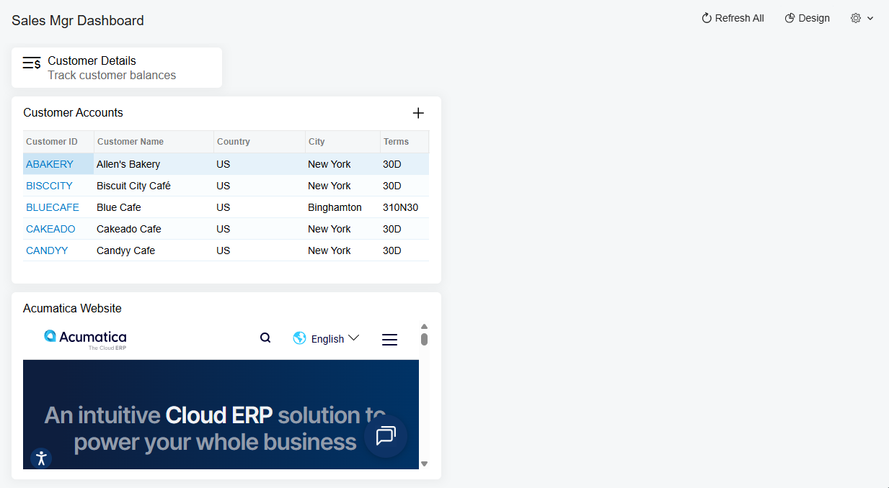

# Specific Widgets: To Add Link, Table, and Embedded Page Widgets {#_672f1307-e9da-4e43-b6da-f3fae6ae5c44 .task}

The following activity will show you how to add and configure link, table, and embedded page widgets.

## Story { .section}

Suppose that you are Kimberly Gibbs, a technical specialist in your company who is working on simple customizations. A sales manager of your company had previously requested a dashboard named *Sales Mgr Dashboard*, and you created the requested dashboard form. The sales manager has now requested that you add the following widgets to the dashboard:

-   A link to the [Customer Details](AR_40_20_00.md) \(AR402000\) form
-   A table that lists customer accounts and has the following columns: **Customer ID**, **Customer Name**, **Country**, **City**, **Terms**, and **Customer Status**
-   An embedded page that displays the Acumatica website or the website of your company

## Process Overview { .section}

In this activity, you will add and configure widgets of the following types: link, table, and embedded page.

## System Preparation {#section_g1x_5xn_wrb .section}

Before you start adding the widgets, make sure that the following tasks have been performed:

-   You have launched the Acumatica ERP website, and signed in to a tenant with the *U100* dataset preloaded.
-   You have signed in as a system administrator with the *gibbs* username and the *123* password.
-   You have completed the [Dashboards: To Add a Dashboard](RPT_Administering_Dashboard_Forms_Implem_Activity.md) activity. In this activity, you created the *Sales Mgr Dashboard* dashboard and made sure that a user with the *Administrator* role can populate the dashboard with the widgets.

    **Tip:** The *gibbs* user is assigned the *Administrator* role, which has sufficient access rights to manage the system configuration and to modify generic inquiries, advanced filters, pivot tables, and dashboards.

## Step 1: Adding a Link Widget { .section}

To add a link widget, do the following:

1.  On the main menu, click the **Opportunities** menu item to open the **Opportunities** workspace, and click the *Sales Mgr Dashboard* link.

    **Tip:** If the **Opportunities** menu item is not on the main menu, click the **More Items** menu item and then click the **Opportunities** tile.

2.  On the dashboard title bar, click **Design**.
3.  In the widget placeholder, click **New Widget**.
4.  In the **Add Widget** dialog box, click **Link**.
5.  In the **Widget Properties** dialog box, specify the following settings:
    -   **Caption**: *Customer Details*
    -   **Form**: *[Customer Details](AR_40_20_00.md) \(AR402000\)*
    -   **Window Mode**: *New Tab*
    -   **Description**: `Track customer balances`
    -   **Icon**: *account details*
6.  Click **Save** to save your changes and close the dialog box.

## Step 2: Adding a Table Widget { .section}

To add a table widget, do the following:

1.  While you are still in design mode of the *Sales Mgr Dashboard* dashboard, in the widget placeholder below the link widget, click **New Widget**.
2.  In the **Add Widget** dialog box, click **Data Table**.
3.  In the **Widget Properties** dialog box, in the **Caption** box, type `Customer Accounts`.
4.  In the **Inquiry Screen** box, select *Customers \(AR3030PL\)*.
5.  Click **Column Settings**.
6.  In the **Column Settings** dialog box, clear the following column names in the list:
    -   *Customer Class*
    -   *Currency ID*
    -   *Customer Status*
    -   *State*
    -   *Post Box*
7.  Click **OK** to save your changes and close the dialog box.
8.  Click **Save** to save your changes and close the dialog box.
9.  Drag the widget borders to change its width and height until you are satisfied with the information displayed.

## Step 3: Adding an Embedded Page Widget { .section}

To add an embedded page widget, do the following:

1.  While you are still in design mode of the *Sales Mgr Dashboard* dashboard, in the widget placeholder below the table widget, click **New Widget**.
2.  In the **Add Widget** dialog box, which opens, select **Embedded Page** and click **Next**.
3.  In the **Widget Properties** dialog box, specify the following settings:
    -   **Caption**: `<company name> website` or `Acumatica Website`
    -   **Source**: address of your company website or `https://acumatica.com`
4.  Click **Save** to save your changes and close the dialog box.
5.  Drag the bottom border of the widget to change its height until you are satisfied with the information displayed.
6.  On the dashboard title bar, click the **Design** button.

You have added widgets of the following types to the dashboard: link, table, and embedded page \(see the following screenshot\).

**Parent topic:**[Configuring Widgets](../UserGuide/RPT_Configuring_Widgets_Mapref.md)

