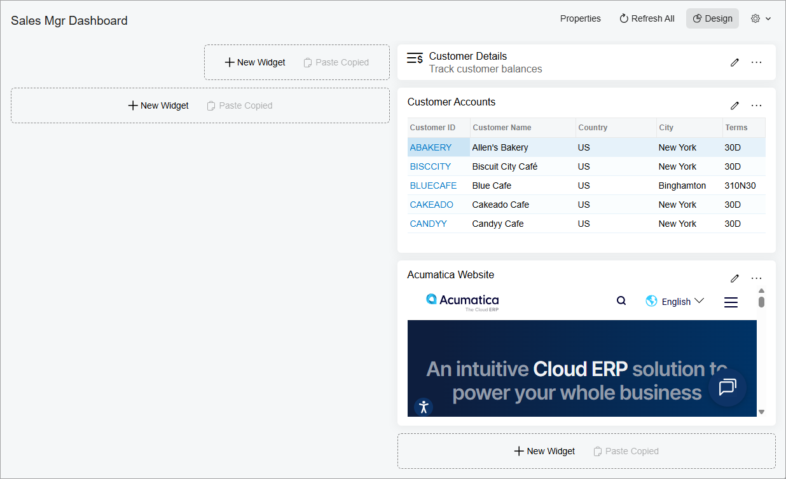
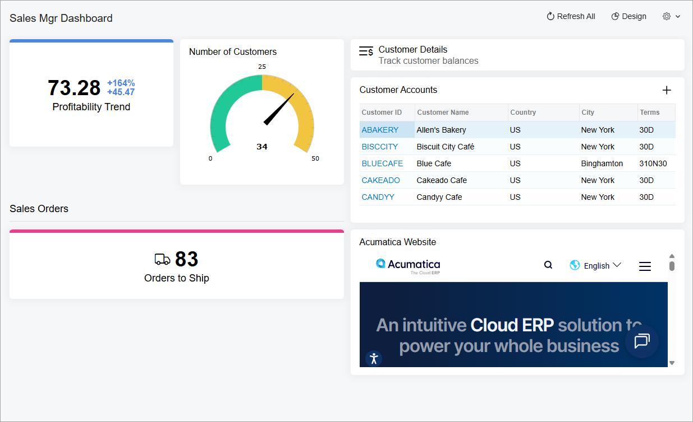

# Specific Widgets: To Add KPI Widgets {#_1dd7bbf6-48e2-420f-aef5-0e5e6feeeb3a .task}

The following activity will show you how to add and configure scorecard, meter, and trend card widgets.

## Story {#section_lcw_pl4_gtb .section}

Suppose that you are Kimberly Gibbs, a technical specialist in your company who is working on simple customizations. A sales manager of your company had previously requested a dashboard named *Sales Mgr Dashboard*, and you created it. The sales manager has now requested that you add the following widgets to the dashboard to track the described KPIs:

-   *Profitability Trend*: The trend for the cumulative margin percentage in comparison to the previous week
-   *Number of Customers*: The current number of customers \(which is 34 at the moment\) in comparison with the department goal to have at least 50 customers by the end of the next quarter
-   *Orders to Ship*: The current number of sales orders ready to ship, which should not exceed 50 percent of the number the department defines as a high load \(40 open orders at a time\)

Also, the new KPI widgets should be located in the upper left corner of the dashboard, and the *Orders to Ship* widget should be separated from the upper widgets, which have the *Sales Orders* header.

## Process Overview {#section_mcw_pl4_gtb .section}

In this activity, you will change the dashboard layout and rearrange the existing widgets to accommodate more widgets. Then you will add and configure widgets of the following types: trend card, meter, header, and scorecard.

## System Preparation {#section_g1x_5xn_wrb .section}

Before you start adding the widgets, make sure that the following tasks have been performed:

1.  Launch the Acumatica ERP website, and sign in to a tenant with the *U100* dataset preloaded. You should sign in as the system administrator by using the *gibbs* username and the *123* password.

    **Tip:** The *gibbs* user is assigned the *Administrator* role, which has sufficient access rights to manage the system configuration and to modify generic inquiries, advanced filters, pivot tables, and dashboards.

2.  You have completed the [Dashboards: To Add a Dashboard](RPT_Administering_Dashboard_Forms_Implem_Activity.md) activity from this course. In this activity, you created the *Sales Mgr Dashboard* dashboard and made sure that a user with the *Administrator* role can populate the dashboard with the widgets.
3.  You have completed the [Specific Widgets: To Add Link, Table, and Embedded Page Widgets](RPT_Configuring_Widgets_To_Add_Header_Table_Link_and_Embedded_Page_Widgets_Activity.md) activity.
4.  In the info area, in the upper-right corner of the top pane of the Acumatica ERP screen, make sure that the business date in your system is set to *1/30/2026*. If a different date is displayed, click the Business Date menu button, and select *1/30/2026* on the calendar.

## Step 1: Modifying the Dashboard Layout {#section_ncw_pl4_gtb .section}

You previously added widgets to the *Sales Mgr Dashboard* dashboard. You need to rearrange the existing widgets to free up the upper left corner for KPIs. To change the layout, do the following:

1.  On the main menu, click the **Opportunities** menu item to open the **Opportunities** workspace, and click the *Sales Mgr Dashboard* link.

    **Tip:** If the **Opportunities** menu item is not on the main menu, click the **More Items** menu item and then click the **Opportunities** tile.

2.  On the dashboard title bar, click the **Design** button.
3.  Move the *Customer Details*, *Customer Accounts*, and *Acumatica Website* widgets to the right working area, and modify their widths and heights to accommodate the information they display. The modified dashboard should be similar to the dashboard in the following screenshot.

    

## Step 2: Adding a Trend Card Widget {#section_pcw_pl4_gtb .section}

To add a trend card widget, do the following:

1.  While you are still in design mode of the *Sales Mgr Dashboard* dashboard, in the widget placeholder in the upper left corner, click **New Widget**.
2.  In the **Add Widget** dialog box, which opens, click **Trend Card**.
3.  In the **Widget Properties** dialog box, which opens, specify the following settings:
    -   **Caption**: `Profitability Trend`
    -   **Inquiry Screen**: *Sales Profitability Analysis \(AR409000\)*
    -   **Field to Aggregate**: *Margin %*
    -   **Aggregate Function**: *Average*
    -   **Timeline Field**: *Date*
    -   **Period**: *Last Week*
    -   **Rising Trend Color**: *Blue*
    -   **Flat Trend Color**: *Orange*
    -   **Falling Trend Color**: *Pink*
4.  Click **Save** to save your changes and close the dialog box.

## Step 3: Adding a Meter Widget {#section_qcw_pl4_gtb .section}

To add a meter widget, do the following:

1.  While you are still in design mode of the *Sales Mgr Dashboard* dashboard, in the widget placeholder next to the *Profitability Trend* widget, click **New Widget**.
2.  In the **Add Widget** dialog box, which opens, click **Meter**.
3.  In the **Widget Properties** dialog box, which opens, specify the following settings:
    -   **Caption**: `Number of Customers`
    -   **Inquiry Screen**: *Customers \(AR3030PL\)*
    -   **Field to Aggregate**: *Customer ID*
    -   **Aggregate Function**: *Count All*
    -   **Minimum**: *Fixed Value* as type, `0` as value and *Teal* as color
    -   **Target 1**: *Fixed Value* as type, `25` as value and *Yellow* as color. To add an intermediate target level, click + next to the **Minimum** setting.
    -   **Maximum**: *Fixed Value* as type, `50` as value and *Pink* as color
4.  Click **Save** to save your changes and close the dialog box.

## Step 4: Adding a Header Widget {#section_rcw_pl4_gtb .section}

To add a header widget, do the following:

1.  While you are still in design mode of the *Sales Mgr Dashboard* dashboard, in the widget placeholder below the *Number of Customers* widget, click **New Widget**.
2.  In the **Add Widget** dialog box, which opens, click **Header**.
3.  In the **Widget Properties** dialog box, which opens, type `Sales Orders` in the **Caption** box.
4.  Click **Save** to save your changes and close the dialog box.
5.  Drag the left widget border to the left until it aligns with the left border of the working area.

## Step 5: Adding a Scorecard Widget {#section_scw_pl4_gtb .section}

To add a scorecard widget, do the following:

1.  While you are still in design mode of the *Sales Mgr Dashboard* dashboard, in the widget placeholder below the *Sales Orders* widget, click **New Widget**.
2.  In the **Add Widget** dialog box, click **Scorecard**.
3.  In the **Widget Properties** dialog box, specify the following settings:
    -   **Caption**: `Orders to Ship`
    -   **Visualization Type**: *Scorecard*
    -   **Inquiry Screen**: *Sales Orders \(SO3010PL\)*
    -   **Field to Aggregate**: *Order Nbr.*
    -   **Aggregate Function**: *Count All*
    -   **Normal Color**: *Teal*
    -   **Normal Level Type**: *Percent Value*
    -   **Normal Level**: `50`
    -   **Warning Color**: *Yellow*
    -   **Alarm Color**: *Pink*
    -   **Alarm Level Type**: *Fixed Value*
    -   **Alarm Level**: `40`
    -   **Icon**: *local shipping*
4.  Click **Save** to save your changes and close the dialog box.
5.  Drag the left widget border to the left until it aligns with the left border of the working area.
6.  On the dashboard title bar, click the **Design** button.

You have changed the dashboard layout and arranged the previously added widgets in the right working area. Then you have added widgets of the following types to the dashboard: trend card, meter, header, and scorecard \(see the following screenshot\).

**Tip:** The width of the widgets and number of available widget placeholders depend on the size of your browser window. You may need to resize other widgets as well to get the same arrangement.

**Parent topic:**[Configuring Widgets](../UserGuide/RPT_Configuring_Widgets_Mapref.md)

