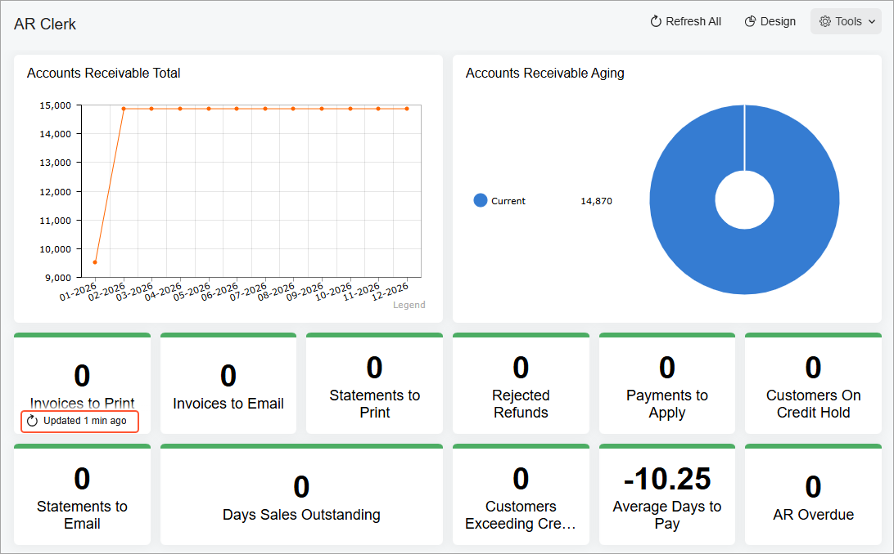

# Widget Settings: To Change a Widget's Title and Caching Settings {#_7c56e8b8-7614-4692-aab5-ff898450feb3 .task}

The following activity will show you how to change a widget's title \(caption\) and its caching settings.

## Story { .section}

Suppose that you are Gladys Peters, a workshop manager of the SweetLife Fruits &amp; Jams company. You have created your own copy of the predefined *AR Clerk* dashboard in order to monitor the accounts receivable. Also, you have defined this dashboard as your home page.

You would like to change the predefined titles for the *Total AR* and *AR Aging* widgets to *Accounts Receivable Total* and *Accounts Receivable Aging*, respectively. Also, you would like to increase the update frequency of widgets that display information about invoices and statements.

## Process Overview { .section}

In this activity, you will do the following:

1.  Switch on design mode for the dashboard
2.  Change the caption of a widget
3.  Change the caching settings of a widget

## System Preparation {#section_g1x_5xn_wrb .section}

Before you start adding the widgets in Acumatica ERP, make sure that the following tasks have been performed:

1.  You have launched the Acumatica ERP website, and signed in to a tenant with the *U100* dataset preloaded. You should sign in as a workshop manager Gladys Peters with the *peters* username and the *123* password.
2.  You have completed the [Dashboard Design: To Modify a Dashboard](RPT_Designing_Dashboard_Contents_Activity.md) activity. In this activity, you defined your copy of the *AR Clerk* dashboard as your home page.

## Step: Changing the Widget's Title and Caching Settings { .section}

To modify the settings of the widget, do the following:

1.  Open the *AR Clerk* dashboard.
2.  On the dashboard title bar, click the **Design** button.
3.  On the title bar of the *Total AR* widget, click Edit \(the pencil icon\).
4.  In the **Widget Properties** dialog box, in the **Caption** box, change the title of the widget to `Accounts Receivable Total`.
5.  Click **Save** to save your changes and close the dialog box.
6.  Repeat the previous three instructions, and rename the *AR Aging* widget to *Accounts Receivable Aging*.
7.  On the title bar of the *Invoices to Print* widget, click Edit.
8.  In the **Widget Properties** dialog box, in the **Refresh Widget** box, select the *Every 5 Min* option.
9.  Click **Save** to save your changes and close the dialog box.
10. By performing similar actions to those in the previous four instructions, modify the caching settings of the following widgets:
    -   *Invoices to Email*
    -   *Statements to Print*
    -   *Statements to Email*
11. On the dashboard title bar, click the **Design** button.
12. Wait several minutes, then refresh the page. Point to each widget with the mouse. Notice that the system now updates widgets showing invoices and statements more often.

    

You have modified the title and caching settings of a widget.

**Parent topic:**[Configuring Widgets](../UserGuide/RPT_Configuring_Widgets_Mapref.md)

