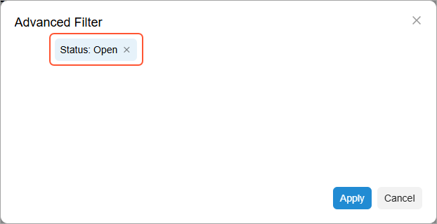
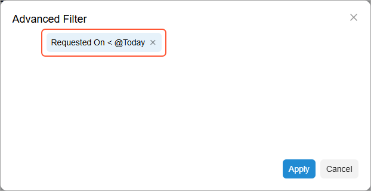
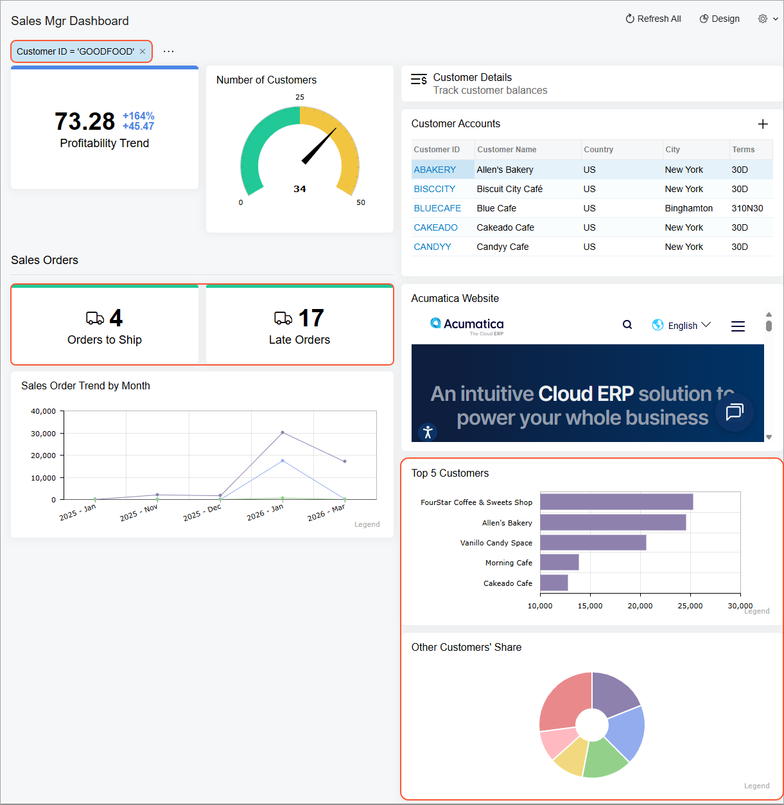

# Specific Widgets: To Filter Widget Data {#_4d3548bf-bffe-49c9-aa8c-9c641ac11ed0 .task}

The following activity will show you how to filter widget data.

## Story { .section}

Suppose that you are Kimberly Gibbs, a technical specialist in your company who is working on simple customizations. A sales manager of your company had previously requested a dashboard named *Sales Mgr Dashboard*, and you created the requested dashboard. After that, the sales manager requested that you add multiple widgets that track different KPIs and trends, and you added the needed widgets.

The sales manager has assessed the data displayed by the widgets and found the following issues:

-   The *Orders to Ship* widget currently counts all orders, regardless of their status, but should count only orders with the *Open* status.
-   The *Top 5 Customers* and *Other Customers' Share* widgets include The Equity Group Investors account, which is tracked by another department and should be excluded.

Also, the sales manager has asked you to add one more scorecard with the number of orders whose requested date is earlier than today—*Late Orders*. Finally, the manager has requested that you add a dashboard parameter to make it possible for the data of the *Orders to Ship* and *Late Orders* widgets to be filtered by customer \(that is, showing only the data of the selected customer if the user makes a selection\).

## Process Overview { .section}

In this activity, you will do the following:

1.  On the [Dashboards](SM_20_86_10.md) \(SM208610\) form, add the **Customer ID** parameter for the *SalesMgrDashboard* dashboard.
2.  On the *Customer Summary \(AR0008DB\)* generic inquiry form, you will add a shared filter to exclude The Equity Group Investors from the list of customers.
3.  On the *Sales Mgr Dashboard*, you will do the following:
    1.  Configure the requested filtering conditions.
    2.  Add the *Late Orders* scorecard by copying the similar widget.
    3.  Apply the shared filter to the widget data.

## System Preparation {#section_g1x_5xn_wrb .section}

Before you start adding the widgets, make sure that the following tasks have been performed:

-   Launch the Acumatica ERP website, and sign in to a tenant with the *U100* dataset preloaded as system administrator Kimberly Gibbs by using the *gibbs* username and the *123* password.

    **Tip:** The *gibbs* user is assigned the *Administrator* role, which has sufficient access rights to manage the system configuration and to modify generic inquiries, advanced filters, pivot tables, and dashboards.

-   You have completed the [Dashboards: To Add a Dashboard](RPT_Administering_Dashboard_Forms_Implem_Activity.md) activity. In this activity, you created the *Sales Mgr Dashboard* dashboard and made sure that a user with the *Administrator* role can populate the dashboard with the widgets.
-   You have completed the [Specific Widgets: To Add Link, Table, and Embedded Page Widgets](RPT_Configuring_Widgets_To_Add_Header_Table_Link_and_Embedded_Page_Widgets_Activity.md) activity.
-   You have completed the [Specific Widgets: To Add KPI Widgets](RPT_Configuring_Widgets_To_Add_KPI_Widgets_Activity.md) activity.
-   You have completed the [Specific Widgets: To Add Chart Widgets](RPT_Configuring_Widgets_To_Add_Chart_Widgets_Activity.md) activity.
-   In the info area at the upper-right corner of the top pane of the Acumatica ERP screen, make sure that the business date is set to *1/30/2026*. If a different date is displayed, click the Business Date menu button and select *1/30/2026* from the calendar. For simplicity, you'll create and process all documents in this activity using this business date.

## Step 1: Adding the Dashboard Parameter { .section}

To add the dashboard parameter for the customer ID to be selected, do the following:

1.  Open the [Dashboards](SM_20_86_10.md) \(SM208610\) form.
2.  In the **Name** box, select *SalesMgrDashboard*.
3.  On the **Parameters** tab, add a new row with the following settings:
    -   **Active**: Selected
    -   **Is Required**: Cleared
    -   **Name**: `CustomerID`
    -   **Schema Object**: *PX.Objects.AR.Customer*
    -   **Schema Field**: *AcctCD*
    -   **Display Name**: `Customer ID`
4.  On the form toolbar, click **Save**.

## Step 2: Adding a Shared Filter { .section}

To add a shared filter, do the following:

1.  Open the Customer Summary \(AR0008DB\) form.
2.  On the table toolbar, click **Filter Settings** to expand the filtering area.
3.  In the filtering area, click the **Add Quick Filter** button.
4.  In the **Add Quick Filter** dialog box, which opens, select *Customer ID*.
5.  Click the **Customer ID** quick filter button, which appears in the filtering area.
6.  On the Quick Filter menu that opens, perform the following actions:
    -   Select the *Does Not Equal* condition.
    -   In the untitled box at the bottom of the menu, enter the customer ID: `EQUGRP`.
    -   Click **Apply**. This closes the menu and applies the filter.
7.  Click **Save Filter** in the filtering area.
8.  In the **Save Filter As** dialog box, which opens, type `Local Customers`, select the **Shared** check box, and click **Save**

    Notice that the **Local Customers** filter has been added to the Filter List drop-down menu of the generic inquiry form.

## Step 3: Configuring the Widget Filter and Using the Dashboard Parameter { .section}

To configure filtering conditions for the *Sales Orders* widget and use the dashboard parameter to filter its data, do the following:

1.  On the main menu, click the **Opportunities** menu item to open the **Opportunities** workspace, and click the *Sales Mgr Dashboard* link. Notice that the **Customer ID** parameter is displayed under the dashboard name.
2.  On the dashboard title bar, click the **Design** button.
3.  On the title bar of the *Orders to Ship* widget, click Edit.
4.  In the **Widget Properties** dialog box, in the **Dashboard Parameters Mapping** section, in the **Customer ID** box, select *Customer*.

    With this condition, if a user selects a customer in the **Customer ID** box, the widget will show the data for the selected customer.

5.  In the **Filter** section, click **Add Condition**.
6.  In the **Advanced Filter** dialog box, which opens, add the following condition \(as shown on the screenshot below\):

    -   **Data Field**: *Status*
    -   **Condition**: *Equals*
    -   **Value 1**: *Open*
    

7.  Click **Apply** to save your changes and close the dialog box.
8.  In the **Widget Properties** dialog box, to which you return, click **Save**.

## Step 4: Adding a Widget by Copying the Similar Widget { .section}

To add a widget, do the following:

1.  While you are still in design mode of the *Sales Mgr Dashboard* dashboard, drag the right border of the *Orders to Ship* widget to the left until the system displays a widget placeholder next to it.
2.  On the title bar of the *Orders to Ship* widget, click the **Copy** button. Notice that **Paste from clipboard** becomes available in the widget placeholders.
3.  In the widget placeholder next to the *Orders to Ship* widget, click **Paste Copied**.
4.  On the title bar of the pasted widget, click Edit.
5.  In the **Widget Properties** dialog box, which opens, type `Late Orders` in the **Caption** box.
6.  In the **Filter** section, click **Conditions** box.
7.  In the **Advanced Filter** dialog box, which opens, remove the copied filter condition and add the following condition \(as shown on the screenshot below\):

    -   **Data Field**: *Requested On*
    -   **Condition**: *Is Less Than*
    -   **Value**: *@Today*
    

8.  Click **Apply** to save your changes and close the dialog box.
9.  Click **Save** to save your changes and close the **Widget Properties** dialog box.

## Step 5: Applying the Shared Filter to the Widget Data { .section}

To apply the shared filter you created for the source inquiry to the widget data, do the following:

1.  While you are still in design mode of the *Sales Mgr Dashboard* dashboard, on the title bar of the *Top 5 Customers* widget, click Edit.
2.  In the **Widget Properties** dialog box, which opens, in the **Shared Filter to Apply** box, select *Local Customers*.
3.  Click **Save** to close the dialog box.
4.  By performing similar actions to those in the previous two instructions, apply the *Local Customers* shared filter to the *Other Customers' Share* widget data.
5.  On the dashboard title bar, click the **Design** button.

You have added the requested dashboard parameter, configured filter settings for the widgets and added one more scorecard widget. Now you can select a customer account in the **Customer ID** box and notice that the system changes the numbers on the *Orders to Ship* and *Late Orders* scorecards. \(See the following screenshot.\)

**Parent topic:**[Configuring Widgets](../UserGuide/RPT_Configuring_Widgets_Mapref.md)

