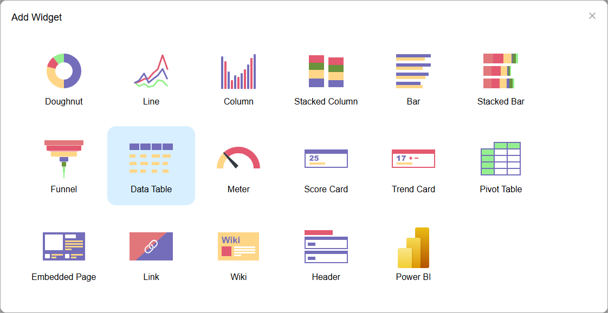
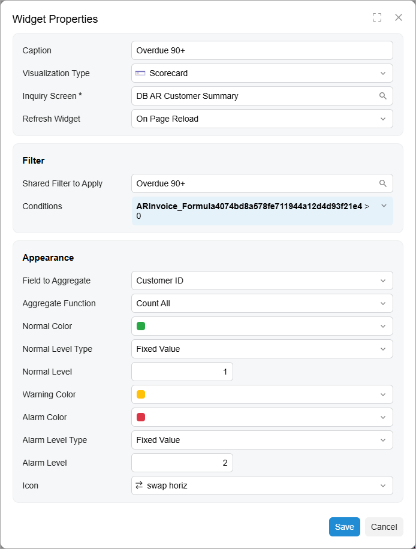
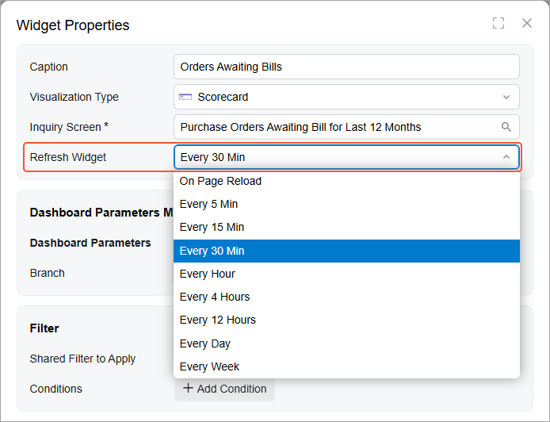
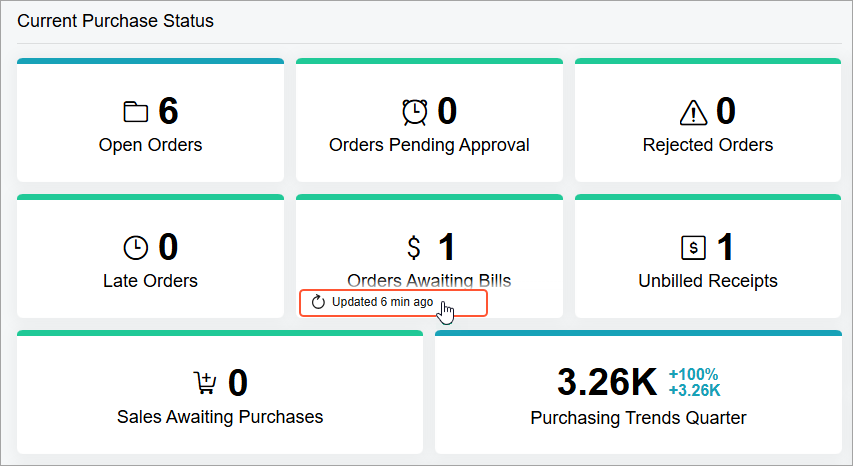

# Widget Settings: General Information {#_ddb3fa94-b2de-4248-94ea-c998b47f5581 .concept}

Acumatica ERP dashboards support various types of widgets, which have drill-down capabilities. By using the drill-down capabilities, you can navigate directly from a dashboard widget to the source of the data you are viewing, so that you can learn more about the data that is highlighted on the dashboard and take actions on it. This data might be, for example, key customers’ details for the past 12 months or the number of projects that will be closed within 30 days.

## Learning Objectives { .section}

In this chapter, you will learn how to do the following:

-   Recognize the types of widgets and their main features
-   Configure different types of widgets
-   Filter the data that is used for a widget

## Applicable Scenario { .section}

You need to configure widgets when you are designing a new dashboard or modifying an existing one that requires changed or added widgets. Every widget type has a different appearance and serves a specific purpose.

## Widget Type Selection { .section}

When you click **New Widget** in a widget placeholder, the system opens the **Add Widget** dialog box where you select the desired widget type \(see the following screenshot\). The system opens the **Widget Properties** dialog box, whose elements you use to configure the settings of the widget.

## Widget Properties {#section_j2k_kq3_4fc .section}

In the Modern UI, you’ll find widget configuration streamlined and more intuitive than it was in the Classic UI. You can define the widget’s settings, set up filters, and adjust layout options in a single dialog box. Also, you can see filter conditions without extra clicks and find settings easily.

The **Widget Properties** dialog box has slightly different settings based on the type of widget you're creating. Below you can see the dialog box for a widget for a scorecard.

The Modern UI’s approach to parameter mapping gives you greater control and flexibility. You can:

-   Map a widget filter directly to a field or GI parameter
-   Specify conditions at the dashboard level instead of within individual widgets
-   Save multiple filters for possible reuse and switch between them as needed
-   Modify conditions quickly without reconfiguring widgets

## Caption { .section}

For all widget types, the **Caption** box, in which you specify the widget title, appears in the **Widget Properties** dialog box.

## Caching of Dashboard Widgets { .section}

When a dashboard with many widgets is refreshed or opened, it may take certain time to load data for all widgets. Dashboard widgets can display information that is updated very frequently \(such as every five minutes\) or very rarely \(such as once a week\). When you design the dashboard, you can manage the interval at which the system refreshes data for each widget.

You can specify the interval at which the system refreshes data \(see the following screenshot\) or you can switch off caching by using the **Refresh Data** box of the **Widget Properties** dialog box for any type of widget.

After you specify the refresh interval for a widget, the system loads the widget data from the database and caches the data when a user opens the dashboard with the widget for the first time. When the dashboard is reopened or the dashboard page is refreshed by the user, the system displays the data in the widget from the cache \(that is, it does not load the data from the database\) if the data was updated a shorter time ago than the interval specified in the **Refresh Data** box.

To switch off caching for a particular widget and make the system update the widget's data each time a dashboard is opened or refreshed, the dashboard designer should select *On Page Reload* in the **Refresh Data** box for the widget.

A user can view information about how much time has passed since the last update of a widget’s data in the pop-up toolbar that appears when the user points to the widget \(as shown in the following screenshot\). The user can manually update the widget data by clicking **Update** on this toolbar.

**Parent topic:**[Configuring Widgets](../UserGuide/RPT_Configuring_Widgets_Mapref.md)

