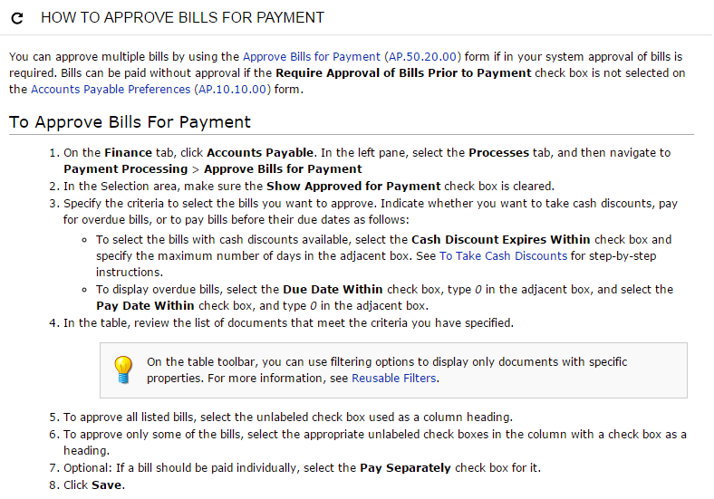

# Specific Widgets: Wiki Page Widgets {#_4247a685-6e3f-42dc-9ea5-420d93908fdd .concept}

A wiki page widget is a dashboard view of a wiki topic, generally one that you need to refer to frequently. You can add to a dashboard any wiki topics that you consider useful. These topics can contain information—such as policy and procedure documents, plans, and task lists—shared within project teams, within or between departments, or with external users. For more information about Acumatica ERP wiki concepts, see [Wiki Overview](SM__con_Wiki_Management.md) in the Acumatica ERP System Administration Guide.

When adding a wiki topic to a dashboard, you need to select the wiki page and specify the widget name. For a detailed description of the wiki page widget properties, see [Add Widget Dialog Box for Wiki Page Widgets](DB__ref_Article.md) in the Acumatica ERP Getting Started Guide.

See the screenshot below for an example of a help article widget.

By using a wiki page widget, you can open the source help article and update the widget view.

For the step-by-step procedure on how to add a wiki page to a dashboard, see [Specific Widgets: To Add a Wiki Page Widget](DB__how_Adding_an_Article.md) in the Acumatica ERP Getting Started Guide.

**Parent topic:**[Configuring Widgets](../UserGuide/RPT_Configuring_Widgets_Mapref.md)

