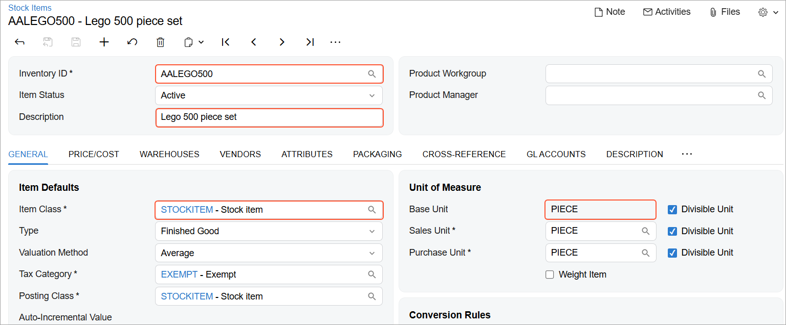
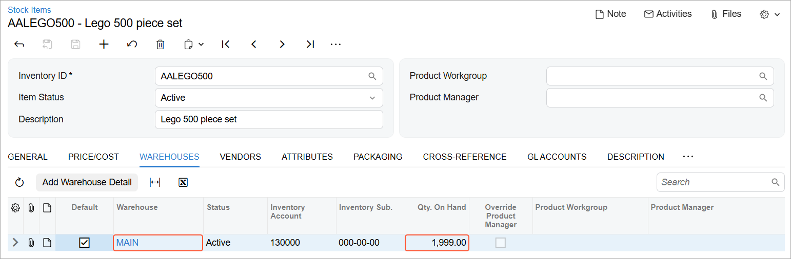

# DAC-Based OData: To Filter the Requested Data {#_68d9bf5b-592a-4c85-ba66-f6493eb82cc8 .task}

This activity will walk you through the process of filtering the requested data through the DAC-based OData interface.

## Story { .section}

The business intelligence \(BI\) application of the MyStore company should display information about the items that are sold in the store. These items are entered and updated on the [Stock Items](IN_20_25_00.md) \(IN202500\) form in Acumatica ERP.

Suppose that you already have a list of items with the necessary information, and now you need to retrieve only the changes to the items that have been made during the past day. By obtaining only these changes, you optimize the performance of the request. To display the list of modified items to a user, you will export the list of stock items that satisfy the specified conditions from Acumatica ERP. You will export the stock item records that have the *Active* status and that were modified within the past day.

## Process Overview { .section}

You will modify two stock item records in Acumatica ERP and make one of them inactive. You will then research the needed fields on the [Stock Items](IN_20_25_00.md) \(IN202500\) form, and retrieve the data by using the DAC-based OData interface. Because you need to filter the results of the inquiry to obtain only the active records that were modified within the past day, you will use the *$filter* parameter.

## System Preparation { .section}

Before you begin performing the steps of this activity, do the following:

1.  Deploy an instance of Acumatica ERP with the *MyStoreInstance* name and a tenant that has the *MyStore* name and contains the *T100* data.
2.  Make sure the Postman application is installed on your computer. To download and install Postman, follow the instructions on [https://www.postman.com/downloads/](https://www.postman.com/downloads/).
3.  Complete the following prerequisite activity: [DAC-Based OData: To Sign In to Acumatica ERP and Retrieve the Metadata](../Shared/../UserGuide/RPT_DAC_OData_SignIn_Activity.md).
4.  If you have created a Postman collection with the basic authentication configured, add a new request to the collection and configure the request to inherit the authorization type from the parent collection.

## Step 1: Modifying Records { .section}

In this step, you will modify stock items so that you have at least one stock item record modified within the past day.

**Tip:** If you use the Postman collection that is provided with this course, the pre-request script modifies the inventory items as the following instructions do.

On the [Stock Items](../Shared/../UserGuide/IN_20_25_00.md) \(IN202500\) form, do the following:

1.  Open the *KEYBOARD* inventory item. Change its status to *Inactive* and save the record.
2.  Open the *AALEGO500* inventory item. Change its description and notice that it has the *Active* status; save the record.

Now you have at least two inventory items that have been modified within the past month, and one of them has *Active* status.

The system tracks the last modified date for every record, but this date is not displayed on the [Stock Items](../Shared/../UserGuide/IN_20_25_00.md) form. In the system, a preconfigured generic inquiry shows the dates when stock items were last modified. To view this generic inquiry, on the [Generic Inquiry](../Shared/../UserGuide/SM_20_80_00.md) \(SM208000\) form, you can select the inquiry with the title *Stock Items: Last Modified Date*, and click **View Inquiry** on the form toolbar.

## Step 2: Researching the Needed Fields { .section}

For a stock item record entered and maintained on the [Stock Items](../Shared/../UserGuide/IN_20_25_00.md) \(IN202500\) form, you need to export the following values:

-   The inventory ID
-   The description of the item
-   The item class assigned to the item in Acumatica ERP
-   The base unit of measure
-   The date and time the record was last modified \(for which there are no corresponding elements on the form\)
-   The following information about the availability of the item in particular warehouses:
    -   The warehouse ID
    -   The quantity of the item available in the warehouse

The elements that are available on the form are shown in the following screenshots.





You will use the following DAC fields and navigation properties of the [PX.Objects.IN.InventoryItem](https://help.acumatica.com/dacBrowser/PX.Objects.IN/InventoryItem) DAC to retrieve this information about a stock item:

-   The InventoryCD \(the stock item identifier\), Descr \(a description of the stock item\), ItemStatus \(the status of the stock item\), LastModifiedDateTime \(the date and time of the last modification\), and BaseUnit \(the base unit\) fields
-   The INSiteByDfltSiteID navigation property and the SiteCD field \(the default warehouse\)
-   The INItemClassByItemClassID navigation property and the ItemClassCD field \(the item class\)
-   The INSiteStatusCollection navigation property and the QtyOnHand field \(the quantity on hand in each warehouse\)

## Step 3: Retrieving the List of Modified Stock Items { .section}

To narrow the list of stock items, you will specify the following conditions in the request:

-   The StkItem value is *true*
-   The ItemStatus value is *AC*
-   The LastModifiedDateTime date value is equal to today's date

To retrieve the list of modified stock items, do the following:

1.  In the Postman collection, add a request with the following settings:
    -   HTTP method: `GET`
    -   URL: *http://localhost/MyStoreInstance/t/MyStore/api/odata/dac/PX\_Objects\_IN\_InventoryItem*
    -   Parameters:

        |Parameter|Value|
        |---------|-----|
        |*$select*|`InventoryCD,Descr,ItemStatus,LastModifiedDateTime,BaseUnit`|
        |*$expand*|        ```
INSiteByDfltSiteID($select=SiteCD),
INItemClassByItemClassID($select=ItemClassCD),
INSiteStatusCollection($select=QtyOnHand)
        ```

|
        |*$filter*|        ```
StkItem eq true and ItemStatus eq 'AC' and
LastModifiedDateTime eq 2025-12-01
        ```

 Specify today's date instead of `2025-12-01`.

 **Tip:** If you use the Postman collection that is provided with this course, the pre-request script specifies the today's date in the request.

|

2.  Send the request. The response of the successful request contains the `200 OK` status code. The following code shows an example of the response body.

    ```language-json
    {
        "@odata.context":
         "http://localhost/MyStoreInstance/t/MyStore/api/odata/dac/$metadata
         #PX_Objects_IN_InventoryItem(
         InventoryCD,Descr,ItemStatus,LastModifiedDateTime,BaseUnit,
         INSiteByDfltSiteID(SiteCD),INItemClassByItemClassID(ItemClassCD),
         INSiteStatusCollection(QtyOnHand))",
        "value": [
            {
                "InventoryCD": "AALEGO500 ",
                "Descr": "Lego 500 piece set",
                "ItemStatus": "AC",
                "LastModifiedDateTime": "2025-12-01T12:34:56+03:00",
                "BaseUnit": "PIECE",
                "INSiteByDfltSiteID": {
                    "SiteCD": "MAIN      "
                },
                "INItemClassByItemClassID": {
                    "ItemClassCD": "STOCKITEM "
                },
                "INSiteStatusCollection": [
                    {
                        "QtyOnHand": 1999.000000
                    }
                ]
            }
        ]
    }
    ```

3.  Save the request.

**Parent topic:**[Accessing DACs Through OData](../UserGuide/RPT_DAC_OData_Mapref.md)

