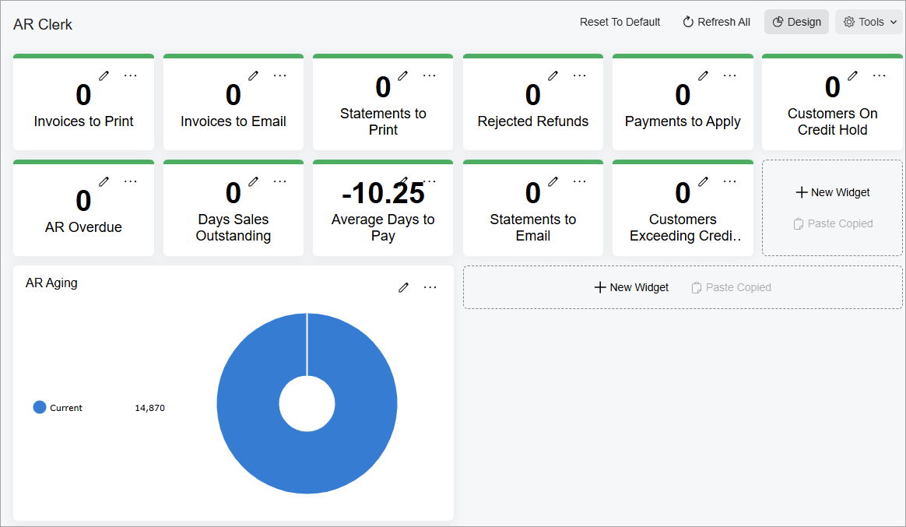
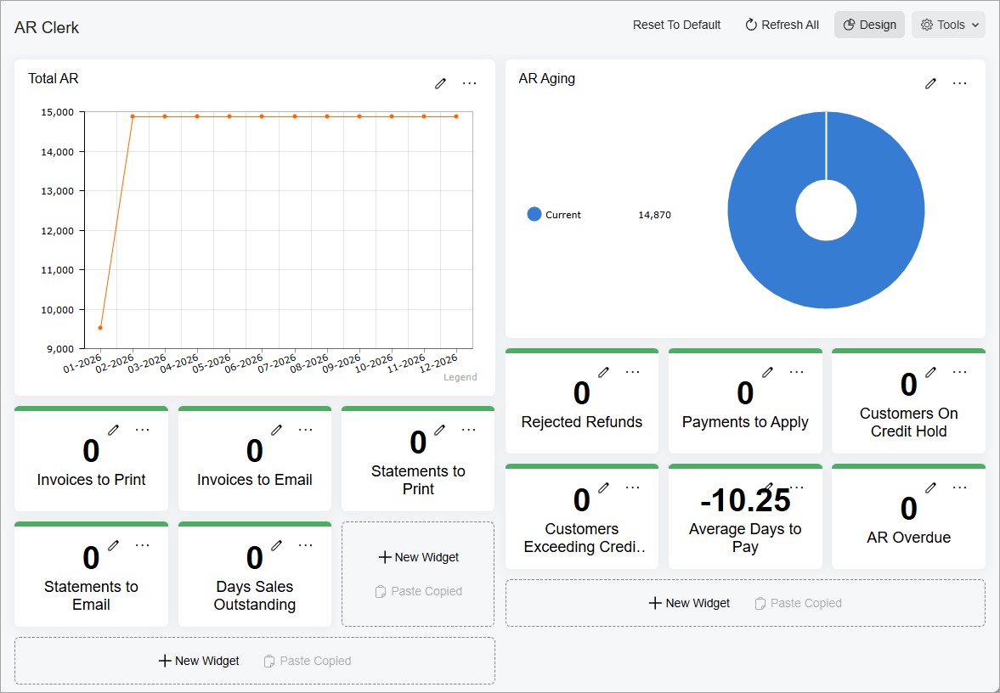
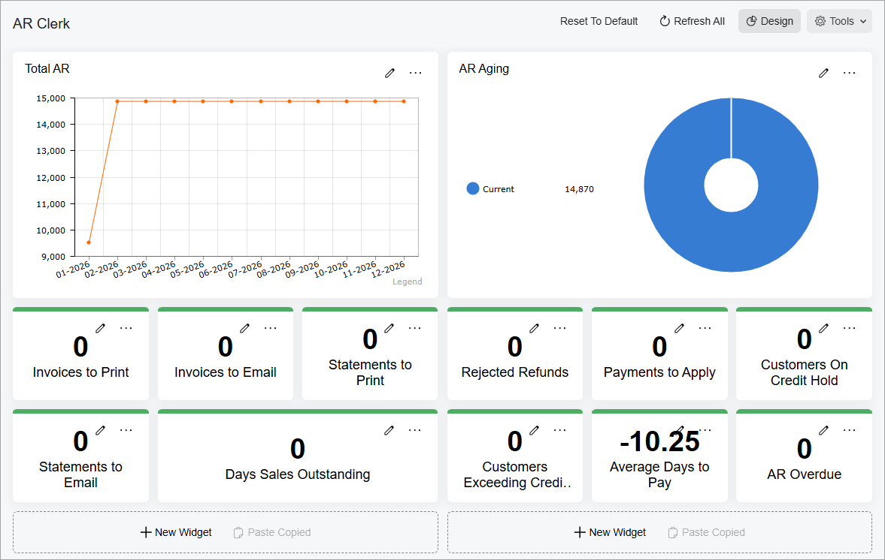

# Dashboard Design: To Modify a Dashboard {#_afe2eeb1-ade0-4aa1-9f92-bca77f099c54 .task}

The following activity will show you how to modify your copy of an Acumatica ERP dashboard.

**Attention:** This activity is based on the *U100* dataset. If you are using another dataset or if any system settings have been changed in *U100*, these changes can affect the workflow of the activity and the results of the processing. To avoid issues, restore the *U100* dataset to its initial state.

## Story { .section}

Suppose that you are Gladys Peters, a new manager of the SweetLife Fruits &amp; Jams company workshop. You have been using the predefined *AR Clerk* dashboard to stay informed about accounts receivable. However this dashboard displays too many parameters and you need to adjust it to your liking.

## Process Overview { .section}

In this activity, you will do the following:

1.  Switch on design mode for the predefined dashboard
2.  Remove widgets from the dashboard
3.  Rearrange widgets on the dashboard
4.  Resize widgets
5.  Specify the dashboard as your Acumatica ERP home page

## System Preparation { .section}

Before you start modifying the dashboard, launch the Acumatica ERP website, and sign in to a tenant with the *U100* dataset preloaded as workshop manager Gladys Peters with the *peters* username and the *123* password.

## Step 1: Switching On Design Mode for the Predefined Dashboard { .section}

Suppose that you need to save a copy of the dashboard and switch to design mode so that you can modify it for your personal use.

To switch on design mode for the dashboard, do the following:

1.  Open the **Dashboards** workspace.

    **Tip:** If the **Dashboards** menu item is not on the main menu, click the **More Items** menu item and then click the **Dashboards** tile.

2.  In the **Dashboard: Finance** category, click *AR Clerk*. The *AR Clerk* dashboard opens.
3.  On the dashboard title bar, click the **Create User Copy** button. The system creates your personal copy of the dashboard. Notice that the **Design** button has appeared on the dashboard title bar.

    **Attention:** You can see the **Create User Copy** button on the dashboard title bar before you switch on design mode for a dashboard for the first time. Once you have created your copy of the dashboard, the **Design** button is displayed on the dashboard title bar.

4.  Click the **Design** button. You have switched the dashboard to design mode.
5.  Click the **Design** button again to switch to view mode for the dashboard.

## Step 2: Removing Widgets from the Dashboard { .section}

Suppose that in your copy of the *AR Clerk* dashboard, you do not need the following widgets, which are related to documents and cash inflow: *Documents on Hold*, *Unreleased Documents in Prior Months*, *Documents to Release* and two *Cash Inflow for 7 Days* widgets. Also you do not need to view the *Overdue by Salesperson* and *Top 10 Overdue Balances* charts.

To remove these widgets from the dashboard, do the following:

1.  While you are still viewing the *AR Clerk* dashboard in view mode, click the **Design** button on the dashboard title bar to switch on design mode for the dashboard.
2.  On the widget title bar of the *Documents on Hold* widget, click the **Remove** button \(\) which is located at the right of the widget.
3.  In the warning dialog box that opens click **OK**. The widget is removed from the dashboard, and the remaining widgets are automatically rearranged.
4.  By performing similar actions to those in the previous two instructions, delete the following widgets from your dashboard:

    -   *Unreleased Documents in Prior Months*
    -   *Documents to Release*
    -   Both *Cash Inflow for 7 Days* widgets
    -   *Overdue by Salesperson*
    -   *Top 10 Overdue Balances*
    You can see the modified dashboard in the following screenshot.

    

5.  On the dashboard title bar, click the **Design** button to switch to view mode for the dashboard.

## Step 3: Rearranging Widgets on the Dashboard { .section}

Suppose that you want to move the *Total AR* widget to the upper-left part of the dashboard, and move the *AR Aging* widget to the upper-right part of the dashboard. Also, you want to move the *AR Overdue* and *Average Days to Pay* widgets to the right working area, and place the *Statements to Email* widget next to the *Statements to Print* one.

To rearrange the widgets on the dashboard, do the following:

1.  While you are still viewing the *AR Clerk* dashboard in view mode, click the **Design** button on the dashboard title bar to switch on design mode.
2.  Drag the *Total AR* widget to the upper-left part of the dashboard.
3.  Drag the *AR Aging* widget to the upper-right part of the dashboard.
4.  Drag the *AR Overdue* and *Average Days to Pay* widgets, one by one, to the right working area.
5.  Drag the *Statements to Email* widget to the widget placeholder next to the *Statements to Print* widget.

You can see the modified dashboard in the following screenshot.

## Step 4: Resizing Widgets { .section}

Suppose that you want to resize the *Total AR* widget, so that it had the same height as the *AR Aging* widget. Also, you want to make the *Days Sales Outstanding* widget wider, so that the left working area had no empty gaps.

To resize these widgets, do the following:

1.  While you are still viewing the *AR Clerk* dashboard in design mode, in the left working area, drag the bottom right corner of the *Total AR* widget upwards to make its height the same as the height of the *AR Aging* widget.
2.  Drag the right border of the *Days Sales Outstanding* to the right until it occupies the gap in left working area.

    You can see the modified dashboard in the following screenshot.

    **Tip:** The width of the widgets and number of available widget placeholders depend on the size of your browser window. You may need to resize other widgets as well to get the same arrangement.

    

3.  On the dashboard title bar, click the **Design** button to switch to view mode for the dashboard.

## Step 5: Defining the Dashboard as Your Acumatica ERP Home Page { .section}

To make your modified *AR Clerk* dashboard your home page in Acumatica ERP, do the following:

1.  In the top pane, click the User menu button \(where your username appears\), and on the User menu, click **My Profile**. The [User Profile](SM_20_30_10.md) \(SM203010\) form opens.
2.  On the **General Info** tab \(**Personal Settings** section\), in the **Home Page** box, click the magnifier button to open the lookup table.
3.  In the Search box of the lookup table, type `ar clerk` to search for the *AR Clerk* dashboard.
4.  In the **Title** column, double-click the *AR Clerk* entry, which has *DBAR0001* in the **Screen ID** column. This selects the value, closes the lookup table, and fills in the **Home Page** box.
5.  On the form toolbar, click **Save** to save your changes.
6.  In the upper left corner of the Acumatica ERP screen, click the Home button to make sure that the *AR Clerk* dashboard, which you have defined as your home page, opens.

**Parent topic:**[Designing Dashboard Contents](../UserGuide/RPT_Designing_Dashboard_Contents_Mapref.md)

