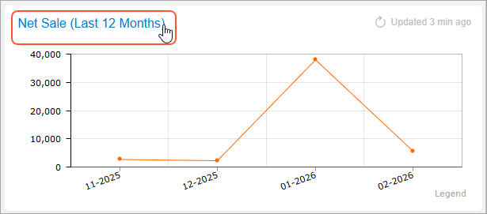
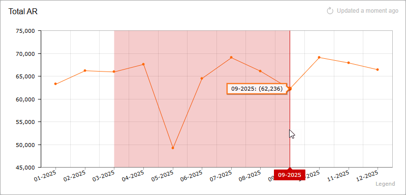
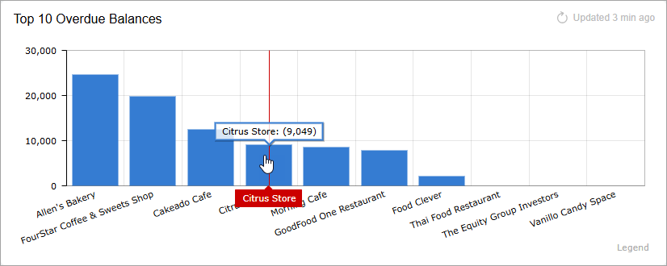
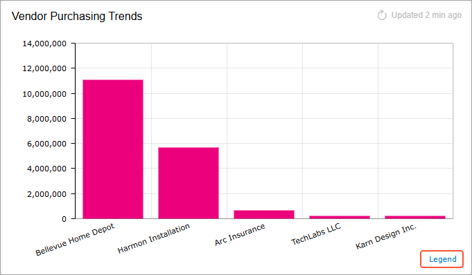
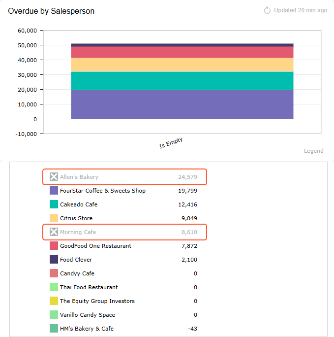
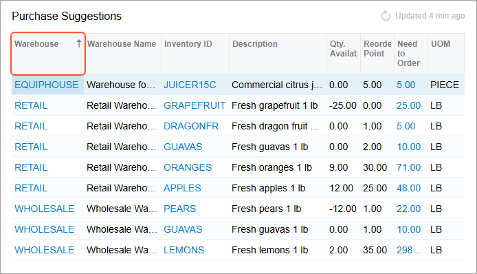

# Dashboard Design: User Operations with Data {#_2398fd31-1b6a-40d1-894e-c9a8b63f0cac .concept}

Acumatica ERP dashboards support various types of widgets, which have drill-down capabilities. By using the drill-down capabilities, a user can navigate directly from a dashboard widget to the source of the data they are viewing, so that the user can learn more about and take actions based on the data that is highlighted on the dashboard.

For better dashboard design, you should understand how users can work with data on a dashboard.

## Drilling Down to the Source Data { .section}

To drill down to the source data of a widget, a user simply clicks the widget or the widget title \(see the following screenshot\), and the system opens in a new browser tab the generic inquiry form that is specified as the source of the widget data.

In a chart widget, the user can click a particular data point in the chart area, and the system opens the generic inquiry form with its results filtered according to the selected value. For example, suppose that in a doughnut chart that shows the number of opportunities generated by a source, the user clicks the sector that represents the number of opportunities generated by campaigns. In a new tab, the system opens the list of opportunities that have a campaign specified as the source.

## Updating Information on Widgets { .section}

A user can refresh the information on a particular widget by clicking **Update**, which is displayed on the widget title bar when the user hovers over the widget.

## Zooming In on a Chart Region { .section}

To zoom in on a chart region, a user drags the pointer to create a selection around the area where the user wants to zoom in \(see the following screenshot\). The system zooms in on the selected area when the user releases the pointer.

To zoom out, the user clicks **Update** right of the chart title.

## Viewing Details on a Chart { .section}

In a chart widget, a user can point to the desired legend item to view its details on the chart \(see the following screenshot\). If the legend of the chart is visible, the system duplicates the values of the selected point in the legend.

## Viewing the Legend of a Chart { .section}

If a chart legend has multiple entries or if entry names are quite long, the user will find the layout less distracting if you display the legend on demand in a pop-up box. If the legend is configured in this way for a chart, the system displays a legend label in the right bottom corner of the chart \(see the following screenshot\).

The user can click the label to view the legend.

## Excluding Data from a Chart { .section}

In the legend, a user can click a legend item to exclude the associated series from the chart \(see the following screenshot\).

For the doughnut and funnel widget types, the system proportionally distributes the share of the excluded sector among the remaining sectors on the chart.

## Sorting Data in a Table {#section_urf_bwf_5qb .section}

In a table widget, a user can sort data by a column in ascending or descending order. The user clicks the header of a column by which data in the table should be sorted. The system displays the sorting direction in the column header \(see the following screenshot\). To change the direction, the user clicks the header again. When the user clicks the header for the third time, the system clears the applied sorting and does not display the sorting direction.

**Parent topic:**[Designing Dashboard Contents](../UserGuide/RPT_Designing_Dashboard_Contents_Mapref.md)

