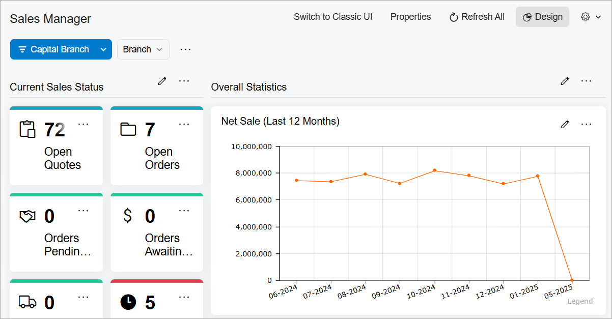
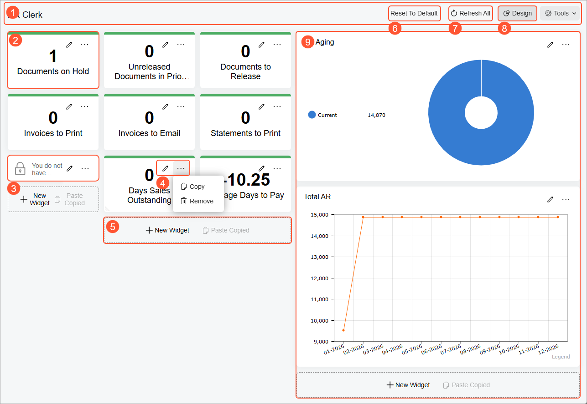
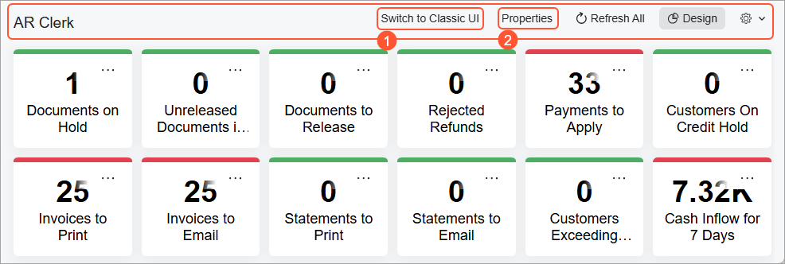

# Dashboard Design: General Information {#_e3c52cc1-556d-40d8-ac95-da223eccee32 .concept}

An Acumatica ERP dashboard is a type of form that an administrative user can design to present relevant data in engaging ways.

With dashboards, you can monitor current financial, operational, and organizational information of your company, and analyze real-time trends that relate to your job. On dashboards, different types of information can be displayed in various presentation forms—such as text, charts, graphs, and tables—depending on your preferences and the specific type of data you want to see.

## Learning Objectives { .section}

In this chapter, you will learn how to do the following:

-   Identify the basic elements of an Acumatica ERP dashboard and their functions
-   Become familiar with the basic steps of designing a dashboard
-   Modify your copy of a dashboard
-   Define a dashboard as your home page
-   Reset a dashboard

## Applicable Scenarios { .section}

If you are responsible for tailoring Acumatica ERP to meet users' needs in your company, you may need to design a dashboard from scratch or modify a copy of a predefined dashboard in the following cases:

-   Your company’s managers need to monitor the company's overall health. The best way to monitor all the key performance indicators \(KPIs\) and data points is to have a dashboard with the relevant information.
-   The management of your company has set goals for each department, and the department managers need to track the progress toward these goals by monitoring key indicators and task completion.
-   Employees of your company are using dashboards as a home page for performing their duties.

## Preparation for Dashboard Design { .section}

Before you start designing a dashboard, you should decide what metrics users should be able to track by using the dashboard. When you decide on the metrics, you need to work on the data collection to gauge the metrics.

In Acumatica ERP, most types of widgets are based on data from generic inquiries. A generic inquiry is a user-definable tool—generally created by a developer, customizer, or system administrator—that collects data from the system database and displays the query results on an Acumatica ERP form. The system provides a number of predefined generic inquiries to meet most needs. You can modify copies of these generic inquiries if needed or build your own generic inquiries from the ground up.

**Tip:** To create widgets based on a generic inquiry, you need to have at least *View Only* access rights to the [Generic Inquiry](SM_20_80_00.md) \(SM208000\) form.

With the data sources prepared, you need to plan how many widgets and which types you will add to the dashboard.

## Dashboard Modes { .section}

In Acumatica ERP, a dashboard can be displayed in view or design mode. When you open a dashboard, it is displayed in view mode.

To modify a dashboard, you switch to design mode by clicking the **Design** button on the dashboard title bar. The button appears if your user account has the owner role for the dashboard on the [Dashboards](SM_20_86_10.md) \(SM208610\) form—that is, the role selected in the **Owner Role** box on this form.

If your user account does not have the role assigned and the owner of the dashboard has allowed its personalization, you can create a copy of it by clicking the **Create User Copy** button on the dashboard title bar. \(This button is displayed if the **Allow Users to Personalize** check box is selected on the [Dashboards](SM_20_86_10.md) form for the dashboard.\) Once you have created your copy of the dashboard, the **Design** button is displayed on the dashboard title bar instead of **Create User Copy**. You click **Design** to switch on design mode for the dashboard.

## Simplified Design Mode in Modern UI {#section_kxh_dq3_4fc .section}

In the Modern UI, you can create and modify dashboards efficiently, thanks to the responsive, clean design mode \(shown below\). It’s more responsive and visually cleaner.

The grid used to place widgets on a dashboard has been designed to ease dashboard design. You can move widgets effortlessly—they’ll snap into proper alignment without needing manual adjustments.

## Basic Elements of a Dashboard in Design Mode { .section}

When a dashboard is in design mode, it has the basic elements shown in the following screenshot.

The dashboard has the following elements, whose numbers correspond to those in the screenshot:

1.  The dashboard title bar, which you can use to click the needed actions and add the needed dashboard to your favorites.
2.  A widget in design mode.
3.  A widget with unavailable data. You can view the data in the widget if you have access rights to view the form the widget is based on. This is true of both view mode and design mode.
4.  A title bar of a widget, with buttons you can click to paste a copied widget by using the clipboard, edit the widget, or delete it.
5.  A widget placeholder. You can add a new widget, copy and paste an existing widget from the clipboard \(from this dashboard or another dashboard\), or replace this UI element with an existing widget by dragging the widget.
6.  The **Reset to Default** button. This button is displayed if your copy of the dashboard differs from the original dashboard. You click the button to cancel all your changes to the dashboard and restore the default dashboard and settings.
7.  The **Refresh All** button. You click this button to update the information in all the widgets on the dashboard.
8.  The **Design** button. You click this button to switch between design and view modes for the dashboard.
9.  A working area, which is the major part of the dashboard. The number and placement of working areas determines the overall appearance of the dashboard and depends on the dashboard layout \(for details, see [Dashboard Design: Widget Arrangement](RPT_Designing_Dashboard_Contents_Widget_Arrangement_Concept.md)\).

## The Dashboard Title Bar for an Administrative User { .section}

An administrative user can view additional buttons on the dashboard title bar if their user account is assigned both of the following roles:

-   A role with access to the [Dashboards](SM_20_86_10.md) \(SM208610\) form
-   The dashboard owner role for the dashboard

The following screenshot shows an example of the dashboard title bar for an administrator.

You can see the following buttons \(with the numbers corresponding to those in the screenshot\), which are not shown for users:

1.  The **Switch to Classic UI** or **Switch to Modern UI** button. You click this button to switch between the Modern UI and the Classic UI version of the dashboard.
2.  The **Properties** button. You click this button to open the [Dashboards](SM_20_86_10.md) form for the current dashboard.

## Types of Widgets { .section}

A widget is a dashboard component that provides a particular type of information, such as a real-time data view or wiki article.

You can add to a dashboard various types of widgets. In the **Add Widget** dialog box, you can click one of the following widget types:

-   **Chart**: A graphical representation of data from an Acumatica ERP form. You can use charts of the following types:
    -   **Doughnut**
    -   **Line**
    -   **Column**
    -   **Stacked Column**
    -   **Bar**
    -   **Stacked Bar**
    -   **Funnel**
-   **Data Table**: A systematic display of data from an Acumatica ERP form, with data arranged into rows and columns.
-   **Meter**: A statistical record that tracks progress or achievement toward a specific performance indicator by displaying key parameters relevant to your organization's business processes. Data appears as a gauge with normal, warning, and alarm levels.
-   **Score Card**: A statistical record showing a single performance parameter.
-   **Trend Card**: A statistical record showing parameters whose dynamic change is important to the business processes of your organization.
-   **Pivot Table**: A data table organized to filter, sort, count, total, or give the average of data from an Acumatica ERP inquiry, displaying the summarized results in a separate table.
-   **Embedded Page**: A document or an image that is stored on an external resource, such as cloud storage.
-   **Link**: A link to an Acumatica ERP form, report, or dashboard.
-   **Wiki**: A reference topic, procedure, business plan, or other content that is frequently consulted by Acumatica ERP users.
-   **Header**: A title that can be added to the widget section.
-   **Power BI**: A chart, scorecard, or other analytical information that is represented on a Power BI dashboard designed by your organization.

## Actions with Widgets on Dashboards {#section_jxl_bz4_q4b .section}

In design mode of a dashboard, you can perform the following actions:

-   Add a new widget: Click **New Widget** in a widget placeholder.
-   Move an existing widget to a new position: Drag the widget from its current position to a new position on the dashboard.
-   Resize an existing widget: Hover the mouse cursor over the widget and drag the widget border to the desired width or height.
-   Copy and paste an existing widget: Click **Copy** on the widget title bar and then click **Paste Copied** in a widget placeholder. You can copy and paste widgets within the same dashboard or from one dashboard to another. The clipboard clears when the user session ends.
-   Change widget properties: Click **Edit** on the title bar of the widget.
-   Delete a widget: Click **Remove** on the title bar of the widget.

**Parent topic:**[Designing Dashboard Contents](../UserGuide/RPT_Designing_Dashboard_Contents_Mapref.md)

