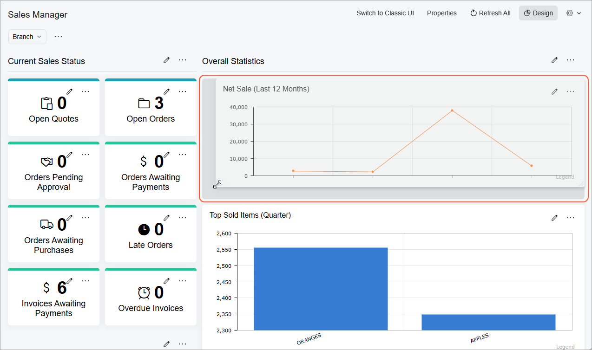
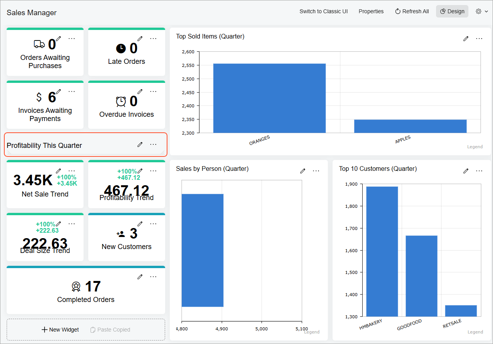

# Dashboard Design: Widget Arrangement {#_3b13ef44-4e01-4106-a129-bdee705a92bf .concept}

Best practices in dashboard design involve more than just good metrics and well-thought-out charts. The next step is the placement of charts on a dashboard. If your dashboard is well organized, users will easily find the information they need. Poor layout forces users to think more before they grasp the key points. The general rule is that key information should be displayed first—at the top of the screen, in the upper left corner.

You should also group the charts by theme with comparable metrics placed next to each other. This way, users do not have to change gears while looking at the dashboard by, for example, jumping from sales data to marketing data, and then back to sales data.

In most situations, we recommend using no more than 10 widgets, so that users can understand the data quickly and easily. On some dashboards, however, you may want to use more widgets so that users have immediate access to a variety of different information.

## Widget Arrangement { .section}

In design mode, you can add widgets to a working area of the dashboard. Widgets can be organized in rows or columns within the working area. The system does not allow an empty space between widgets in a row or a column within a working area. You add widgets one at a time from left to right or from top to bottom.

To move an existing widget to a new position, drag it from its current position to a new position.

To resize an existing widget, hover the mouse cursor over the widget and drag its border to the desired width or height \(as shown below\).

To visually separate groups of widgets, you can use the header widget. Header widget can help you to group the widgets by theme \(see below\). This also gives you the ability to simplify chart titles.

**Parent topic:**[Designing Dashboard Contents](../UserGuide/RPT_Designing_Dashboard_Contents_Mapref.md)

