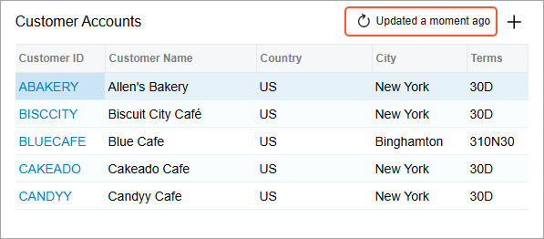
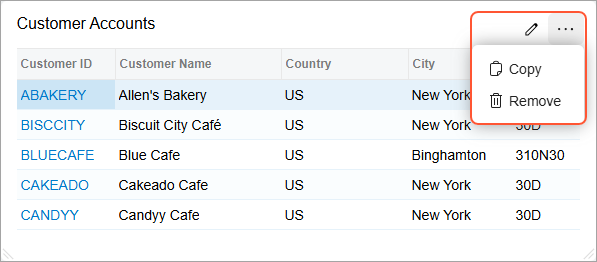
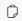
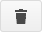

# Dashboard Design: Widget Toolbar Reference {#_f2937b6f-c596-44f8-a856-2a5d4d69acce .reference}

The widget toolbar is located at the top of each widget. The widget toolbar actions that are available to you depend on the mode in which you are working with the dashboard \(view or design\) and on the widget type. In view mode, you can update the widget. See the following screenshot for an example of a table widget in view mode.

In design mode, shown in the following screenshot, you can copy and delete the widget and edit its properties.

You can switch to design mode only if you have the rights to modify the dashboard on which the widget is added—that is, only of you see the **Design** button on the dashboard toolbar.

The widget toolbar includes only standard buttons, which are described in the following section.

## Standard Widget Toolbar Buttons { .section}

The following table provides descriptions of the standard buttons of the widget toolbar.

|Button|Icon|Description|
|:-----|:---:|-----------|
|**Update**||Updates the widget view.|
|**Edit**||Opens the appropriate version of the **Widget Properties** dialog box.|
|**Copy**||Copies the widget.|
|**Remove**||Deletes the widget from the dashboard.|

**Parent topic:**[Designing Dashboard Contents](../UserGuide/RPT_Designing_Dashboard_Contents_Mapref.md)

