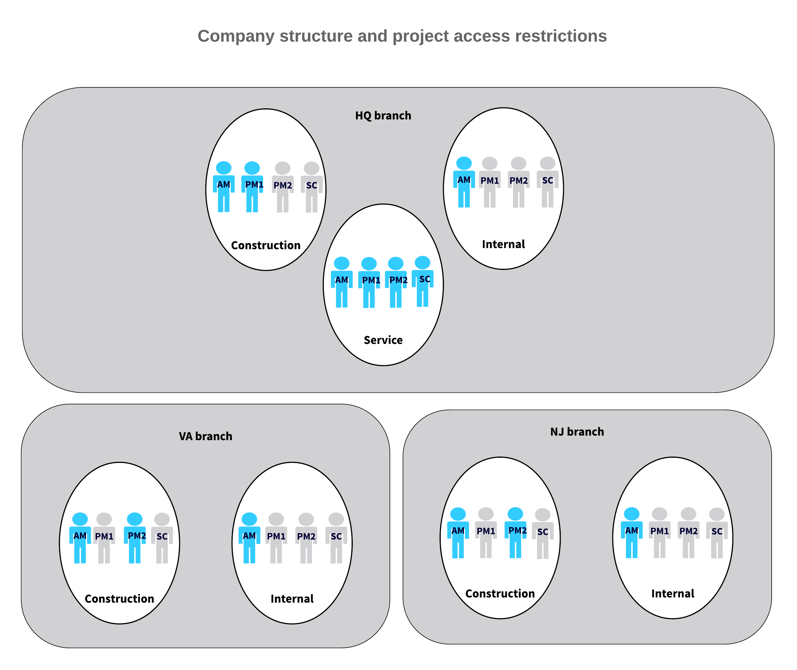

# Project Security {#_acb29e28-bbd7-4e7d-8f1d-984b580e47a8 .concept}

Many organizations use projects to achieve their business objectives efficiently. An organization may have multiple projects in progress at a given time. By limiting users' access to and visibility of information about particular projects and related transactions, managers can properly organize the work on each project. In Acumatica ERP, you can use roles to provide access to forms based on employees' responsibilities and restriction groups and to limit the visibility of particular projects to only the responsible team, as described in this topic.

**Tip:** In Acumatica ERP, you can configure groups with direct and inverse restriction. In this topic, for simplicity, groups with direct restriction are used in examples. You can use inverse restriction groups in the same way as you use direct restriction groups. For details on the types of restriction groups, see [Types of Restriction Groups](../Shared/../UserGuide/SM__con_Types_of_Restriction_Groups.md).

## Usage Scenarios { .section}

The most common scenarios of securing projects are the following:

-   Managing access to particular forms based on users’ roles: Each employee involved with a project has specific tasks. You can define user roles that will give employees access to project-related forms based on their responsibilities. For details, see [Access to Forms Based on Roles](#_b98eee64-b49f-4c4d-9cad-6ff721e34697).
-   Managing the visibility of particular groups of projects: For more information, see [Visibility of Project Groups](#_34d05b94-b159-425f-b3ed-fd8aecc7bcf6).

    **Important:** The non-project code specified on the [Projects Preferences](../Shared/../UserGuide/PM_10_10_00.md) \(PM101000\) form \(which is *X* by default\) does not represent an actual project and thus cannot be added to any restriction group.

-   Controlling the visibility of sensitive projects by user: If your organization has multiple project teams and multiple employees have the same functional responsibilities in different projects, you can make particular projects available to employees of only a particular project team by using restriction groups. For more information, see [Visibility of Projects by User](#_6c297192-d05e-4099-8e3e-e406666b50de).
-   Controlling the visibility of projects by area of the system: If a project should be associated with transactions in a particular functional area of the system \(such as accounts payable\), you can make the project visible only within this area. For details, see [Visibility of Projects by Area](#_6995d0a0-1ccb-4f49-8de6-e3312b55a3ea).
-   Managing the visibility of project transactions by account group: If you need to limit the visibility of sensitive project transactions so that only particular users can see and work with these transactions, you can configure access to the project transactions by account group. For details, see [Visibility of Project Transactions by Account Group](#pmtran_accountgroup).

## Access to Forms Based on Roles {#_b98eee64-b49f-4c4d-9cad-6ff721e34697 .section}

By using the user security forms, you can configure access rights to the project-related forms for each employee, in accordance with the employee's typical responsibilities. For more information about user roles, see [User Roles: General Information](../Shared/../UserGuide/User_Roles_GeneralInfo.md).

For example, you can create the following roles for employees of your organization who work with projects:

-   *Project Manager:* A role for an employee who coordinates projects and is responsible for achieving the project goals. In the system, this person sets up pricing in projects, creates tasks, and configures projects and project templates. This role should have access to project-related forms—that is, the forms in the **Projects** workspace—including those listed in the **Preferences** category. Also, this role may require access to the [Approvals](../Shared/../UserGuide/EP_50_30_10.md) \(EP503010\) form so that users with this role can approve projects.
-   *Project Controller*: A role for an employee who controls project transactions, performs allocations, and runs project billing. This role should have full access to project-related forms—that is, the forms in the **Projects** workspace—including those listed in the **Processes** category.
-   *Project Accountant*: A role for an employee who plans and executes the project budget and enters project transactions. This role should have access to project-related forms—that is, the forms in the **Projects** workspace—including those listed in the **Transactions** and **Profiles** categories. Users with this role may also create project groups.
-   *Project Team Member:* A role for an employee who works on a project and enters time sheets and time cards. This role should have access to project-related forms—that is, the forms in the **Projects** workspace—including those listed in the **Transactions** and **Profiles** categories. It should also have access to the forms listed in the **Time Tracking** category of the **Time and Expenses** workspace.

## Visibility of Project Groups {#_34d05b94-b159-425f-b3ed-fd8aecc7bcf6 .section}

By default, employees who have access to the [Projects](../Shared/../UserGuide/PM_30_10_00.md) \(PM301000\) form can view or edit all the projects available in your organization. You may need to limit the visibility of specific projects to only employees of a particular project team. You can organize projects into *project groups*: groups of projects to which you configure access for a particular set of users by using restriction groups. You can define project groups on the [Project Groups](../Shared/../UserGuide/PM_20_25_00.md) \(PM202500\) form. By using the row-level security forms of Acumatica ERP, you can configure the system to hide or display particular project groups for particular employees.

For example, you could configure a project group that includes internal projects and then configure restriction groups to make these projects available only for particular users. Alternatively, you could organize projects into project groups, with each project group managed by a particular project manager so that no project manager has access to the projects that belong to other project managers.

As another example, suppose that you are a system administrator for an organization that works with construction projects, internal projects that have been created for financial purposes, and other miscellaneous projects. You have to configure the visibility of project groups to the appropriate users as follows:

-   You will configure project visibility for three users: user *AM*, user *PM*, and user *SC*.
-   User *AM*, the accounting manager, is allowed to see any project, including internal projects, which should not be visible to other users.
-   User *PM*, the project manager, is allowed to work with any projects except for the internal projects.
-   User *SC*, the service consultant, does not work with the projects related to construction and cannot see internal projects, but should be able to work with any other project.

To configure this security, the system administrator performs the following general steps in the system:

1.  On the [Project Groups](../Shared/../UserGuide/PM_20_25_00.md) form, configures the *INTERNAL* and *CONSTR* project groups.
2.  On the [Projects](../Shared/../UserGuide/PM_30_10_00.md) form, assigns the created project groups to projects whose visibility should be controlled \(that is, to internal projects and to construction-related projects\).
3.  On the [Project Access](../Shared/../UserGuide/PM_10_20_00.md) \(PM102000\) form, creates a new restriction group with the *A* type and adds user *AM* and the *INTERNAL* project group to this restriction group.
4.  On the same form, creates a second restriction group with the *A* type and adds user *PM*, user *AM*, and the *CONSTR* project group to this restriction group.

With this configuration, user *AM* can work with all projects, including the construction and internal ones. User *PM* can work with all projects except for the internal projects. User *SC* can work with the company's miscellaneous projects: the projects that are not assigned to the *INTERNAL* or *CONSTR* project group.

As a system administrator, you can further narrow the visibility of particular projects by user, as described in the next section.

## Visibility of Projects by User {#_6c297192-d05e-4099-8e3e-e406666b50de .section}

By using the row-level security forms of Acumatica ERP, you can configure the system to hide or display particular projects for employees, in addition to implementing task-based roles and access based on project groups. For details on restriction groups, see [Restriction Groups in Acumatica ERP](../Shared/../UserGuide/SM__con_Overview_of_Restriction_Groups.md).

As a simple example, suppose that you need to restrict the visibility of projects to employees in your organization given the following:

-   There are two projects in your organization: *Project Y* and *Project Z*.
-   User *PM* is a project manager who controls all projects in your organization.
-   User *AC* is an accountant who plans budgets and enters project transactions for all projects in your organization.
-   Users *E1* and *E2* are engineers who work on *Project Y*.
-   Users *E3* and *E4* are engineers who work on *Project Z*.

To configure the visibility of projects according to the listed statements, you would do the following on the [Project Access](../Shared/../UserGuide/PM_10_20_00.md) \(PM102000\) form:

1.  Create two restriction groups of type *A* \(with direct restriction\): *Group 1* for *Project Y* and *Group 2* for *Project Z*.
2.  Include the following entities in Group 1: *Project Y*, and users *PM*, *AC*, *E1*, and *E2*.
3.  In Group 2, include *Project Z*, and users *PM*, *AC*, *E3*, and *E4*.

With the restriction groups you have created, the users’ visibility of projects would be the following:

-   Users *PM* and *AC* can see both *Project Y* and *Project Z*.
-   Users *E1* and *E2* can see only *Project Y*.
-   Users *E3* and *E4* can see only *Project Z*.

## Visibility of Projects by Branch { .section}

Restriction groups configured for branches do not affect the visibility of projects that have these branches specified on the **Summary** tab of the [Projects](../Shared/../UserGuide/PM_30_10_00.md) \(PM301000\) form. However, you can use the project group functionality to configure branch-based restrictions for user access to projects and project-related forms.

As a simple example, suppose that you need to restrict the visibility of projects to employees in your organization, which has the following organizational and project structure:

-   There are three branches in your organization: *HQ*, *VA*, and *NJ*.
-   There are three main types of projects in your organization: construction projects, service projects, and internal projects.
-   Service projects are created and managed only in the *HQ* branch.

The following restrictions should be applied to employees of the company:

-   User *AM*, the accounting manager, is allowed to see any project in the system, including internal projects, which should not be visible to any other users. This user works with all the projects of all three branches.
-   User *PM1*, a project manager, is allowed to work with construction projects in the *HQ* branch. This user can also work with service projects.
-   User *PM2*, another project manager, is allowed to work with construction projects in the *VA* and *NJ* branch. This user can also work with service projects.
-   User *SC*, the service consultant, works only with service projects.

The following diagram illustrates the structure and restrictions to be configured.

To configure this security, the system administrator performs the following general steps in the system:

1.  On the [Project Groups](../Shared/../UserGuide/PM_20_25_00.md) \(PM202500\) form, configures the following project groups:
    -   *HQCONSTR*: Construction projects of the *HQ* branch
    -   *HQINTERNAL*: Internal projects of the *HQ* branch
    -   *HQSERVICE*: Service projects of the *HQ* branch
    -   *VACONSTR*: Construction projects of the *VA* branch
    -   *VAINTERNAL*: Internal projects of the *VA* branch
    -   *NJCONSTR*: Construction projects of the *NJ* branch
    -   *NJINTERNAL*: Internal projects of the *NJ* branch
2.  On the [Projects](../Shared/../UserGuide/PM_30_10_00.md) form, assigns the created project groups to projects whose visibility should be controlled based on the type of the project and the branch that is specified for the project on the **Summary** tab of the [Projects](../Shared/../UserGuide/PM_30_10_00.md) form.
3.  On the [Project Access](../Shared/../UserGuide/PM_10_20_00.md) \(PM102000\) form, creates restriction groups, and adds the users and project groups as follows.

    |Restriction Groups|Type|Project Groups|Users|
    |------------------|----|--------------|-----|
    |Group 1|*A*|*HQCONSTR*, *HQINTERNAL*,*HQSERVICE*,*VACONSTR*, *VAINTERNAL*, *NJCONSTR*, *NJINTERNAL*|*AM*|
    |Group 2|*A*|*HQSERVICE*|*PM1*, *PM2*, *SC*|
    |Group 3|*A*|*HQCONSTR*|*PM1*|
    |Group 4|*A*|*VACONSTR*,*NJCONSTR*|*PM2*|

    With this configuration, user *SC* will not be able to see construction and internal projects of any branch. User *AM* is the only user that can see internal projects in all branches. User *PM1* can see construction projects of the *HQ* branch and service projects. User *PM2* can see construction projects of the *VA* and *NJ* branches, as well as service projects.

    For the users included in restriction groups, visibility restrictions will result in the following:

    -   The users will not be able to open the restricted projects on the [Projects](../Shared/../UserGuide/PM_30_10_00.md) form.
    -   The users will not be able to select the restricted projects on any project-related forms—that is, on the forms that are exclusive for the project and construction functionality, such as the [Change Orders](../Shared/../UserGuide/PM_30_80_00.md) \(PM308000\) form and [Pro Forma Invoices](../Shared/../UserGuide/PM_30_70_00.md) \(PM307000\) form.
    -   The users will still be able to work with existing documents that are related to restricted projects \(such as financial documents\). For example, if an AP bill is related to a project that is restricted for a user, but the user has access to the [Bills and Adjustments](../Shared/../UserGuide/AP_30_10_00.md) \(AP301000\) form and has access to the branch that is specified on the document level of the bill, the user can see this AP bill.

## Visibility of Projects by Area {#_6995d0a0-1ccb-4f49-8de6-e3312b55a3ea .section}

After you have created a project in Acumatica ERP, the project is available system-wide by default. You can control the visibility of projects within functional areas of the system in the following ways:

-   Display or hide the **Project** and **Project Task** boxes and columns on forms: If you want to track project-related data in particular functional areas \(for example, accounts receivable and purchase orders\), you can configure the system to display the boxes and columns where a user can specify the project-related data only within these areas. To do this, in the **Visibility Settings** section of the [Projects Preferences](../Shared/../UserGuide/PM_10_10_00.md) \(PM101000\) form, you select the check boxes for the areas where these elements should be displayed and clear the check boxes for the areas where the elements should not be displayed.
-   Display or hide a project: If the project transactions of a particular project should be performed within a particular area \(for example, inventory\), you can make the project visible in this area and hidden in other areas, so that users can select only appropriate projects when they are preparing documents. You can select areas in the **Visibility Settings** section of the **Summary** tab on the [Projects](../Shared/../UserGuide/PM_30_10_00.md) \(PM301000\) form. After you have selected an area, users can select the project in documents generated on the related forms, and the release of these documents automatically updates the project data.
-   Display or hide the tasks of a project: If the users perform particular tasks of a project in a certain area \(for example, the *Warehouse operations* task requires users to enter inventory transactions, and the *Customer payments* task requires users to enter accounts receivable documents\), you can select the areas where the task will be displayed in the settings of the project task. You select these areas in the **Visibility Settings** section of the **Summary** tab on the [Project Tasks](../Shared/../UserGuide/PM_30_20_00.md) \(PM302000\) form.

## Visibility of Project Transactions by Account Group {#pmtran_accountgroup .section}

By using the [Project Transaction Visibility by Account Group](../Shared/../UserGuide/PM_10_30_00.md) \(PM103000\) form, you can configure the system to hide particular lines of project transactions that contain sensitive information by configuring user access by account group.

**Attention:** The restrictions configured for project account groups do not affect the visibility of account groups on the **Balances** tab of the [Projects](../Shared/../UserGuide/PM_30_10_00.md) \(PM301000\) form. That is, the system still shows the total balances by each account group, regardless of the access rights of the signed-in user. A user with insufficient access rights for a particular account group will see the total balance of each account group, but will not able to review the detail information for the project transactions that include this account group.

If you configure a user to have no access to a particular account group, this user cannot enter and release project transactions that include lines with this account group on the [Project Transactions](../Shared/../UserGuide/PM_30_40_00.md) \(PM304000\) form. Also, on the following forms, the user is not able to view transactions that include the restricted account group in the **Debit Account Group** or **Credit Account Group** box:

-   [Project Transactions](../Shared/../UserGuide/PM_30_40_00.md) \(PM304000\)
-   [Project Transaction Details](../Shared/../UserGuide/PM_40_10_00.md) \(PM401000\)
-   [Project Transactions](../Shared/../UserGuide/PM_63_30_00.md) \(PM633000\)
-   [Project Cost History](../Shared/../UserGuide/PM_70_62_30.md) \(PM706230\)

**Important:** On any of these forms, if any transaction lines are hidden because a user is denied access to the account group, the system displays a warning and calculates the totals shown on the forms based on the visible transaction lines.

For example, suppose that you are a system administrator, and you have to configure the visibility of project transactions to the appropriate users considering the following:

-   There are two users for which you need to configure the visibility of project transactions in your organization: User *A* and User *P*.
-   User *A*, the accounting manager who controls work of the accounting department, is allowed to see all financial information. This user enters project expenses related to employee labor.
-   User *P*, the project manager who manages the project is allowed to enter and view project transactions for project expenses related to cost of materials and subcontract work. The user must not be able to see sensitive information related to employee labor for the project

To configure the described security scenario, the system administrator does the following in the system:

1.  On the [Account Groups](../Shared/../UserGuide/PM_20_10_00.md) \(PM201000\) form, configures the *MATERIAL* \(for material expenses\), *SUBCON* \(for subcontract expenses\), and *LABOR* \(for employee labor expenses\) account groups, and maps the appropriate general ledger accounts to these groups.
2.  On the [Project Transaction Visibility by Account Group](../Shared/../UserGuide/PM_10_30_00.md) \(PM103000\) form, creates a new restriction group with the *B Inverse* type and adds User *P* and the *LABOR* account group to this restriction group.

With this configuration, User *A* enters project transactions with employee labor related to project and selects the *LABOR* account group. Access to this account group is restricted for User *P*, who is able to review the project transaction lines with the *MATERIAL* and *SUBCON* account groups but cannot view the lines with *LABOR* account group on data entry forms and in reports.

## Forms for Project Security { .section}

In the following table, you can find the list of the forms that you can use to manage restriction groups with projects. The table also includes the task that you can perform by using each form.

For information about how to add or remove objects from a restriction group, see [Operations with Restriction Groups](../Shared/../UserGuide/RS__con_Operations_Restriction_Groups.md).

|Task|Form|
|----|----|
|To initially configure the visibility of a project to users|[Project Access](../Shared/../UserGuide/PM_10_20_00.md) \(PM102000\)|
|To change the visibility of a project in multiple restriction groups|[Restriction Groups by Project](../Shared/../UserGuide/PM_10_20_10.md) \(PM102010\)|
|To change the visibility of a project group in multiple restriction groups|[Restriction Groups by Project Group](../Shared/../UserGuide/PM_10_20_20.md) \(PM102020\)|
|To change the visibility of projects to a user in multiple restriction groups|[Restriction Groups by User](../Shared/../UserGuide/SM_20_10_35.md) \(SM201035\)|
|To change the visibility of project transactions with particular account groups to a user in multiple restriction groups|[Restriction Groups by Account Group](../Shared/../UserGuide/PM_10_30_10.md) \(PM103000\)|

**Parent topic:**[Managing Visibility with Restriction Groups](../UserGuide/RS__mng_Managing_Restriction_groups.md)

