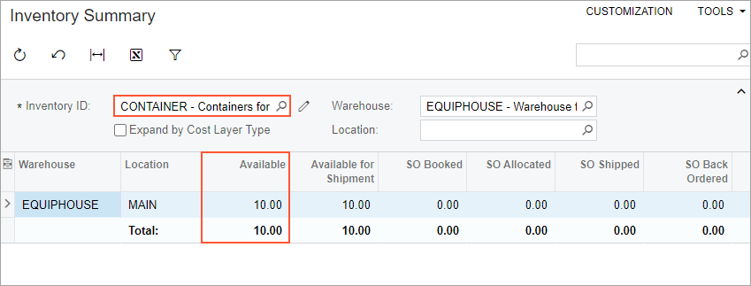

# Route Executions with Item Delivery: To Create Pickup and Delivery Route Services {#_eddcfbae-9892-4dab-b843-c40e8371dc50 .task}

This activity will walk you through the process of creating pickup and delivery route services.

## Story {#section_tx2_xjb_ldc .section}

Suppose that the SweetLife Service and Equipment Sales Center has decided to provide route services that involve the pickup or delivery of stock items. Acting as an administrative user of the company, you will create route services in the system with special configuration settings. That is, you will create services based on the *ROUTE* item class, and on the **Pickup/Delivery Item** tab of the [Non-Stock Items](IN_20_20_00.md) \(IN202000\) form, you will specify the needed action in the **Pickup/Delivery Action** box, and the stock items to be delivered or picked up.

## Process Overview { .section}

On the [Services](FS_40_08_00.md) \(FS400800\) form, you will create pickup and delivery services and add the inventory items to be picked up or delivered. Then on the [Inventory Summary](IN_40_10_00.md) \(IN401000\) form, you will check their availability in a warehouse.

## System Preparation {#section_ht5_5jb_ldc .section}

Before you begin performing the steps of this lesson, do the following:

1.  On the Acumatica ERP website, sign in to a company with the *U100* dataset preloaded as a system administrator by using the *gibbs* username and the *123* password.
2.  On the Company and Branch Selection menu on the top pane of the Acumatica ERP screen, select the *SWEETEQUIP - Service and Equipment Sales Center* branch.

## Step 1: Creating the Delivery Service {#section_lvs_mkb_ldc .section}

In this step, you will create a route service \(*SUPP JUIACC*\) to represent the delivery of juicer supplies.

Perform the following instructions:

1.  On the [Services](FS_40_08_00.md) \(FS400800\) form, click **New Record**.

    The [Non-Stock Items](IN_20_20_00.md) \(IN202000\) form opens.

2.  In the **Inventory ID** box, type `SUPP JUIACC`.
3.  In the **Description** box, type `Delivery of juicer accessories`.
4.  On the **General** tab, select *ROUTE* in the **Item Class** box.

    Notice that the system has populated the following elements with the values specified for the selected item class: the **Type**, **Tax Category**, **Posting Class**, and **Default Warehouse** boxes, as well as those in the **Unit of Measure** section.

5.  In the **Field Service Defaults** section, in the **Estimated Duration** box, type `0 h 30 m`.

    Notice that the **Route Service** check box is already selected and unavailable.

6.  On the **Price/Cost** tab, enter `100` in the **Default Price** box.
7.  On the **Pickup/Delivery Item** tab, in the **Pickup/Delivery Action** box, select *Deliver Items*.
8.  On the table toolbar, click **Add Row**, and select *CONTAINER* in the **Pickup/Delivery Item ID** column to add this stock item.
9.  On the form toolbar, click **Save**.

## Step 2: Creating the Pickup Service {#section_nsj_nkb_ldc .section}

In this step, you will create a service to represent the pickup of juicer accessories \(such as dull blades requested for sharpening\). Do the following:

1.  While you are still viewing the [Non-Stock Items](IN_20_20_00.md) \(IN202000\) form, on the form toolbar, click **Add New Record** to create another non-stock item
2.  In the Summary area, specify the following settings:
    -   **Inventory ID**: `PICK JUIACC`
    -   **Item Status**: *Active*
    -   **Description**: `Pickup juicer accessories`
3.  On the **General** tab, select *ROUTE* in the **Item Class** box.
4.  In the **Field Service Defaults** section, in the **Estimated Duration** box, type `0 h 30 m`.
5.  On the **Price/Cost** tab, leave the **Default Price** set to *0*.
6.  On the **Pickup/Delivery Item** tab, in the **Pickup/Delivery Action** box, select *Pick Up Items*.
7.  On the table toolbar, click **Add Row**, and in the **Pickup/Delivery Item ID** column, select *BLADE12*. Repeat this instruction to add the *BLADE20* item.
8.  Click **Save &amp; Close**.
9.  Return to the [Services](FS_40_08_00.md) \(FS400800\) form, and review the route services that you have created.

## Step 3: Checking the Availability of Items in the Warehouse {#section_cxz_nkb_ldc .section}

To ensure that the items you plan to deliver are available in the warehouse, do the following:

1.  Open the [Inventory Summary](IN_40_10_00.md) \(IN401000\) form.
2.  In the Selection area, in the **Inventory ID** box, select *CONTAINER*.
3.  In the **Warehouse** box, select *EQUIPHOUSE*.

    In the table, ensure that the items are available in the warehouse \(see the following screenshot\).

    

Now you can proceed to creating route execution documents and adding the delivery and pickup services to route appointments.

**Parent topic:**[Route Executions with Item Delivery](../UserGuide/RouteMgmt_Route_Executions_with_Item_Delivery_mapref.md)

