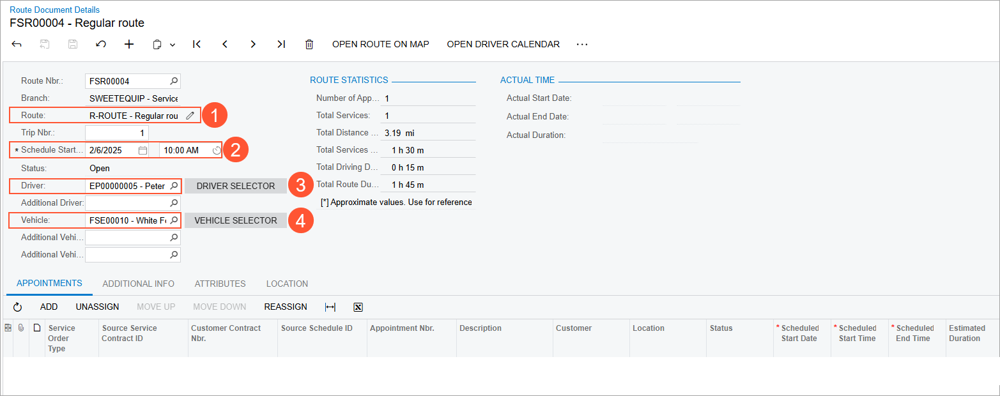
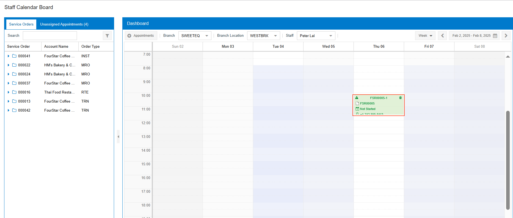
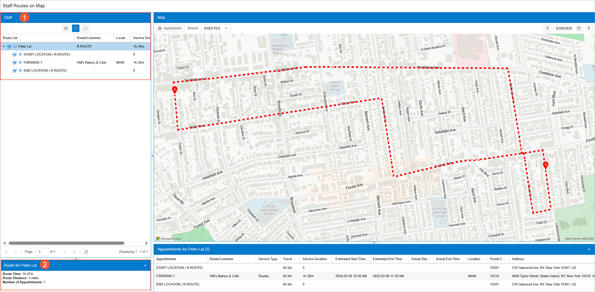

# Route Executions with Service Delivery: To Create a Route Execution with Appointments {#_09211bbb-38e5-43a9-8ed5-a721fb7fa6f5 .task}

This activity will walk you through the process of creating a route execution document, scheduling the route execution for a specific day and time, adding a route appointment, and viewing the route on a map.

## Story {#section_pzt_zdb_ldc .section}

Suppose that the HM's Bakery &amp; Cafe customer has requested the juicer demonstration service, which will be performed at the customer's location. Acting as a service manager \(Maia Davis\) of the SweetLife Service and Equipment Sales Center, you will create a route execution document that includes one trip to the *HMBAKERY* customer for the demonstration. You will schedule the route for a specific day and time \(next Thursday at 10:00 AM\) and add the route appointment, where you will select the customer and the service to be performed. You will also view the route on a map.

## Process Overview { .section}

On the [Route Document Details](FS_30_40_00.md) \(FS304000\) form, you will create a route execution document and specify the scheduled start time, driver, and vehicle. Then you will add an appointment to the route execution and view the route on the map.

## System Preparation {#section_z4x_b2b_ldc .section}

Before you begin performing the steps of this lesson, do the following:

1.  On the Acumatica ERP website, sign in to a company with the *U100* dataset preloaded. You should sign in as a service manager by using the *davis* username and the *123* password.
2.  In the info area, in the upper-right corner of the top pane of the Acumatica ERP screen, set the business date to *1/30/2026*. For simplicity, in this activity, you will create and process all documents in the system on this business date.

## Step 1: Creating the Route Execution {#section_y3d_d2b_ldc .section}

To create the route execution, do the following:

1.  On the [Route Document Details](FS_30_40_00.md) \(FS304000\) form, click **Add New Record**.
2.  In the Summary area, specify the following settings, as shown in the screenshot below:

    -   **Route**: *R-ROUTE* \(see Item 1 in the following screenshot\)
    -   **Schedule Start Date**: The date of the next Thursday, *10:00 AM* \(Item 2\), relative to the current business date of 1/30/2026
    -   **Driver**: *EP00000005 - Peter Lai* \(Item 3\)
    -   **Vehicle**: *White Ford* \(Item 4\)
    

3.  Save your changes.

    The route execution document has been created. The system inserts the reference number based on the numbering sequence you have specified on the [Route Management Preferences](FS_10_04_00.md) \(FS100400\) form.

    **Tip:** If you edit the route that you have selected for this route execution document, it will not affect the route executions that have already been created based on the route.

## Step 2: Creating an Appointment for the Route Execution {#section_mhr_d2b_ldc .section}

To add an appointment to the route execution, do the following:

1.  While you are still viewing the [Route Document Details](FS_30_40_00.md) \(FS304000\) form, on the table toolbar of **Appointments** tab, click **Add**.

    The **Select Service Order Type for New Appointment** dialog box opens.

2.  In the dialog box, ensure that *ROUT* is selected and click **Proceed**.

    This opens the [Appointments](FS_30_02_00.md) \(FS300200\) form, where you can add appointment details for the first appointment in the route execution.

3.  In the Summary area, specify the following settings for the appointment:
    -   **Customer**: *HMBAKERY - HM's Bakery &amp; Cafe*
    -   **Description**: `Demonstration of goods for prospective customer`
4.  Save your changes.
5.  On the table toolbar of the **Details** tab, click **Add Row**, and select the *VISIT* service in the **Inventory ID** column.

    **Tip:** You can select only route services for route appointments.

6.  Save your changes and close the form. Return to the [Route Document Details](FS_30_40_00.md) form and notice that the created appointment is listed on the **Appointments** tab.
7.  On the form toolbar, click **Open Driver Calendar**.

    The system opens the [Staff Calendar Board](FS_30_04_00.md) \(FS300400\) form.

8.  Verify that the appointment is shown on the Staff Calendar Board.

    Move the appointment box on the dashboard so that the appointment is scheduled to start at 10:00 AM.

    

9.  Close the [Staff Calendar Board](FS_30_04_00.md) form.

## Step 3: Viewing the Route Execution on a Map {#section_x4f_22b_ldc .section}

Now you can view the route execution on a map. Do the following:

1.  Open the [Staff Routes on Map](FS_30_10_00.md) \(FS301000\) form.
2.  In the top right corner of the map, in the Date box, select the date for which you have scheduled the route execution \(next Thursday\).

    Here you can view on a map the routes to which the staff members are assigned on the selected date.

3.  On the **Staff** pane \(located on the left side of the form\), click the arrow button next to the driver’s name \(*Lai, Peter*\) to view the appointment details for this driver.

    In particular, you can view the customer associated with the appointment, the identifiers of the appointment locations, and the total time required to perform the services \(see Item 1 in the following screenshot\).

    In the bottom left corner of the form, the system displays the route duration, the distance, and the total number of appointments for the selected driver \(Item 2\).

    

In the bottom part of the map on the form, the system displays the travel time between route points and the addresses of the route locations.

**Parent topic:**[Route Executions with Service Delivery](../UserGuide/RouteMgmt_Route_Executions_with_Service_Delivery_mapref.md)

