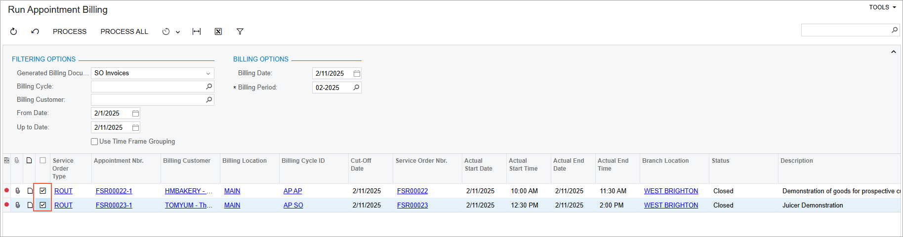

# Route Executions with Service Delivery: To Generate Invoices for Route Appointments {#_c64246de-efe0-4e88-8beb-3db203571082 .task}

In Acumatica ERP, you can generate billing documents for appointments that are completed or closed, depending on the settings of the applicable service order type.

## Story {#section_n2p_2jb_ldc .section}

Acting as an accountant of the SweetLife company, you will run billing for route appointments, including appointments that were closed in the previous step. The appointments are of the *ROUT* service order type, which is defined to generate the sales invoice.

## Process Overview { .section}

On the [Run Appointment Billing](FS_50_01_00.md) \(FS500100\) form, you will initiate the generation of sales invoices for the appointments of the *ROUT* service order type.

## System Preparation {#section_z4x_b2b_ldc .section}

Before you begin, do the following:

1.  On the Acumatica ERP website, sign in to a company with the *U100* dataset preloaded. You should sign in as a service manager by using the *davis* username and the *123* password.
2.  In the info area, in the upper-right corner of the top pane of the Acumatica ERP screen, set the business date to *2/15/2026*. For simplicity, in this activity, you will create and process all documents in the system on this business date.
3.  To perform this activity, make sure that you have performed the following prerequisite activities: [Route Executions with Service Delivery: To Create a Route Execution with Appointments](RouteMgmt_Creating_Route_Execution_with_Appointments_Process_Activity.md), [Route Executions with Service Delivery: To Modify the Route Execution](RouteMgmt_Modifying_Route_Execution_Process_Activity.md), and [Route Executions with Service Delivery: To Process the Route Execution](RouteMgmt_Processing_Route_Execution_Process_Activity.md).

## Step: Running the Appointment Billing {#section_kkd_fjb_ldc .section}

To generate the sales invoices for the appointments, perform the following instructions:

1.  Open the [Run Appointment Billing](FS_50_01_00.md) \(FS500100\) form.

    This form displays completed, closed, or both completed and closed appointments, depending on the setting in the service order type of each appointment. That is, it shows only appointments for which billing documents can be generated.

2.  In the **Generated Billing Documents** box, select *SO Invoices*.
3.  In the **Up to Date** box, select the date associated with Tuesday that was used for routes *02/11/2026*.
4.  In the table, select the appointments of the *ROUT* service order type, as shown in the following screenshot.

    

5.  On the form toolbar, click **Process**.

    The system opens the **Processing** dialog box, in which you can see the status of the process. After the processing has successfully completed, go to the **Processed** tab. In the **Batch Nbr.** column of the table with the processed records, you can review the numbers of the generated batches, each of which is a link you can click to open the generated sales invoices.

**Parent topic:**[Route Executions with Service Delivery](../UserGuide/RouteMgmt_Route_Executions_with_Service_Delivery_mapref.md)

