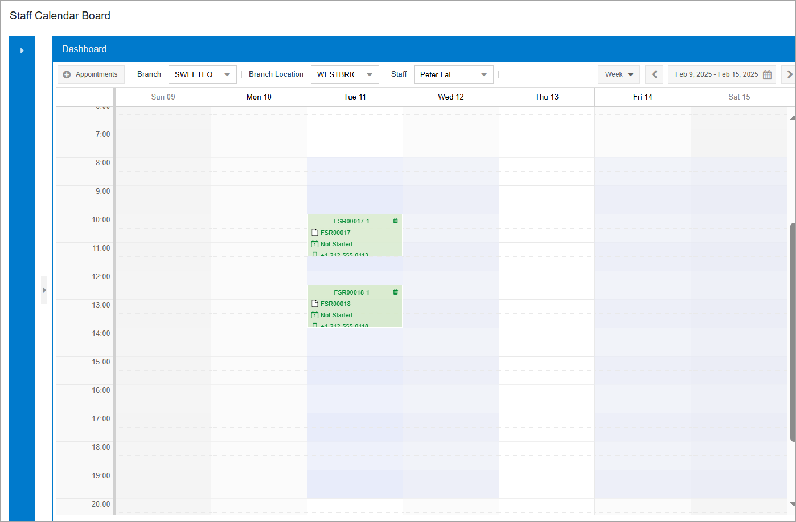
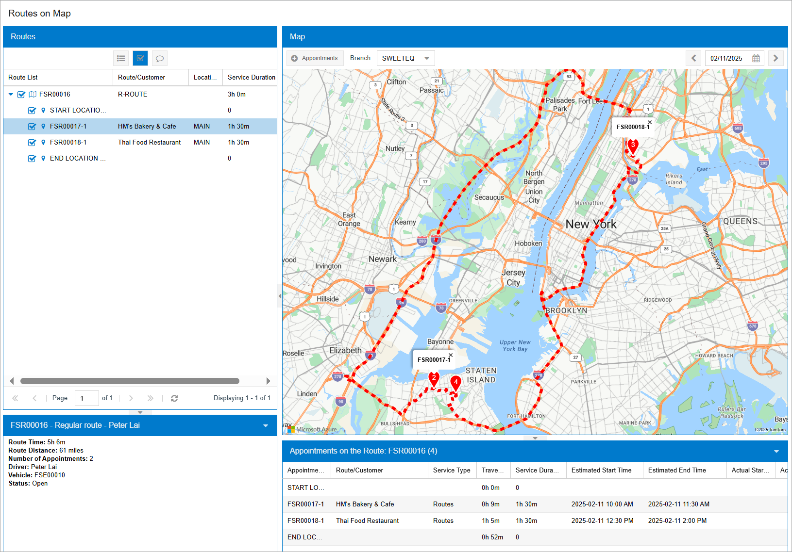

# Route Executions with Service Delivery: To Modify the Route Execution {#_4854f8fc-5f6b-4ea4-aebc-32f46ea2a268 .task}

This activity will walk you through the process of modifying the existing route execution document and reassigning a route appointment from one route execution to another one.

## Story {#section_jk2_p2b_ldc .section}

Suppose that the Thai Food Restaurant customer has requested the juicer demonstration service to be performed at the customer's location. At the same time, the HM's Bakery &amp; Cafe customer, for which a route execution document has been created, has asked to change the date of the service that has been scheduled for them.

A service manager \(Maia Davis\) of the SweetLife Service and Equipment Sales Center analyzed the route execution dates, confirmed them with the customers, and decided to combine these route executions to be performed within one route execution because they were requested for the same day. Acting as this service manager, you will modify the date in the route execution that was previously created for the HM's Bakery &amp; Cafe customer and add an additional appointment for the Thai Food Restaurant customer.

## Process Overview { .section}

On the [Route Document Details](FS_30_40_00.md) \(FS304000\) form, you will update the scheduled date in the selected route execution document and add a second appointment to the route.

## System Preparation {#section_z4x_b2b_ldc .section}

Before you begin performing the steps of this lesson, do the following:

1.  On the Acumatica ERP website, sign in to a company with the *U100* dataset preloaded. You should sign in as a service manager by using the *davis* username and the *123* password.
2.  In the info area, in the upper-right corner of the top pane of the Acumatica ERP screen, set the business date to *1/30/2026*. For simplicity, in this activity, you will create and process all documents in the system on this business date.
3.  To modify the route execution, make sure that you have performed the following prerequisite activity: [Route Executions with Service Delivery: To Create a Route Execution with Appointments](RouteMgmt_Creating_Route_Execution_with_Appointments_Process_Activity.md).

## Step 1: Editing the Start Date in the Route Execution {#section_qqc_q2b_ldc .section}

To edit the scheduled start date in the route execution, do the following:

1.  On the [Route Document Details](FS_30_40_00.md) \(FS304000\) form, in the **Route Nbr.** box, select the regular route that you have created while performing the [Route Executions with Service Delivery: To Create a Route Execution with Appointments](RouteMgmt_Creating_Route_Execution_with_Appointments_Process_Activity.md) activity.
2.  In the **Scheduled Start Date** box, select a different date—the next Tuesday after the currently selected date, at *10:00 AM*.
3.  Save your changes.

    On the **Appointments** tab, notice that the date of the corresponding appointment has automatically been changed to match your edits.

4.  On the **Appointments** tab, click **Add** on the table toolbar to add a second appointment to the route execution.
5.  In the dialog box that opens, select *ROUT*, and click **Proceed** to close the dialog box.

    This opens the [Appointments](FS_30_02_00.md) \(FS300200\) form, where you can add appointment settings.

6.  In the Summary area, specify the following settings for the new appointment:
    -   **Customer**: *TOMYUM - Thai Food Restaurant*
    -   **Description**: `Juicer Demonstration`
7.  Save your changes.
8.  On the **Details** tab, click **Add Row** on the table toolbar, and select the *VISIT* service in the **Inventory ID** column.
9.  Click **Save &amp; Close** and return to the [Route Document Details](FS_30_40_00.md) form to review the route execution with the created appointment listed on the **Appointments** tab.
10. Select the second appointment and click **Open Driver Calendar** on the form toolbar.

    The system opens the [Staff Calendar Board](FS_30_04_00.md) \(FS300400\) form.

11. Move the appointment box on the dashboard so that the appointment is scheduled to start at 12:30 PM \(as the following screenshot shows\). Close the [Staff Calendar Board](FS_30_04_00.md) form.

    

12. Return to the [Route Document Details](FS_30_40_00.md) form, and refresh it to update the appointment's start time in the list.

## Step 2: Viewing the Modified Route on the Map {#section_dwt_q2b_ldc .section}

To view the route on the map, do the following:

1.  While you are still viewing the [Route Document Details](FS_30_40_00.md) \(FS304000\) form, on the More menu, click **Open Route on Map**. The [Routes on Map](FS_30_09_00.md) \(FS300900\) form opens.
2.  In the top right corner of the map, in the Date box, ensure the date for which you have scheduled the route execution \(*02/11/2026*\) is specified.
3.  On the **Routes** pane of the form, click the row with the route to highlight the route on the map, and click the arrow button left of the route to expand the route details \(see the following screenshot\).

    

**Parent topic:**[Route Executions with Service Delivery](../UserGuide/RouteMgmt_Route_Executions_with_Service_Delivery_mapref.md)

