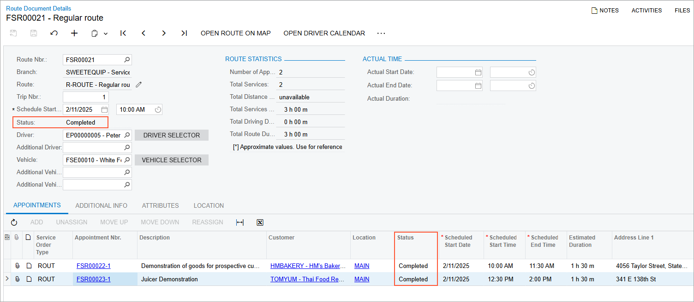

# Route Executions with Service Delivery: To Process the Route Execution {#_29163fa0-1a95-4f30-857e-9e1f96253bca .task}

This activity will walk you through the process of handling a route execution from starting the route execution to completing it.

## Story {#section_atw_r3b_ldc .section}

Suppose that you are a staff member of the SweetLife Service and Equipment Sales Center. Acting as a staff member, you will start the route execution, attend the appointments, enter the actual time and date the appointments have been carried out, and complete the execution of the route. Acting as a service manager, you will close the appointment. \(To ease the training process, you will not sign out and sign in as each involved employee. In production, however, the drivers start and complete the route executions assigned to them.\)

## Process Overview { .section}

On the [Route Document Worksheets](FS_40_39_00.md) \(FS403900\) form, you will start the route execution. Then you will process the appointments included in the route execution. Once all appointments are completed, you will complete the route execution. Finally, on the [Close Routes](FS_50_08_00.md) \(FS500800\) form, you will close the route.

## System Preparation {#section_z4x_b2b_ldc .section}

Before you begin performing the steps of this lesson, do the following:

1.  On the Acumatica ERP website, sign in to a company with the *U100* dataset preloaded. You should sign in as a service manager by using the *davis* username and the *123* password.
2.  In the info area, in the upper-right corner of the top pane of the Acumatica ERP screen, set the business date to *1/30/2026*. For simplicity, in this activity, you will create and process all documents in the system on this business date.
3.  To perform this activity, make sure that you have performed the following prerequisite activities: [Route Executions with Service Delivery: To Create a Route Execution with Appointments](RouteMgmt_Creating_Route_Execution_with_Appointments_Process_Activity.md) and [Route Executions with Service Delivery: To Modify the Route Execution](RouteMgmt_Modifying_Route_Execution_Process_Activity.md).

## Step 1: Starting the Route Execution {#_57d21858-0e0a-43f2-84e9-4c712699525e .section}

To start the route execution, perform the following instructions:

1.  Open the [Route Document Worksheets](FS_40_39_00.md) \(FS403900\) form.
2.  Set the business date to Tuesday, *02/11/2026*.

    The **From** and **To** boxes are now displaying this date.

3.  In the **Driver** box, select *EP00000005 \(Peter Lai\)*.

    The form now displays the route execution assigned to the selected driver for the specified Tuesday.

4.  In the **Route Nbr.** column, click the reference number of the route execution to open the [Route Document Details](FS_30_40_00.md) \(FS304000\) form.
5.  On the More menu, click **Start**.

## Step 2: Performing the Route Execution {#_18328f27-af31-45ce-a38c-fd5a0a78d239 .section}

To start and compete a route execution along with the assigned appointments, do the following:

1.  While you are still viewing the route execution document on the [Route Document Details](FS_30_40_00.md) \(FS304000\) form, in the **Appointment Nbr.** column of the **Appointments** tab, click the reference number of the first appointment in the list.

    The system opens the [Appointments](FS_30_02_00.md) \(FS300200\) form.

2.  On the form toolbar, click **Start**.

    Assume that the staff member has finished providing a service and now needs to complete the appointment.

3.  On the **Settings** tab, in the **Actual Date and Time** section, set the values in the **Actual Start Date** and **Actual End Date** boxes to approximately match the values in the **Scheduled Date and Time** section. Select the **Finished** check box.
4.  On the form toolbar, click **Complete**.
5.  Close the [Appointments](FS_30_02_00.md) form, and return to the [Route Document Details](FS_30_40_00.md) form.
6.  On the table toolbar, click **Refresh**, and verify that the status of the first appointment has changed to *Completed*.
7.  Repeat Instructions 1–6 to complete the second appointment.

    Once all appointments have been completed, you can complete the route execution; before the related appointments are completed, you cannot complete the route.

8.  On the More menu of the [Route Document Details](FS_30_40_00.md) form, click **Complete**.

    The status of the route execution document has changed to *Completed* \(see the following screenshot\).

    

## Step 3: Closing the Route Execution {#_f99789a3-ca45-4a4a-a10a-9dcdbfbe00f0 .section}

To close the route execution, perform the following instructions:

1.  Open the [Close Routes](FS_50_08_00.md) \(FS500800\) form.

    This form displays only completed or closed \(or both\) route execution documents, depending on the settings in the Summary area of the current form.

2.  Click the reference number in the **Route Nbr.** column. The [Routes Closing](FS_30_40_10.md) \(FS304010\) form opens.
3.  In the Summary area, specify the **Actual Start Time** of the route as the **Scheduled Start Time** of the first appointment in the list on the **Appointments** tab. Specify the **Actual End Time** as the **Scheduled End Time** of the last appointment in the list.
4.  On the More menu, click **Close**. In the **Confirm Route Closing** dialog box, click **Yes**.

    Refresh the page. Notice that the route execution status has been changed to *Closed*, reflecting that the document is closed; the document details cannot be edited.

    You can now proceed to generating invoices for these appointments.

**Parent topic:**[Route Executions with Service Delivery](../UserGuide/RouteMgmt_Route_Executions_with_Service_Delivery_mapref.md)

