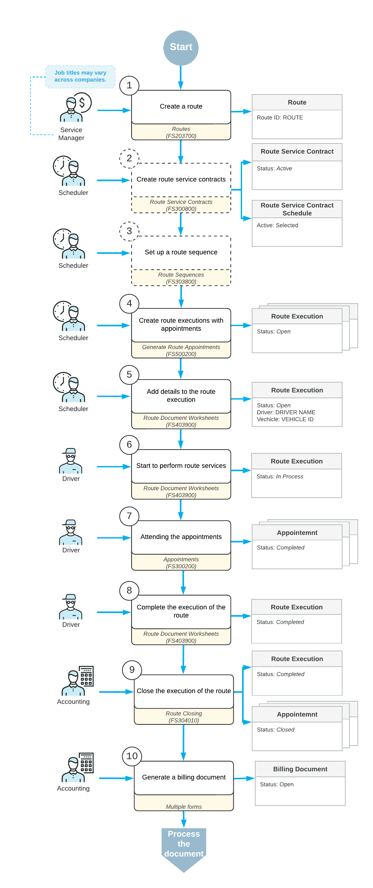

# Route Executions with Service Delivery: General Information {#_af0a4446-a568-4087-8e90-9da1671cee8b .concept}

A route execution is a predefined path with some stops to perform services or deliver and receive inventory items. Each stop in a route execution represents a route appointment, which is an appointment associated with a service order type configured with the *Route* behavior. A route execution is created for each specific day that route services are provided.

## Learning Objectives {#section_y3r_scb_ldc .section}

In this chapter, you will learn how to do the following:

-   Create a route execution document and add appointments to the route
-   View the route on the map
-   Modify the route execution document and edit the order of appointments in the route execution
-   Start, complete, and close the route execution
-   Run route appointment billing

## Applicable Scenarios { .section}

You create routes and route executions when your company provides on-site services or deliveries to customers on specified service days.

## Ways of Creating Route Executions {#section_ppj_xcb_ldc .section}

To process each route executed by your company, you have to create a route execution document in the system for each specific day when a particular route is executed. Route executions can be created in the following ways:

-   Manual creation: If your company performs services for a customer rarely or does not have a contract that defines the details of the services provided, you can create route execution documents manually.
-   Automated creation: If your company regularly provides route services for a customer on a contract basis, you can create a route service contract. The system will then automatically generate route execution documents based on the contract schedule.

## Manual Entry of a Route Execution {#section_e3f_ycb_ldc .section}

You enter a route execution on the [Route Document Details](FS_30_40_00.md) \(FS304000\) form. For the route execution, you specify the following information:

-   The route to which the route execution relates.
-   The date of the route execution. You can select a date that is one of the days of the week specified for the associated route.
-   The driver or drivers who will perform the services of the route execution.
-   The vehicle or vehicles to be used for the route execution.
-   The values of the attributes defined for executions of the route. You can specify or modify the values of any attributes that are listed on the **Attributes** tab; if the **Required** check box is selected for an attribute, you must specify a value for it.

After you have specified and saved this information, you can add appointments to the route execution by clicking **Create New Appointment** on the table toolbar and entering the details of each appointment on the [Appointments](FS_30_02_00.md) \(FS300200\) form.

**Tip:** In the appointments on the route, you can include only services that are indicated as route services in the system—that is, they have the **Route Service** check box selected on the [Services](FS_40_08_00.md) \(FS400800\) form. These services have to be assigned to a route service class, which is an item class for which the **Route Service Class** is selected on the [Item Classes](IN_20_10_00.md) \(IN201000\) form.

By default, the system assigns a new route execution document the *Open* status. Reference numbers for new route execution documents are generated according to the numbering sequence specified in the **Route Numbering Sequence** box on the **General** tab of the [Route Management Preferences](FS_10_04_00.md) \(FS100400\) form.

## Statuses of Route Executions {#section_pxw_ycb_ldc .section}

The statuses of route executions keep managers informed about the route service delivery. The system changes the status of each route execution based on user actions. A route execution has one of the following statuses, which is displayed for the route execution on the [Route Document Details](FS_30_40_00.md) \(FS304000\) form:

1.  *Open*: The route execution has been created and can be populated with route appointments. The system assigns this default status when you create a new route execution.
2.  *In Process*: A driver has started the route execution and will complete the route appointments.
3.  *Completed*: The driver has finished all the activities related to the route execution. A route execution document with this status can be reopened \(returned to the *In Process* status\) or closed.
4.  *Closed*: A manager has reviewed the record and confirmed that everything has been done. All administrative activities for this route execution document are over. The document cannot be editedunless you reopen the route execution, which causes it to be assigned the *Open* status.

## Process Workflow {#section_k3k_zcb_ldc .section}

The process of executing a route in the system is shown in the diagram below.

In general, the simplest way of executing a route involves the following steps:

1.  Creating the route: If a route has not been created yet, a manager creates a route with the common details of the route to be executed.
2.  Creating route service contracts for the customers who require recurrent service appointments \(optional\): The scheduler creates a route service contract and specifies a customer, a schedule with services to be provided, and other settings. The scheduler then activates the contract.
3.  Setting up the sequence for scheduled appointments in contracts \(optional\): The scheduler reviews the order in which customers will be visited during route execution and adjusts it as needed.
4.  Creating route executions with appointments: If route service contracts have been created for customers, the scheduler generates appointments in the corresponding route execution in the order that is specified in the route sequence. If route service contracts have not been created, the scheduler creates a route execution manually.
5.  Adding details to the route execution: The scheduler assigns drivers and vehicles to the route execution defined in the system. The scheduler can manually add or delete appointments in response to customer requests.
6.  Starting to perform route services: On the day of the route execution, the driver locates the assigned route execution in the system, reviews the details, proceeds to the starting location, and begins executing the route.
7.  Attending the appointments of the route: At each appointment location, the driver starts the appointment, performs the required services, and enters any additional information into the system \(such as items picked up or delivered\), if needed. Once the work is completed and all details are reviewed, the driver marks the appointment as complete in the system. The driver then proceeds to the next appointments associated with the route execution and repeats the process.
8.  Completing the execution of the route: Once all appointments in the route execution have been completed, the driver proceeds to the route's end location, records the end time, and finalizes the route execution.
9.  Closing the execution of the route: The accountant reviews the route document and its associated appointments to verify the accuracy of the information, and then closes the route execution.
10. Generating billing documents for customers: An accountant generates billing documents for completed or closed appointments.

**Parent topic:**[Route Executions with Service Delivery](../UserGuide/RouteMgmt_Route_Executions_with_Service_Delivery_mapref.md)

