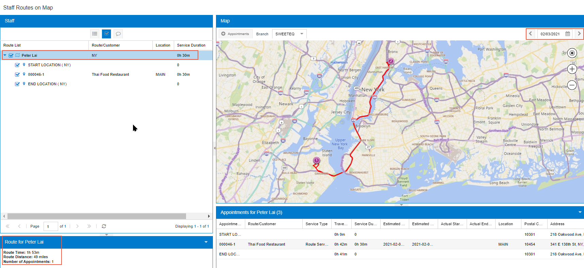

# Route Executions: Creating a Route Execution on the Fly {#_2674d93c-6783-4db6-8bf5-fd0026eb2990 .task}

In this activity, you will learn how to create a route execution on the fly. You will also learn how to review the appointments of a driver assigned to the route execution and how to view the route execution on a map.

**Attention:** This activity is based on the *U100* dataset. If you are using another dataset or if any system settings have been changed in *U100*, these changes can affect the workflow of the activity and the results of the processing. To avoid issues, restore the *U100* dataset to its initial state.

## Story { .section}

Suppose that the service manager, Maia Davis, has received a request from the Thai Food Restaurant customer for the delivery of fruits for 1/31/2026. She needs to create a new route execution in the system with an appointment for the customer. The service manager will then review the schedule of the driver selected to perform the route execution, and view the created route execution on a map. Acting as the service manager, you will perform these actions in the system.

## Configuration Overview { .section}

In the *U100* dataset, the following tasks have been performed to support this activity:

-   On the [Enable/Disable Features](CS_10_00_00.md#) \(CS100000\) form, the *Route Management* feature has been enabled.
-   On the [Service Management Preferences](FS_10_01_00.md#) \(FS100100\) form, an API key has been specified in the **Map API Key** box.
-   On the [Branch Locations](FS_20_25_00.md#) \(FS202500\) form, the *WEST BRIGHTON* branch location has been configured.
-   On the [User Profile](SM_20_30_10.md#) \(SM203010\) form, the *WEST BRIGHTON* branch location has been assigned as a default branch location to the *davis* user.
-   On the [Service Order Types](FS_20_23_00.md#) \(FS202300\) form, the *ROUT* service order type with the *Route* behavior has been configured to generate sales orders to bill customers for services that have been provided. That is, the **Sales Orders** option has been selected under **Generated Billing Documents** in the **Billing Settings** section of the **General** tab.
-   On the [Customers](AR_30_30_00.md#) \(AR303000\) form, the *TOMYUM \(Thai Food Restaurant\)* customer has been preconfigured, and the *AP SO* billing cycle has been selected in the **Service Management** section of the **Billing** tab.
-   On the [Non-Stock Items](IN_20_20_00.md#) \(IN202000\) form, the *DELIVERY* non-stock item has been configured, and the *Service* type has been selected for it. For this item, the *DELIVERING* item class has been selected, for which the **Route Service Class** check box has been selected on the [Item Classes](IN_20_10_00.md#) \(IN201000\) form.
-   On the [Employees](EP_20_30_00.md#) \(EP203000\) form, for *EP00000005 \(Peter Lai\)*, the **Staff Member in Service Management** check box has been selected on the **General Info** tab\), and the *DRIVING* skill has been added on the **Skills** tab.
-   On the [Routes](FS_20_37_00.md#) \(FS203700\) form, the *NY* route has been configured with executions on Mondays, Wednesdays, and Fridays starting at 9:00 AM. *Peter Lai* has been assigned to this route on the **Employees** tab.
-   On the [Vehicles](FS_20_36_00.md#) \(FS203600\) form, the *FSE00004 \(White Foord\)* has been preconfigured

## Process Overview { .section}

To create a route execution on the fly, you specify the details of the route execution on the [Route Document Details](FS_30_40_00.md#) \(FS304000\) form, and add appointments that you create on the [Appointments](FS_30_02_00.md#) \(FS300200\) form. You then review the assigned driver's schedule on the [Routes on Map](FS_30_09_00.md#) \(FS300900\) form, and check the route execution on the [Staff Routes on Map](FS_30_10_00.md#) \(FS301000\) form.

## System Preparation { .section}

To sign in to the system and prepare to perform the instructions of the activity, do the following:

1.  Launch the Acumatica ERP website, and sign in to a company with the *U100* dataset preloaded; you should sign in as a service manager by using the *brawner* username and the *123* password.
2.  In the info area at the upper-right corner of the top pane of the Acumatica ERP screen, make sure that the business date is set to *1/30/2026*. If a different date is displayed, click the Business Date menu button and select *1/30/2026* from the calendar. For simplicity, you'll create and process all documents in this activity using this business date.

## Step 1: Creating a New Route Execution { .section}

To create a new route execution, do the following:

1.  Open the [Route Document Details](FS_30_40_00.md#) \(FS304000\) form.
2.  Create a new route execution, and specify the following settings in the Summary area:
    -   **Route**: *NY*
    -   **Scheduled Start Date**: *2/3/2026**3:00 PM*
3.  Click **Driver Selector**.

    The **Driver Selector** dialog box opens. Notice that only driver of the company is not assigned to the appointments during the specified time \(the **Already Assigned** check box is cleared for him\).

4.  In the table, click *EP00000005 \(Peter Lai\)*, and then click **Select Driver** at the bottom of the dialog box.
5.  Click **Vehicle Selector**.

    The **Vehicle Selector** dialog box opens.

6.  In the table, click *FSE00004 \(Mersedes-Bens S3500\)*, and then click **Select Vehicle** at the bottom of the dialog box.
7.  On the form toolbar, click **Save**.

## Step 2: Adding an Appointment to the Route Execution { .section}

To add an appointment to the route execution, do the following:

1.  While you are still viewing the route execution on the [Route Document Details](FS_30_40_00.md#) \(FS304000\) form, on the **Appointments** tab, click **Add Row**.

    The **Select the Service Order Type for the New Appointment** dialog box has been opened.

2.  In the dialog box, make sure the *RTE* service order type is selected and click **Proceed**.

    This brings up the [Appointments](FS_30_02_00.md#) \(FS300200\) form, where you can add the details of the appointment in the route execution.

3.  Specify the following settings for the appointment:
    -   **Customer**: *TOMYUM \(Thai Food Restaurant\)*
    -   **Description**: `Delivery of fruits`
4.  On the table toolbar of the **Details** tab, click **Add Row**, and specify the following settings:
    -   **Line Type**: *Service*
    -   **Inventory ID**: *DELIVERY*
5.  On the **Settings** tab, in the **Scheduled Start Date** box, specify *2/3/2021**3:00 PM*. Ensure **Confirmed** is selected.
6.  On the form toolbar, click **Save &amp; Close**.
7.  In the **Scheduled Start Time** column on the **Appointments** tab of the [Route Document Details](FS_30_40_00.md#) form, notice that the stat time has been calculated by the system according to the start time of the route execution and the estimated driving time from the start location to the appointment location.

## Step 3: Reviewing the Appointments of the Driver { .section}

To review the appointments for Peter Lai, do the following:

1.  While you are still viewing the route execution on the [Route Document Details](FS_30_40_00.md#) \(FS304000\) form, on the form toolbar, click **Open Driver Calendar**.

    The system brings up the [Staff Calendar Board](FS_30_04_00.md#) \(FS300400\) form for the driver assigned to execute the route \(Peter Lai\).

2.  Verify that the created appointment is present on the [Staff Calendar Board](FS_30_04_00.md#).
3.  Close the [Staff Calendar Board](FS_30_04_00.md#) form.

## Step 4: Reviewing a Route Execution on a Map { .section}

To view the route execution on a map, do the following:

1.  Open the [Staff Routes on Map](FS_30_10_00.md#) \(FS301000\) form.

    The map opens for the current business date.

2.  In the **Date** box, select the *2/3/2026* date for which you have scheduled the route execution.
3.  Click the arrow button left of the driver’s name \(*Peter Lai*\) in the **Staff** section to view the appointment details of this driver for this day.
4.  Click the driver's name \(*Peter Lai*\) to open the **Route for Peter Lai** tab in the bottom left corner of the form.

    Here you can review the route duration, distance, and number of appointments for the selected driver, as the screenshot below shows.

5.  On the **Appointments for Peter Lai** tab in the bottom part of the map on the form.

    The system displays the names of the customers with which appointments take place, the time that is needed to travel between points of the route, and the addresses of the route locations.

**Parent topic:**[Route Executions](../UserGuide/RouteMgmt_Managing_Route_Executions_Mapref.md)

