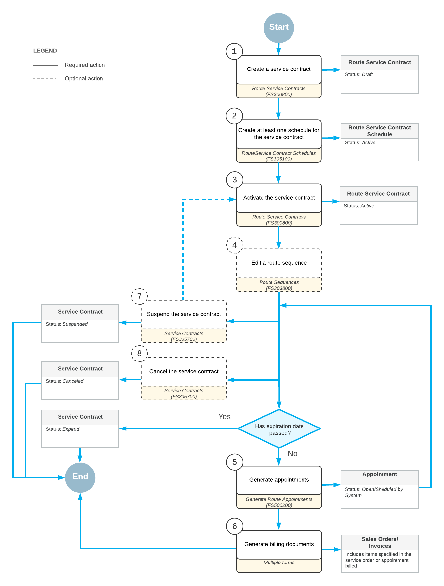

# Route Service Contracts: General Information {#_6d43fb7f-62f5-487e-b6ce-6a7b729c0c38 .concept}

With Acumatica ERP's integrated route and service management capabilities, you can manage appointments associated with routes. Routes can be generated automatically from contracts or created manually for a specific day.

## Learning Objectives { .section}

In this chapter, you will learn how to do the following:

-   Create a route for the service contract, and then create a service contract
-   Create a schedule for the route service contract
-   Specify the order in which the appointments for the route will be generated
-   Generate appointments for the service contract
-   Find the generated route execution documents in the system and assign drivers and vehicles to them

## Applicable Scenarios { .section}

You create and process a route service contract when you and the customer have agreed to the terms of regular deliveries of some inventory items.

## Process Diagram { .section}

In general, when processing a route service contract, your employees perform the following steps:

1.  Creating the route service contract: The service manager enters the route service contract into the system.
2.  Creating at least one schedule: The scheduler creates one or more schedules for service delivery based on the route contract.
3.  Activating the service contract: The scheduler activates the route service contract in the system so that appointments can be generated for the contract schedules.
4.  Reviewing and adjusting the appointment order: The scheduler reviews the order of appointments generated for the contract within a route execution and can adjust it if needed.
5.  Generating appointments on the route: The scheduler generates the appointments based on the contract and schedule.
6.  Creating the appointments on the fly: If a related schedule has not been created or additional appointments are needed, the scheduler creates appointments.
7.  Generating and processing billing documents for the service orders or appointments: An accountant approves service orders or appointments for the generation of billing documents. An accountant then generates billing documents for the service orders and appointments and processes them in the system.
8.  Modifying the next billing period \(optional\): If any changes are necessary, the scheduler modifies the next billing period and can add or delete services and non-stock items for it. The scheduler can also modify the quantity and prices of the existing items.
9.  Activate the next billing period \(optional\): If the **Automatically Activate Upcoming Period** check box is not selected on the [Route Management Preferences](FS_10_04_00.md#) \(FS100400\) form, the scheduler activates the next billing period for the contract.
10. Suspending the contract \(optional\): If it is necessary to hold the contract for a while, the scheduler can suspend the contract.
11. Canceling the contract \(optional\): If the scheduler has activated the contract but the services for the contract are not going to be provided for some reason, the scheduler can cancel the contract. This step can be performed after your company has started to provide services according to the contract.

The following diagram shows the general process related to route service contracts billed at the time of service.

**Parent topic:**[Managing Route Service Contracts](../UserGuide/RouteMgmt_Service_Contracts_Mapref.md)

