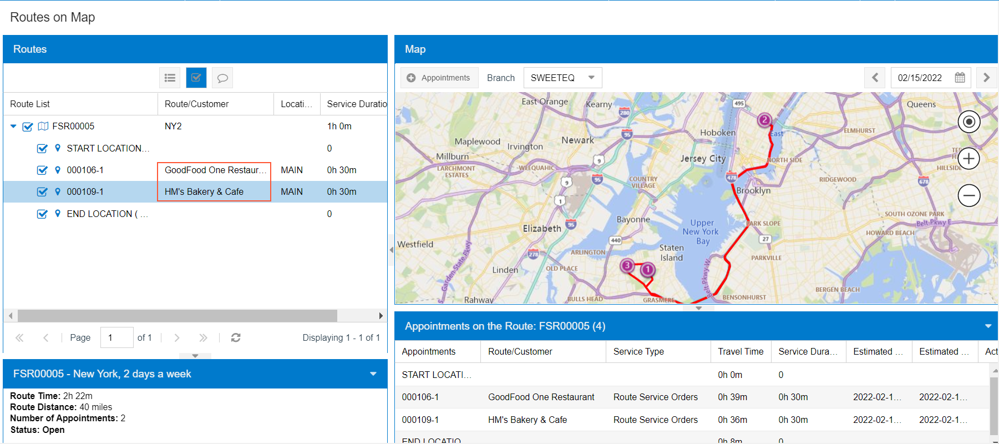

# Route Service Contracts: To Create and Process Service Contract Billed at the Time of Service {#_1af78574-491b-4dc6-b6b7-2e677c0a417c .task}

With a route service contract, which is based on the agreement between the customer and the company, the predefined route services are performed at the agreed-upon frequency. In the system, a route service contract contains basic information—such as the customer, customer location, and dates—and the schedule or schedules associated with the contract. A route contract schedule defines the route service \(or services\), inventory items, and other settings that the generated appointments of route executions will have. It also specifies the recurrence of the generation of these appointments.

In this activity, you will learn how to create a route service contract billed at the time of service, and generate appointments for it.

## Story { .section}

Suppose that the GoodFood One Restaurant and HM's Bakery and Cafe customers have each agreed to the terms of separate contracts with Sweet Life for the delivery of fruits every week on Tuesday and Thursday. The service manager of Sweet Life, Maia Davis, needs to create route service contracts and schedules for the generation of appointments. She will then specify the order in which customers will be visited during route execution. You will perform the needed actions in the system, acting as a service manager.

## Configuration Overview { .section}

In the *U100* dataset, the following tasks have been performed to support this activity:

-   On the [Enable/Disable Features](CS_10_00_00.md#) \(CS100000\) form, the *Service Management* and *Route Management* features have been enabled.
-   On the [Branch Locations](FS_20_25_00.md#) \(FS202500\) form, the *WEST BRIGHTON* branch location has been configured. This branch location has been assigned as a default branch location to the *davis* user on the [User Profile](SM_20_30_10.md#) \(SM203010\) form.
-   On the [Service Order Types](FS_20_23_00.md#) \(FS202300\) form, the *ROUT* service order type with the *Route* behavior has been configured to generate sales orders to bill customers for services that have been provided. That is, the **Sales Orders** option button has been selected under **Generated Billing Documents** in the **Billing Settings** section of the **General** tab.
-   On the [Customers](AR_30_30_00.md#) \(AR303000\) form, for the *GOODFOOD \(GoodFood One Restaurant\)* and *HMBAKERY \(HM's Bakery and Cafe\)* customer, the *AP AP* billing cycle has been selected in the **Service Management** section of the **Billing Settings** tab.
-   On the [Routes](FS_20_37_00.md#) \(FS203700\) form, the *NY2* route has been configured with executions on Tuesdays and Thursdays starting at 9:00 AM.
-   On the [Non-Stock Items](IN_20_20_00.md#) \(IN202000\) form, the *DELIVERY* non-stock item has been configured, and the *Service* type has been selected for it. For this item, the *DELIVERING* item class has been selected, for which the **Route Service Class** check box has been selected on the [Item Classes](IN_20_10_00.md#) \(IN201000\) form.

## Process Overview { .section}

To process route service contracts billed at the time of service, you create service contracts on the [Route Service Contracts](FS_30_08_00.md#) \(FS300800\) form, and create schedules for the generation of appointments on the [Route Service Contract Schedules](FS_30_56_00.md#) \(FS305600\) form. You then review the sequence in which customers will be visited during route executions and modify it on the [Route Sequences](FS_30_38_00.md#) \(FS303800\) form. Finally, you generate the appointments that are stops during the route execution on the [Generate Maintenance from Contract Schedules](FS_50_03_00.md#) \(FS500300\) form.

## System Preparation { .section}

To sign in to the system and prepare to perform the instructions of the activity, do the following:

1.  Launch the Acumatica ERP website, and sign in to a company with the *U100* dataset preloaded; you should sign in as a service manager by using the *davis* username and the *123* password.
2.  In the info area, in the upper-right corner of the top pane of the Acumatica ERP screen, make sure that the business date in your system is set to *1/30/2026*. If a different date is displayed, click the Business Date menu button, and select the *1/30/2026* date from the calendar. For simplicity, in this activity, you will create and process all documents in the system on this business date.

## Step 1: Creating Route Service Contracts { .section}

To create both route service contracts for the customers, do the following:

1.  Open the [Route Service Contracts](FS_30_08_00.md#) \(FS300800\) form.
2.  On the form toolbar, click **Add New Record**, and specify the following settings:
    -   **Customer**: *GOODFOOD \(GoodFood One Restaurant\)*
    -   **Description**: `Delivery Contract`
3.  On the **Summary** tab, specify the following settings of the contract:
    -   **Start Date**: *2/4/2026*
    -   **Expiration Type**: *Expiring*
    -   **Duration**: *1 Year*
    -   **Schedule Generation Type**: *Appointments*
    -   **Billing Type**: *At Time of Service*
4.  On the form toolbar, click **Save**.
5.  Repeat Instructions 2–6 to create a route service contract for *HMBAKERY \(HM's Bakery and Cafe\)*; only the **Customer** setting is different than the settings specified for *GOODFOOD \(GoodFood One Restaurant\)*.

## Step 2: Creating Route Service Contract Schedules { .section}

To create route service contract schedules for the route service contracts you have created, do the following:

1.  While you are still viewing the service contract for *HMBAKERY \(HM's Bakery and Cafe\)* on the [Route Service Contracts](FS_30_08_00.md#) \(FS300800\) form, on the **Schedules** tab, click **Add Schedule**.

    The [Route Service Contract Schedules](FS_30_56_00.md#) \(FS305600\) form opens.

2.  In the **Service Order Type** box of this form, ensure *RTE* is selected.
3.  On the **Details** tab, add a row and specify the following settings:
    -   **Line Type**: *Service*
    -   **Inventory ID**: *DELIVERY*
4.  On the **Recurrence** tab, in the **Frequency** box, select **Weekly**, and do the following in the **Weekly Settings** section:
    -   Leave **Every** *1* **Weeks**.
    -   Select the **Tuesday** and **Thursday** check boxes.
    -   Leave the check boxes for the remaining weekdays cleared.
5.  On the **Route** tab, in the **Route ID** box, select *NY2*.
6.  On the form toolbar, click **Save &amp; Close**.
7.  On the [Route Service Contracts](FS_30_08_00.md#) \(FS300800\) form, on the More menu, click **Activate**.
8.  Open the [Route Service Contracts](FS_30_08_00.md#) form with the created contract for *GOODFOOD \(Good Food Restaurant\)*.
9.  Repeat Instructions 1–7 to create a route service contract schedule with the same settings and activate the contract for *GOODFOOD \(GoodFood One Restaurant\)*.

## Step 3: Specifying the Route Order { .section}

To change the default order of appointments in route executions, do the following:

1.  Open the [Route Sequences](FS_30_38_00.md#) \(FS303800\) form.
2.  In the **Route** box, select *NY2*.

    For the *NY2* route definition, the system shows the sequence in which the appointments will be generated.

3.  In the **Order** column, type `00005` in the line with the *GOODFOOD \(GoodFood One Restaurant\)* customer.
4.  On the form toolbar, click **Save**.

    Notice that the order has changed.

5.  On the toolbar, click **Reset Sequence**.

    The order numbers have been updated with the first two numbers of the default sequence but kept the specified order.

## Step 4: Generating Route Appointments { .section}

To generate route appointments based on the route service contract, do the following:

1.  Open the [Generate Route Appointments](FS_50_02_00.md#) \(FS500200\) form.
2.  Specify the following settings:
    -   **Route**: *NY2*
    -   **Generate Up To**: *2/15/2026*
3.  On the form toolbar, click **Process All**.

    The system opens the **Processing** pop-up window, in which you can see the status of the process.

4.  After the processing has successfully completed, click **Close**.

## Step 5: Reviewing the Generated Route Appointments { .section}

To view the generated route appointments, do the following:

1.  Open the [Routes on Map](FS_30_09_00.md#) \(FS300900\) form.
2.  In the Date box, select the *2/15/2026* date for which you have generated a route execution.
3.  Click the arrow button left of the route execution number in the **Routes** section to view the appointment details of this route execution for the selected day.

    Appointments for the *GOODFOOD \(GoodFood One Restaurant\)* and *HMBAKERY \(HM's Bakery and Cafe\)* customers have been generated within one route execution.

**Parent topic:**[Managing Route Service Contracts](../UserGuide/RouteMgmt_Service_Contracts_Mapref.md)

