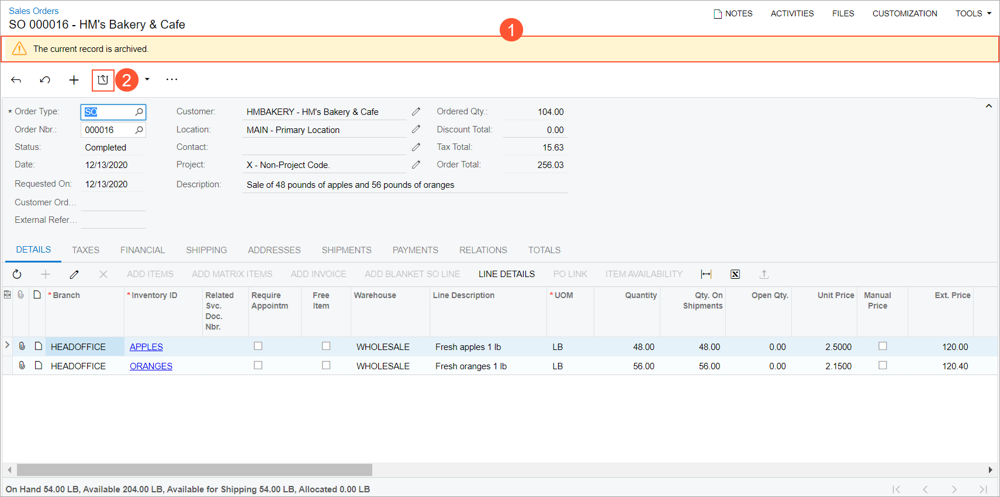
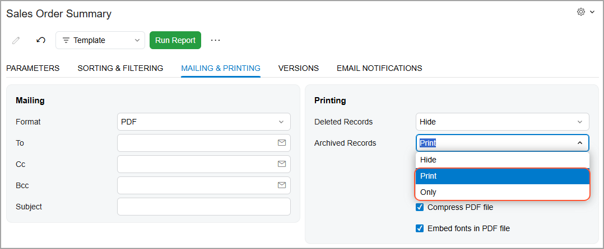

# Archiving Documents: General Information {#_a8b89ec1-b211-452c-8bf4-47fe9d6b9e2f .concept}

By using the document archival functionality, you can archive obsolete documents so that the system does not use these documents in day-to-day operations. The archived documents are not included in the results of database queries executed during regular activities, such as opening generic inquiries, lookup tables, or tabs that load a list of records. As a result, data retrieval performance improves.

You can configure the system to archive documents that have already been processed to completion \(for example, sales orders that have the *Completed* or *Canceled* status\). On the [Archival Policy](SM_20_04_00.md) \(SM200400\) form, you set up the archival policy settings that satisfy your company's rules and regulations. These policies include the entity types of the documents to be archived, as well as the retention period of the documents of each type. So if a document meets all the required criteria and is older than the retention period that you have specified, it is subject to be archived. Currently, the archiving can be configured for only sales orders and shipment documents.

You can create a schedule for archiving the documents automatically according to the schedule settings, or archive documents manually.

If needed, you can open an archived document on its data entry form, and reviewit or extract it from the archive.

## Learning Objectives { .section}

In this chapter, you will learn how to do the following:

-   Configure the archival policy
-   Run the archival process
-   Review the archival history

## Applicable Scenarios { .section}

You use the document archival functionality in the following cases:

-   You want to improve system performance in daily data retrieval operations, so you configure the archival policy and schedule the archival process to automatically occuron a regular basis.
-   You want to hide obsolete documents from reports and inquiries. For example, if according to your company policy, sales orders and shipments must be stored in the system and be valid for one year, you can archive the documents after this retention period.

## Archive Management Roles { .section}

Only users with the *Administrator* or *Archivist* role \(or both roles\) assigned can manage the archiving process, which involves having access to the archive-related forms and having the archive-related UI elements available. This role can be granted to a user on the **Roles** tab of [Users](SM_20_10_10.md) \(SM201010\) form.

## Archival Preferences { .section}

In order to set up the archiving process, you should configure the archival preferences on the [Archival Policy](SM_20_04_00.md) \(SM200400\) form. On this form, you specify the entity types of all documents to be archived \(sales orders, shipments, or both\) and the retention period for each entity type. The retention period of a document is the period that starts when a document is assigned its final status \(for example, a sales order is assigned with the *Completed* or *Canceled* status\) and ends when the specified date range is over.

The archival process may take a lot of time, and during this process, the performance of data entry forms can be affected. Setting the duration time of the archiving process can help you to adjust the process to the company's working schedule. In the Summary area of the [Archival Policy](SM_20_04_00.md) form, the duration of the archival process is set by default to six hours, which means that the system runs the process no longer than six hours. Even if the system has not processed all the documents ready to be archived during the specified duration, it stops the process. You can override this value on the [Archival Policy](SM_20_04_00.md) form manually while you are configuring the archival policy, or it can be overridden in the archival schedule settings \(see the *Scheduling an Archiving Process* section further in this topic\). This duration can also be modified on the [Archive Documents](SM_50_04_00.md) \(SM500400\) form when you are running the process manually.

## Mass-Archiving Process { .section}

If documents are ready to be archived, they appear in the list on the [Archive Documents](SM_50_04_00.md) \(SM500400\) form. On this form, you can manually run the archival process. In the list, each row groups the documents that are ready to be archived on the date. If the row is selected and you start processing, the system will archive the batch of documents of all types that are available for archiving for this specific date. You can view the batch of documents of a specific type for a specific date by clicking the number of documents in the corresponding column cell. This will open the list of documents.

## Scheduling an Archiving Process { .section}

You can set up a schedule so that the system performs the archival process regularly according to the schedule's settings. While this process is running, it can slow down the performance of other system operations \(such as opening inquiries or lookup dialog boxes\), so we recommend that you schedule the process during non-working hours when users are not likely to be interacting with the system.

On the [Archive Documents](SM_50_04_00.md) \(SM500400\) form, on the form toolbar, you click the Schedule \(\) button, and in the drop-down menu, you click **Add**. In the **Automation Schedules** dialog window, which opens, on the **Schedule** tab, you specify the schedule settings, such as the schedule execution frequency and the execution start time. On the **Filter Values** tab, you can specify the maximum duration of the archival process, so that even if the system has not processed all the records in the list, it will stop the process when the archival duration time is over.

## Archiving the Individual Document Manually { .section}

You can archive a needed document individually if it meets the archival criteria—that is, if its retention period is over according to the settings made on the [Archival Policy](SM_20_04_00.md) \(SM200400\) form, and it has been processed to its final status. To archive the document that you have opened on the [Sales Orders](SO_30_10_00.md) \(SO301000\) or [Shipments](SO_30_20_00.md) \(SO302000\) form, you click the **Archive** button \(\) on the form toolbar .

## Extracting an Archived Document { .section}

You can extract any archived document from the archive, if needed. To open an archived document, you can use the document's direct link, such as the document reference number link located in another document \(for example, in an invoice related to a sales order\). When the document is opened, you can see a message at the top of the form \(see Item 1 in the following screenshot\) notifying you that the document has been archived. The archived document is not fully usable; you can only view it for reference. In the archived document, most of the boxes, buttons, and actions are disabled by default. Archived sales orders can be copied and printed.

To make the document fully usable again, you need to extract it from the archive. You do this by clicking the **Extract** button on the form toolbar of the data entry form \(Item 2\).

**Tip:** Archived documents are not available in the document lookup tables of data entry forms, and they cannot be opened when you click the navigation buttons on the form toolbar of data entry forms.

## History of Archival { .section}

On the [Document Archival History](SM_40_04_00.md) \(SM400400\) form, you can review the results of the archival process executions. On this form, in the Selection area, you can specify the date range and review the list of executions \(if any\) by date within the specified data range, the number of documents archived on each date, and duration of the process executions.

This information can be used for analysis and statistics. For example, you can estimate how long it will take to process a certain number of documents or determine whether the process duration is enough to effectively prevent the number of usable records from growing \(for example, the number of sales orders archived in a particular day should be greater than or equal to the number of sales orders created in the system that day\).

## Archived Documents in Generic Inquiries and Reports { .section}

By default, archived documents are excluded from the results of all generic inquiries and reports. To include archived documents in the results of the selected generic inquiry, on the [Generic Inquiry](SM_20_80_00.md) \(SM208000\) form, you select the **Show Archived Records** check box in the Summary area of the form.

You can also opt to include archived documents in a report that you are running. On the **Mailing &amp; Printing** tab of the report form, you select one of the following options in the **Archived Records** box \(shown below\):

-   *Print*: Includes both archived and unarchived records in the report.
-   *Only*: Includes only the archived records in the report.

If you select *Hide*, the archived records are excluded from the report.

**Parent topic:**[Archiving Old Documents](../UserGuide/SA_Archiving_Old_Documents_Mapref.md)

