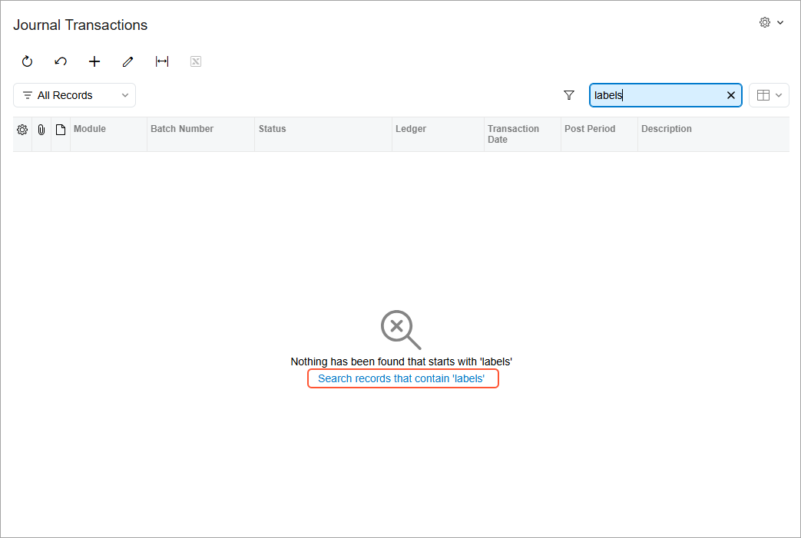

# Search Indexes: General Information {#_91e54e08-0fb9-440f-a22d-9ca2e54c6919 .concept}

Within Acumatica ERP, users can perform searches in Help topics, wikis, and various entities, such as vendors, customers, invoices, and contracts. To make the process quick and accurate, Acumatica ERP uses semantic search and search indexes.

## Learning Objectives { .section}

In this chapter, you will learn how to build search indexes.

## Applicable Scenarios { .section}

You need to rebuild the search indexes in the following cases:

-   You have received complaints from the users of the system on the quality of search results. You rebuild the search indexes as the first step of the process of investigating the reported issue.
-   You have upgraded your Acumatica ERP system from a version that did not include the search indexes.

## Semantic Search in Acumatica ERP { .section}

Acumatica ERP uses semantic search through SQL databases, which gives the system the ability to identify the key phrases in text or documents, discover similar or related documents, and provide information to explain how documents are similar or related.

To employ semantic search in your Acumatica ERP instance, make sure that semantic search functionality is enabled, which depends on your SQL server as follows:

-   In Microsoft SQL Server, the semantic search functionality is disabled by default. Enable the functionality, as described in [Preparation for the Acumatica ERP Installation: System Environment](INST_Preparing_Installation_System_Environment.md) in Acumatica ERP Installation Guide.
-   In MySQL Server, the semantic search functionality is enabled by default.

## Search Indexes { .section}

The search indexes are used to accelerate searching in Acumatica ERP. When users perform day-to-day operations, such as adding new documents or updating customer accounts, new information is added to the appropriate search indexes automatically.

The list of indexed entities, excluding the wikis, is available on the [Rebuild Full-Text Entity Index](SM_20_95_00.md) \(SM209500\) form. By using this form, you can rebuild selected search indexes or all of them at once.

**Tip:** We strongly recommend rebuilding search indexes after upgrading Acumatica ERP to the next version.

The indexing of the data may take some time. In the **Processing** dialog box, the green check mark appears for the indexes after their successful creation. The red check mark appears for the indexes that could not be built.

## Recreation of Search Indexes { .section}

If the system has failed to rebuild some search indexes, you can recreate all the indexes. On the More menu of the [Rebuild Full-Text Entity Index](SM_20_95_00.md) \(SM209500\) form, you click **Clear All Indexes** to remove all the indexes. Then on the form toolbar, you click **Process All** to build all the indexes anew.

## Wiki Search Indexes { .section}

The built-in Help wikis are indexed automatically. The wikis created in your system are not indexed automatically; you need to build indexes for such wikis manually. On the More menu of the [Rebuild Full-Text Entity Index](SM_20_95_00.md) \(SM209500\) form, you click **Index Custom Articles** to initiate indexing of your custom articles. Wiki search indexes are not displayed on the [Rebuild Full-Text Entity Index](SM_20_95_00.md) form.

## Known Limitations to Search Queries { .section}

The system performs a full-text search for the queries that contain words whose length is two or more characters.

A semantic search does not find related entities if the search query includes word breakers, such as AND or FOR.

For example, suppose that you want to find related entities by using a description as a search query. If the description includes at least one word breaker, the search returns no results.

## Restart of the Full-Text Engine {#section_fcn_mhy_n5b .section}

The full-text search functionality could unexpectedly stop working after an upgrade, snapshot restoration, or unsuccessful attempt to copy a company because the full-text search feature became disabled on a database server.

The system detects that the Full-Text Search feature is disabled on the server and shows a warning message to a user after a global search attempt. You can restart the engine by clicking **Restart Full-Text Search** on the More menu of the [Rebuild Full-Text Entity Index](SM_20_95_00.md) \(SM209500\) form.

## Configuration of a Search Condition {#section_als_snk_qsb .section}

You can control which condition the system uses by default for the searches performed with the search box in tables. You select a condition in the **Search Condition** box on the [Site Preferences](SM_20_05_05.md) \(SM200505\) form. The following options are available:

-   *Contains* \(default\): The system converts the *Contains* condition to the `LIKE '%X%'` inquiry in MS SQL; the search may take some time and cause performance issues. This option is offered to preserve backward compatibility.
-   *Starts With*: The *Starts With* condition \(`LIKE 'X%'` in MS SQL\) works more quickly when a user is searching for a record in a table.

If the *Starts With* option is selected, the system uses this condition by default for these searches. If a search returns no results, the system notifies the user and provides a link that the user can click to perform the search with the *Contains* condition instead; see the following screenshot.

**Attention:** The system applies the configured search condition only to the Search box of the tables.

**Parent topic:**[Building Search Indexes](../UserGuide/SA_Building_Search_Indexes_Mapref.md)

