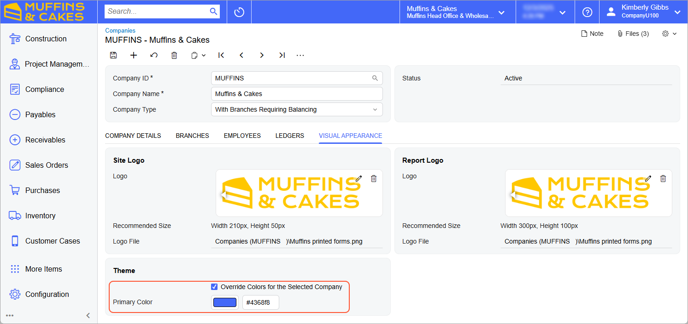

# Color Theme: To Change the Primary Color {#_7e557a43-6c87-489e-a2d1-2863c3d07d15 .task}

The following activity will walk you through the process of modifying the color theme for the Muffins &amp; Cakes company.

## Story { .section}

Suppose that a manager of the Muffins &amp; Cakes company has asked you to change the default color theme for the company's user interface so that it complies with the Muffins &amp; Cakes company's style guidelines and corporate colors. Acting as a system administrator, you will change the primary color.

## Configuration Overview { .section}

For the purposes of this activity, in the *U100* dataset, on the [Companies](CS_10_15_00.md) \(CS101500\) form, the Muffins &amp; Cakes \(*MUFFINS*\) company has been configured.

## Process Overview { .section}

In this activity, you will change the primary color of the Muffins &amp; Cakes company's UI by using the [Companies](CS_10_15_00.md) \(CS101500\) form.

## System Preparation { .section}

Before you begin changing the color theme for the Muffins &amp; Cakes company, do the following:

1.  Launch the Acumatica ERP website, and sign in to a company with the *U100* dataset preloaded; you should sign in as system administrator by using the *gibbs* username and the *123* password.
2.  On the Company and Branch Selection menu on the top pane of the Acumatica ERP screen, make sure that the *Muffins Head Office &amp; Wholesale Center* branch is selected. If it is not selected, click the Company and Branch Selection menu button to view the list of branches that you have access to, and then click *Muffins Head Office &amp; Wholesale Center*.
3.  As a prerequisite activity, make sure that you have set up the company logo, as described in [Company Logo Usage: To Set Up a Logo](SA_Setting_Up_Company_Logo_Activity.md).

## Step: To Change the Primary Color for a Company { .section}

To change the color theme for your company, do the following:

1.  Open the [Site Preferences](SM_20_05_05.md) \(SM200505\) form.
2.  Make sure that *Default* is selected in the **Interface Theme** box.
3.  On the [Companies](CS_10_15_00.md) \(CS101500\) form, open the *MUFFINS* company.
4.  On the **Visual Appearance** tab, in the **Theme** section, specify the following settings:
    1.  **Override Colors for the Selected Company**: Selected
    2.  **Primary Color**: `#4368f8`

        In the box on the left, review the color based on which the system will calculate the updated color theme.

5.  On the form toolbar, click **Save**.

    The system updates the color theme. It should look as shown in the following screenshot.

    

6.  Switch to the *SweetLife Head Office and Wholesale Center* branch by using the Company and Branch Selection menu in the top pane to verify that the color theme is used for only the Muffins &amp; Cakes company.

In this activity, you have changed the color theme for the company.

**Parent topic:**[Customizing the Color Theme](../UserGuide/SA_Customizing_Color_Theme_Mapref.md)

