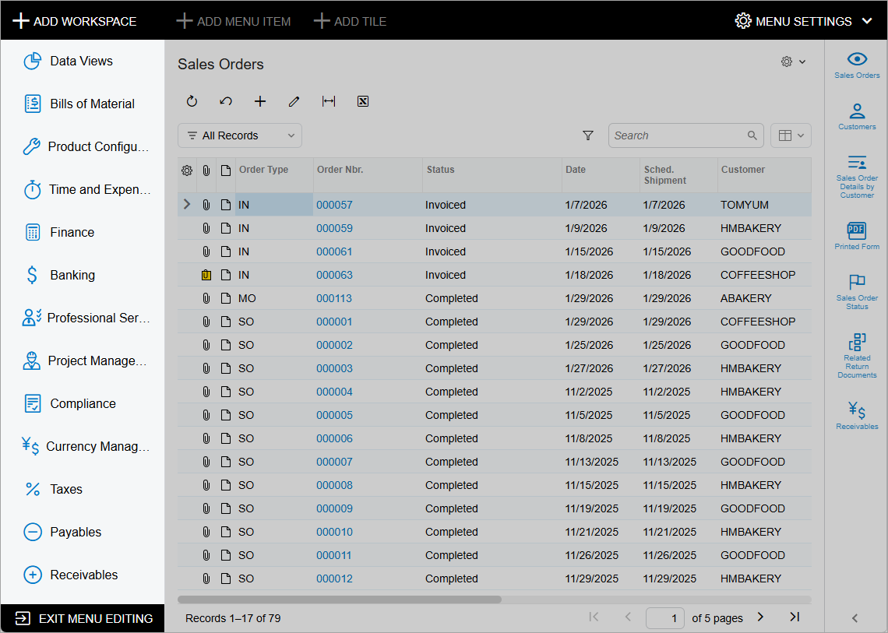
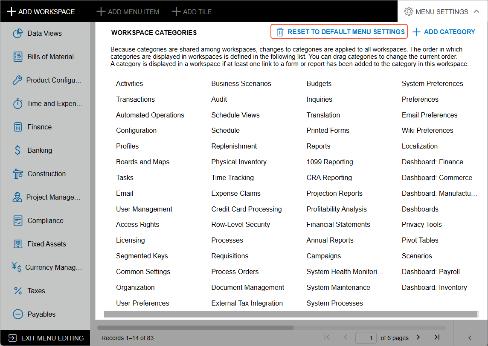

# UI Navigation Options: General Information {#_6ba42a8d-82c5-47b8-8e4d-f5a4ab87b1a5 .concept}

The main user interface of Acumatica ERP provides predefined elements that you can configure to adjust the UI to the business processes of your organization. These elements include the menu items in the main menu and the tiles and links in workspaces.

The main menu displays the menu items that have been pinned to the menu. A user can click a menu item to navigate to the corresponding workspace. Below the named items is the **More Items** menu item, which a user can click to view a menu with tiles that represent all other available workspaces that have not been pinned to the main menu. You can pin the menu items of any workspaces to the main menu.

A workspace is a menu that contains tiles and links to the forms, reports, and dashboards of a particular area of the product. A tile is a button that a user can click to open a form or report with predefined settings. Links to forms are organized in categories.

## Learning Objectives { .section}

In this chapter, you will learn how to do the following:

-   Modify the set of menu items on the main menu by using Menu Editing mode
-   Modify the contents of a workspace by using Menu Editing mode
-   Modify the site map to change a form name or a form location in the workspace or workspaces, and the category where form links appear
-   Create a new workspace on the main menu by using Menu Editing mode

## Applicable Scenarios { .section}

You may want to tailor the main menu and workspaces if you encounter the following scenarios:

-   The predefined set of workspaces does not correspond to the business processes of your organization. You can add new workspaces and populate them with items—that is, tiles and links that provide access to forms, reports, and dashboards. You can also rename existing workspaces.
-   A workspace contains workspace items that your users do not need or otherwise is not organized to fit your business processes. In this case, you can tailor the workspace so that it contains only the workspace items that your employees use in their work. You can regroup the links to forms and reports in a workspace, reorder the links to forms and reports in a category, and reorder tiles in a workspace. You can also remove any unneeded workspace items and change the tiles and links to forms, reports, and dashboards in a workspace.
-   Your users frequently create a record with a particular set of settings. In the applicable workspace, you can add a tile that includes the needed settings on a particular data entry form, which gives users the ability to create records more quickly.
-   A title of a form is not optimal for your users. In this case, you can change it to better fit users' needs and the terminology used in your business.

## User Role for Tailoring the Main Menu and Workspaces { .section}

In the **Menu Editor Role** box of the [Security Preferences](SM_20_10_60.md) \(SM201060\) form, you can specify any available user role. A user with the specified role can use Menu Editing mode to tailor the user interface of the main menu and workspace menu items. The changes this user makes in this mode are applied to all users of Acumatica ERP.

**Tip:** We recommend that you create a dedicated role for editing the main menu and workspaces and assign it to those users who should have the ability to modify the main menu and workspaces.

## Menu Editing Mode { .section}

To modify the main menu, if your user account has been assigned the menu editor role, you switch to Menu Editing mode by clicking the **Open Configuration Menu** button \(\) in the lower left corner of the screen. In the menu that opens, you click **Edit Menu**. The system switches to Menu Editing mode, which is shown in the following screenshot.

When you have completed the modification of the menu, you click **Exit Menu Editing** to save your changes and stop using Menu Editing mode.

**Tip:** If your changes are not applied immediately after you refresh the webpage, we recommend clearing your browser cache and loading the page again.

## Returning the Main Menu and Workspaces to the Default Settings { .section}

If you have tailored the main menu and workspaces in Menu Editing mode and then decide to return to the initial state of the main menu and all workspaces, you can revert to the default settings. In Menu Editing mode, you click **Menu Settings** in the upper right corner of the screen and select **Reset to Default Menu Settings**, as shown in the following screenshot.

The system rolls back the changes to the following:

-   The list of workspaces that have corresponding menu items on the main menu and the **More Items** menu
-   The items in each workspace, including categories, tiles, and links to forms, reports, and dashboards
-   The items in the quick menu of each workspace for all users of the system

**Parent topic:**[Customizing the User Interface](../UserGuide/SA_Customizing_UI_Mapref.md)

