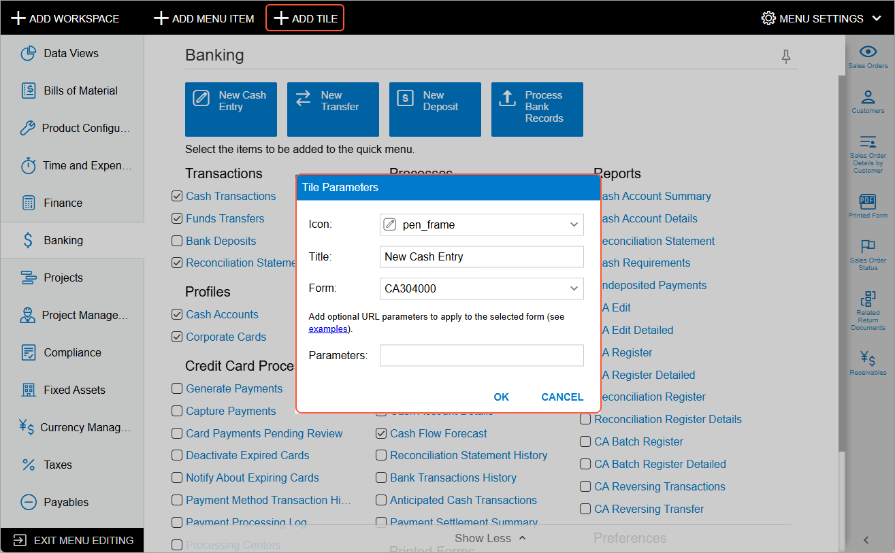
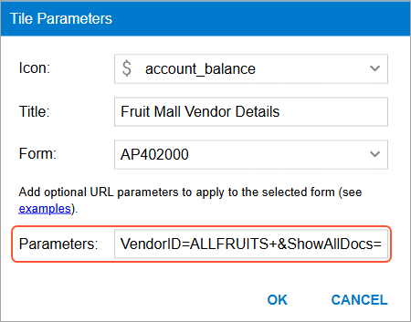
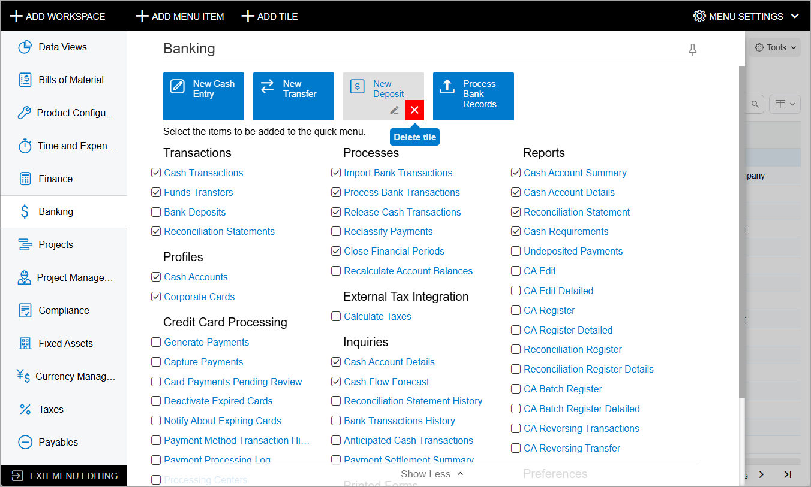
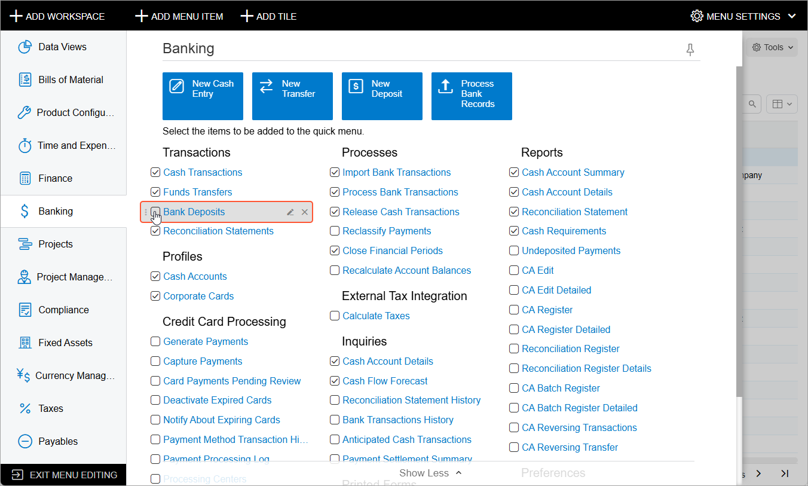
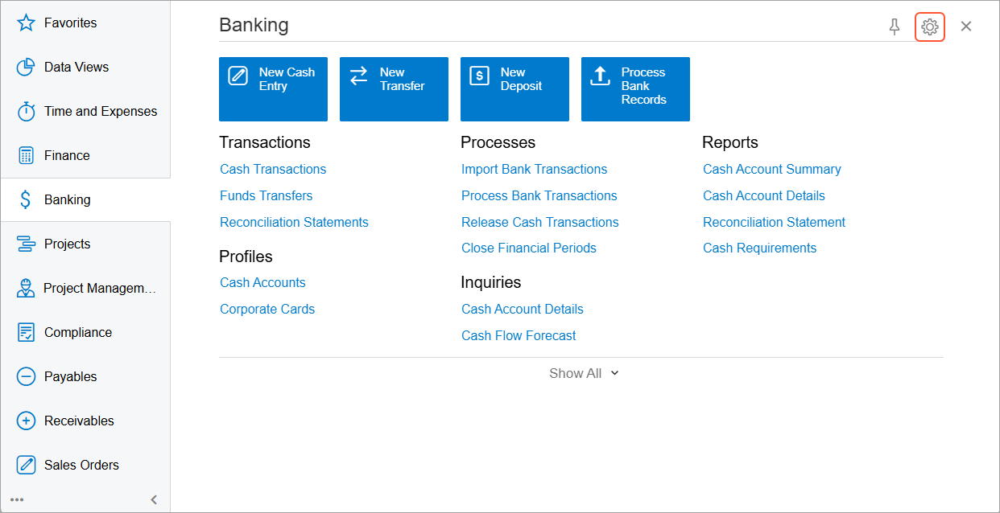
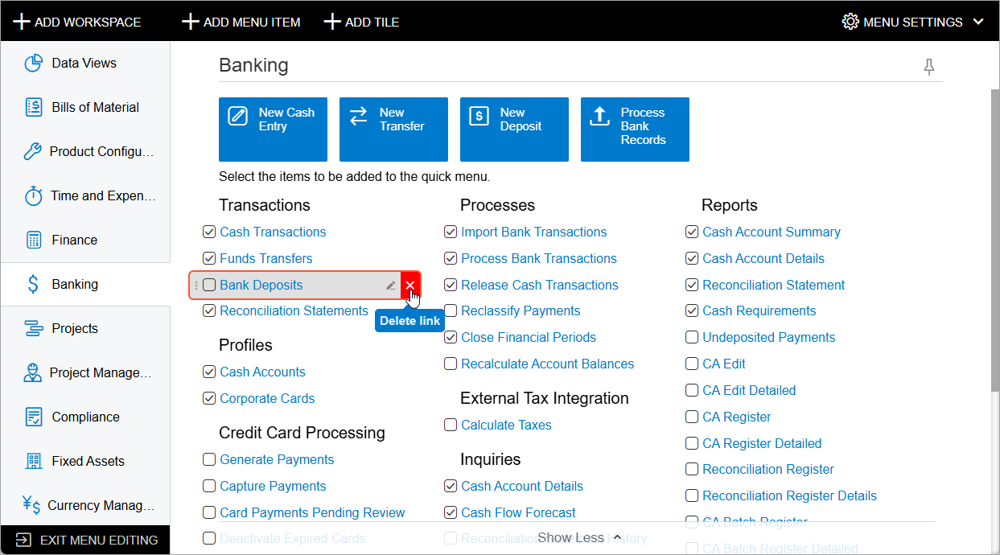
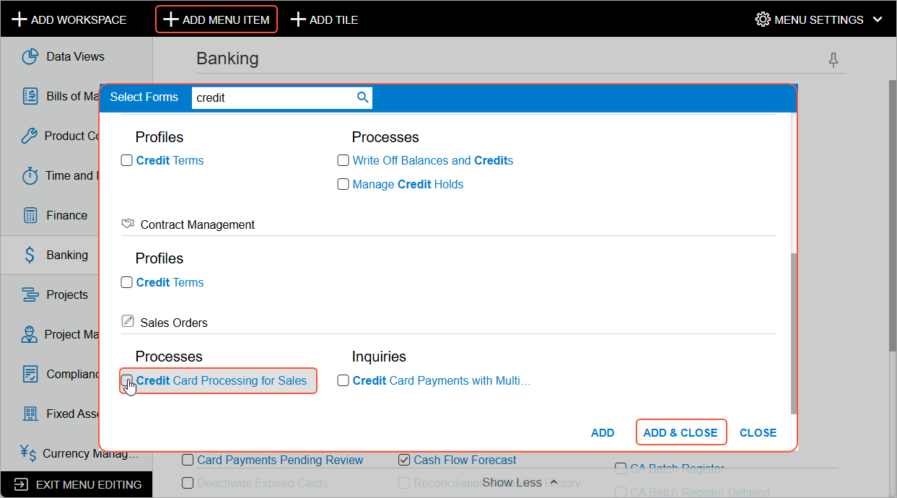
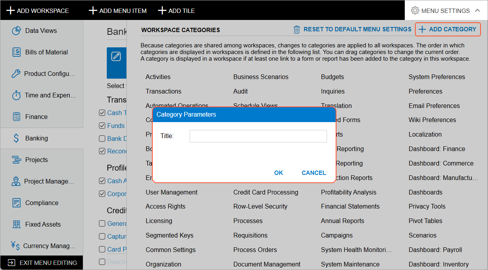
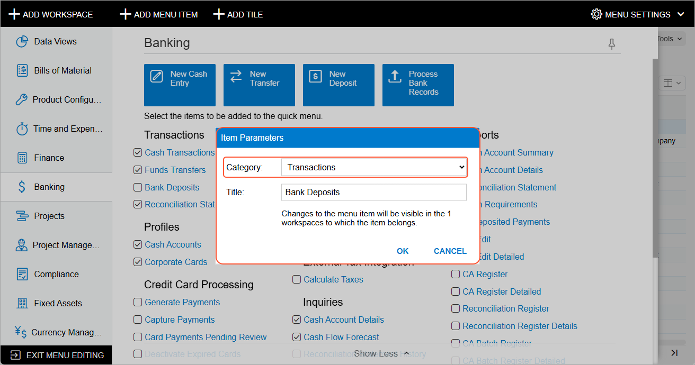

# UI Navigation Options: Tiles and Links to Forms in a Workspace {#_433f5d13-a9a0-45d6-8971-a4da23a923b8 .concept}

Workspaces are used in the system to organize related links to forms, reports, and dashboards in a way that is convenient to users. Each predefined workspace in the system contains tiles and links. Tiles are buttons that users can click to quickly access frequently used forms, possibly with common settings filled in. A workspace also has links to forms, reports, and dashboards with related functionality. These links are grouped into categories, such as **Profiles**, **Reports**, and **Preferences**.

Acumatica ERP gives you the ability to change the sets of Acumatica ERP forms, reports, and dashboards in workspaces so that they optimally support the organization’s processes. You can also change the tiles available in a workspace.

## Adding and Reordering Tiles { .section}

A tile is a special button on a workspace that a user clicks to open a form or report with predefined settings \(or, for a data entry form, with most settings blank so that a user can define a new record\). For example, a tile could be added that a user can click to open the [Cash Transactions](CA_30_40_00.md) \(CA304000\) form to create a new cash entry.

To create a tile, you switch to Menu Editing mode and open the needed workspace. You click **Add Tile** on the top toolbar, and the system opens the **Tile Parameters** dialog box. In the dialog box, you specify the icon and title to be displayed on the tile, as well as the form that the system should open when a user clicks the tile \(see the following screenshot\). You can also add tile parameters, as described in the next section. You then click **OK** to close the dialog box and add the tile.

You can also reorder the tiles in a workspace. To do this, in Menu Editing mode, you drag any tile to the needed position.

## Using Tile Parameters { .section}

If the employees of your organization frequently create records with a particular set of settings or enter particular settings to limit the data in an inquiry form, you can make this operation faster by adding a tile that includes the needed settings. For example, a tile could be added that a user can click to open the [Vendor Details](AP_40_20_00.md) \(AP402000\) form with a particular vendor selected in the **Vendor** box.

To indicate the elements and values that need to be provided to the system when a user clicks the tile, you specify fields and their values as URL parameters in the **Tile Parameters** dialog box for the tile. You can add multiple parameters separated by *&amp;*.

To determine the URL parameters for elements located in the Summary or Selection area of a form, you can open the form, select the box value in the area, and look at the form's URL. The system adds to the URL the parameter that corresponds to the box on a form with the selected value. \(See the following screenshot.\)

Alternatively, to determine the URL parameters for the UI elements of forms that the system does not add as URL parameters, you use the **Element Properties** dialog box to inspect each of these elements and find out what data field corresponds to it. You open the form to be opened in the tile, press Ctrl+Alt, and click the needed element on the form.

**Important:** The way of determining an element's settings by using the **Element Properties** dialog box is available only for form elements and cannot be applied to report elements.

In the **Element Properties** dialog box, which opens, you copy the value specified in the **Data Field** box, as the following screenshot shows for the **Vendor** box of the [Bills and Adjustments](AP_30_10_00.md) \(AP301000\) form. In the URL shown in the screenshot, notice that the system added to the URL only the document type and its reference number, because these two values explicitly identify the document, and adding other parameters to the URL is not needed.

After you find out which data fields correspond to all the elements whose settings you want to provide to the system when a user clicks the tile, you add the parameters for the tile. In Menu Editing mode with the workspace open, you point to the tile and click **Edit Tile Parameters** \(\) on the pop-up toolbar for the tile. In the **Tile Parameters** dialog box, which opens, you specify these parameters in the **Parameters** box \(see the following screenshot\) and click **OK**.

You can also use the **Tile Parameters** dialog box to change a tile, including its name, icon, and parameters.

## Deleting Unnecessary Tiles { .section}

If the employees of your organization do not use the predefined tiles, you can delete any tile from a workspace. To delete a tile, you switch to Menu Editing mode, open the needed workspace, and point at the tile. On the pop-up toolbar of the tile, click **Delete Tile** \(\); see the following screenshot.

**Attention:** After you delete a predefined tile, you will be able to restore it only if you restore the default menu settings.

## Configuring a Quick Menu { .section}

When a user opens a workspace, the system displays its quick menu, which consists of only those links to the forms, reports, and dashboards that were configured to be displayed on this menu, which includes the most frequently accessed items that users need. To view the rest of the forms, reports, and dashboards, the user clicks **Show All** in the workspace footer.

When you tailor the workspace, you can configure the set of links to be available in the quick menu by default. You switch to Menu Editing mode and open the needed workspace. In the workspace, you select the check boxes next to the forms that should be displayed on the quick menu. \(See the following screenshot.\) You clear the check boxes for those forms that are not displayed on the quick menu; they should be displayed only when a user clicks **Show All**.

Users of your system can configure their own set of links on the quick menu of a workspace if the quick menu configured in the system does not meet their needs. On the workspace title bar, they click **Configure Quick Menu**\(\), which is shown in the following screenshot, to switch to Configuration mode.

In this mode, they can select check boxes for the forms, reports, and dashboards whose links will be displayed on the quick menu \(and clear check boxes for items to not be displayed\).

## Removing Links to Forms, Reports, and Dashboards { .section}

If you are sure that users will not need a particular link to a form, report, or dashboard in a workspace, you can remove this link from the workspace. The form, report, or dashboard will remain in the system and can be added to a workspace.

To remove a link, you switch to Menu Editing mode and open the needed workspace. In the workspace, you point to the form, report, or dashboard to be deleted; on the pop-up toolbar of the item, you click **Delete Link** \(\), as shown in the following screenshot, and confirm your action.

## Adding Links to Workspaces { .section}

If a link to an Acumatica ERP form, report, or dashboard is not in a workspace by default but the employees of your organization want to have it in this workspace, you can add the required link to the workspace.

**Attention:** If a link to a form, report, or dashboard has not been added to any workspace, you cannot find this form or report by using the **Search** box in the top pane of the Acumatica ERP screen.

In Menu Editing mode, you open the needed workspace. You click **Add Menu Item** on the top toolbar. In the **Select Forms** dialog box, which opens, you search for the needed form, report, or dashboard by typing its name or identifier in the **Search** box. To add the item, you select the check box next to it and click **Add and Close** to exit the dialog box \(see the following screenshot\).

## Managing Categories { .section}

In a workspace, the links to the forms, reports, and dashboards are grouped by categories. In Menu Editing mode, you can review the list of available categories by clicking **Menu Settings** in the upper right corner to open the **Workspaces Categories** menu. Because categories are shared among workspaces, changes to categories are applied to all workspaces. The order in which categories are displayed in workspaces is defined in this list. You can drag categories to change their order. A category is displayed in a workspace if at least one link to a form or report has been added to the category in this workspace.

If the available set of categories does not work for your employees, you can create a category that fits the terminology used by your company. To do this, in the **Workspaces Categories** menu, you click **Add Category**, and in the **Category Parameters** dialog box, you type the category name and click **OK**. \(See the following screenshot.\)

## Moving Links Within and Between Categories { .section}

If the default grouping of links to forms, reports, and dashboards in a workspace is inconvenient for the employees of your organization, you can move links within a category or to other categories. To move a link within a category, in Menu Editing mode with a workspace open, you can drag the link to the needed position.

If you need to move a link to an existing category that is displayed in a workspace, in Menu Editing mode with the workspace open, you can simply drag the link to the category. Alternatively, you can change a category, by editing the link parameters. You point at the form, report, or dashboard to be moved to another category; on the pop-up toolbar of the item, you click **Edit Link Parameters** \(\) next to the link. The system opens the **Item Parameters** dialog box, where you can select another category for the link in the **Category** box \(see the following screenshot\) and then click **OK**.

## Changing a Form's Title { .section}

If a title of a form is not optimal for your company's users, you can change the title to one your users are accustomed to. The new title will be used for the form throughout the whole system rather than just in the workspace from which you change it.

To do this, in Menu Editing mode, you open the needed workspace. You point to the form, report, or dashboard to be renamed; on the pop-up toolbar of the item, you click **Edit Link Parameters** \(\) next to the link to the form. The system opens the **Item Parameters** dialog box, where you can type the new name of the form in the **Title** box and click **OK** to close the dialog box.

**Parent topic:**[Customizing the User Interface](../UserGuide/SA_Customizing_UI_Mapref.md)

