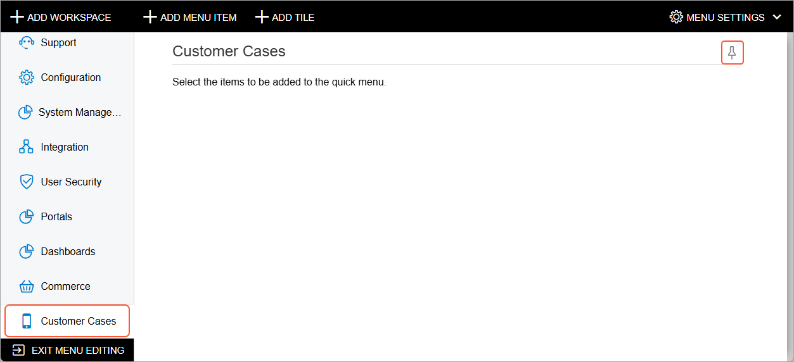
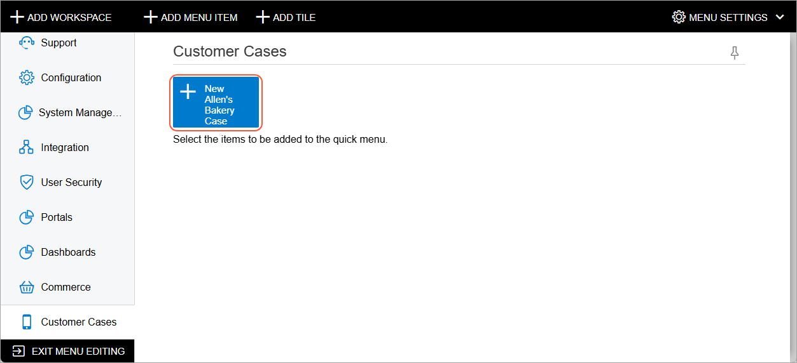
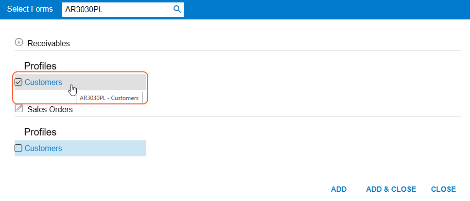
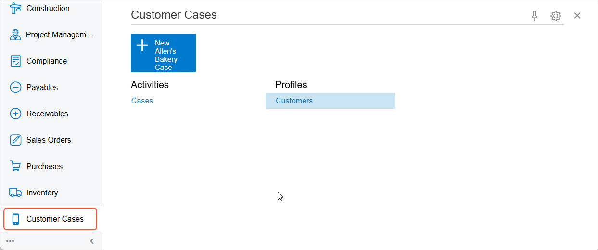

# UI Navigation Options: To Configure a Workspace {#_866b6a42-ebb6-42b1-9104-e981929c16f7 .task}

The following activity will walk you through the process of creating and configuring a workspace in Acumatica ERP.

**Attention:** This activity is based on the *U100* dataset. If you are using another dataset or if any system settings have been changed in *U100*, these changes can affect the workflow of the activity and the results of the processing. To avoid issues, restore the *U100* dataset to its initial state.

## Story { .section}

Suppose that a customer support manager of the Muffins &amp; Cakes company has asked you, the system administrator, to create a new workspace for quick access to the forms that customer support representatives use most often. You have been asked to initially include the [Customers](AR_30_30_00.md) \(AR303000\) and [Cases](CR_30_60_00.md) \(CR306000\) forms in this workspace. The workspace should be pinned to the main menu panel by default.

Also, the manager has requested that you add a new tile for the quick creation of cases from Allen's Bakery, the company's highest-priority customer, for juicer repair \(that is, with the case class for juicer repair specified\). To do this, you need the [Cases](CR_30_60_00.md) form to open with the appropriate customer and case class filled in.

## Configuration Overview { .section}

In the *U100* dataset, the following tasks have been performed to support this activity:

-   On the [Companies](CS_10_15_00.md) \(CS101500\) form, the Muffins &amp; Cakes \(*MUFFINS*\) company has been configured.
-   On the [Case Classes](CR_20_60_00.md) \(CR206000\) form, the *JREPAIR* case class has been configured.
-   On the [Customers](AR_30_30_00.md) \(AR303000\) form, the *ABAKERY* customer account has been configured.

## Process Overview { .section}

You will inspect the **Case Class** and **Business Account** elements on the [Cases](CR_30_60_00.md) \(CR306000\) form to find the corresponding data fields. On the [Case Classes](CR_20_60_00.md) \(CR206000\) form and [Customers](AR_30_30_00.md) \(AR303000\) form, you will find the URL parameters for the needed customer and case class.

You will switch to Menu Editing mode and will create the **Customer Cases** workspace. You will add the **New Allen's Bakery Case** tile to the workspace. Then you will add links to the [Customers](AR_30_30_00.md) and [Cases](CR_30_60_00.md) forms to this workspace.

## System Preparation { .section}

Before you begin configuring a workspace, do the following:

1.  Launch the Acumatica ERP website, and sign in to a company with the *U100* dataset preloaded; you should sign in as system administrator by using the *gibbs* username and the *123* password.
2.  On the Company and Branch Selection menu in the top pane of the Acumatica ERP screen, make sure that the *Muffins Head Office &amp; Wholesale Center* branch is selected. If it is not selected, click the Company and Branch Selection menu button to view the list of branches that you have access to, and then click *Muffins Head Office &amp; Wholesale Center*.

## Step 1: Preparation for the Configuration of the Tile { .section}

To gather the data you will need to configure the tile, do the following:

1.  Open the [Cases](CR_30_60_00.md) \(CR306000\) form.
2.  Press Ctrl+Alt, and click the **Case Class** element in the Summary area of the form.

    **Tip:** As an alternative, you can click **Settings** &gt; **Inspect Element** on the form title bar and then click the needed UI element.

3.  In the **Element Properties** dialog box, which opens, note the value in the **Data Field** box, which is CaseClassID; close the dialog box.
4.  Press Ctrl+Alt, and click the **Business Account** element in the Summary area of the form.
5.  In the **Element Properties** dialog box, which opens, note the value in the **Data Field** box, which is CustomerID; close the dialog box.
6.  Open the Case Classes \(CR2060PL\) form. Review the case class descriptions in the **Description** column, and locate the class with the *Repair of juicers* description \(*JREPAIR*\).
7.  In the **Case Class ID** column, click *JREPAIR*.

    The system opens the [Case Classes](CR_20_60_00.md) \(CR206000\) form with the *JREPAIR* class selected.

8.  In the address bar of your browser window, note the value of the CaseClassID URL parameter, which is JREPAIR.
9.  Open the Customers \(AR3030PL\) form. Review the customer descriptions in the **Description** column, and locate the customer record with the *Allen's Bakery* description \(*ABAKERY*\).
10. In the **Customer ID** column, click *ABAKERY*.

    The system opens the [Customers](AR_30_30_00.md) \(AR303000\) form with *ABAKERY* \(Allen's Bakery\) selected.

11. In the address bar of your browser window, note the value of the AcctCD URL parameter, which is ABAKERY+++.

    **Tip:** The identifiers of customer accounts have a fixed length. If an identifier's length is less than the fixed one, the system replaces the missing symbols with spaces, which are transformed to *+* in a URL address.

You have collected the information needed for adding the requested URL parameter to the new tile, which is CaseClassID=JREPAIR&amp;CustomerID=ABAKERY+++.

## Step 2: Adding the Workspace { .section}

To create the new workspace, do the following:

1.  On the main menu of Acumatica ERP \(lower left\), click the **Open Configuration Menu** button \(*...*\), and then click **Edit Menu** to switch to Menu Editing mode.
2.  On the top toolbar \(upper left\), click **Add Workspace**.
3.  In the **Workspace Parameters** dialog box, which opens, specify the following settings:
    -   **Icon**: *phone\_iphone*
    -   **Area**: *Other*
    -   **Title**: `Customer Cases`
4.  Click **OK** to save your changes and close the dialog box.
5.  In the upper right corner of the workspace title bar, click the **Pin to Main Menu Panel** button. Notice that the **Customer Cases** menu item has been added to the main menu, as shown in the following screenshot.

    

## Step 3: Adding the Tile with Parameters { .section}

Now you will add the new tile for users to quickly create cases for juicer repair from Allen's Bakery. To add the requested tile with the needed tile parameters to the workspace, while you are still reviewing the **Customer Cases** workspace in Menu Editing mode, do the following:

1.  On the top toolbar, click **Add Tile**.
2.  In the **Tile Parameters** dialog box, which opens, specify the following settings:
    1.  **Icon**: *add*
    2.  **Title**: `New Allen's Bakery Case`
    3.  **Form**: *CR306000 - Cases*
    4.  **Parameters**: `CaseClassID=JREPAIR&CustomerID=ABAKERY+++`
3.  Click **OK** to save your changes and close the dialog box.

    The following screenshot shows the workspace in Menu Editing mode with the newly added tile.

    

## Step 4: Adding Links to the Workspace { .section}

To add links to forms to the **Customer Cases** workspace, do the following:

1.  In Menu Editing mode of Acumatica ERP, while you are still reviewing the **Customer Cases** workspace, on the top toolbar, click **Add Menu Item**.
2.  In the **Select Forms** dialog box, which opens, search for the *Customers* \(*AR3030PL - Customers*\) item in the **Profiles** category of the **Receivables** workspace, and select the unlabeled check box for it, as shown in the following screenshot.

    

3.  Click **Add** to add the link to the form.
4.  While you are still viewing the **Select Forms** dialog box, search for the *Cases* \(*CR3060PL - Cases*\) item in the **Activities** category of the **Support** workspace, and select the unlabeled check box for it.
5.  Click **Add &amp; Close**.
6.  In the lower left corner of the screen, click **Exit Menu Editing** to save your changes and exit Menu Editing mode.

    The **Customer Cases** workspace should look as shown in the following screenshot.

    

7.  While you are still viewing the **Customer Cases** workspace, click the tile.
8.  Verify that the system opens the [Cases](CR_30_60_00.md) \(CR306000\) form with the following settings filled in:
    -   **Case Class**: *JREPAIR - Repair of juicers*
    -   **Business Account**: *ABAKERY - Allen's Bakery*

In this activity, you have added a new workspace, pinned it to the main menu panel, and populated it with a tile and links to the frequently accessed forms.

**Parent topic:**[Customizing the User Interface](../UserGuide/SA_Customizing_UI_Mapref.md)

