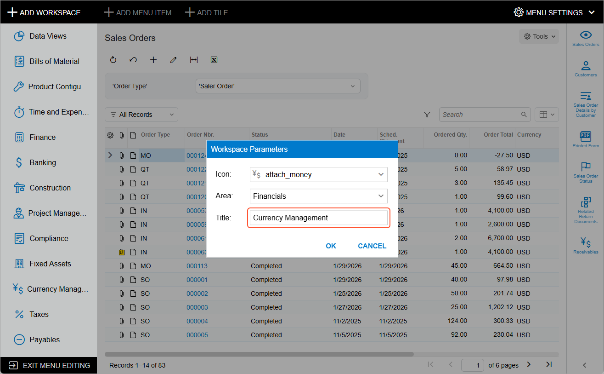
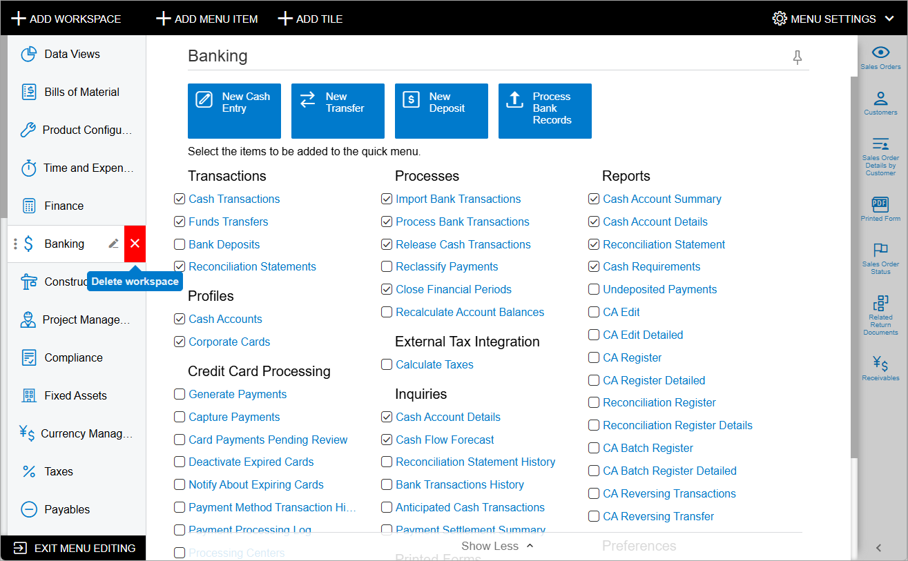
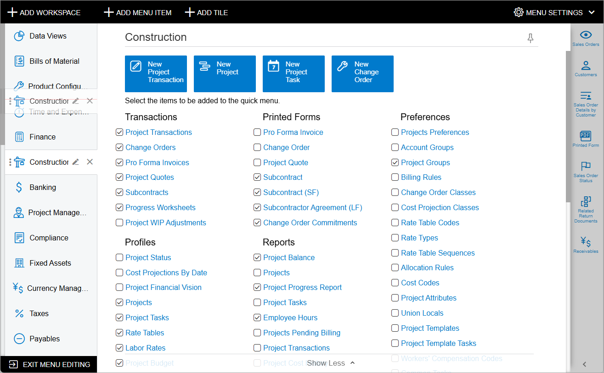
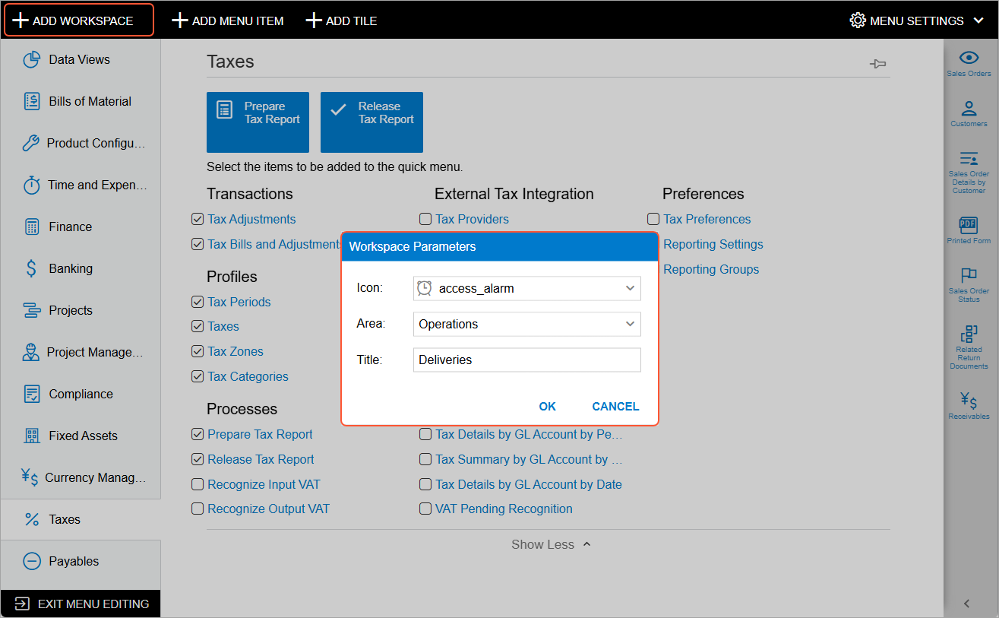

# UI Navigation Options: Workspaces {#_712a19e5-e46c-4499-a5c9-2d0bfcc6cd21 .concept}

The main menu is the primary navigation tool for users as they use Acumatica ERP. The system provides a predefined list of workspaces whose menu items are displayed on the main menu. The list of workspaces that a user can see by default is determined by the features enabled \(which are based on the Acumatica ERP license\) and the access rights of the user roles assigned to the particular user account.

## Renaming a Workspace { .section}

If a title of any existing workspace is not optimal for your company's users, you can change the title to help users easily find the forms, reports, and dashboards they need. To do this, you switch to Menu Editing mode; you then point at the workspace and click **Edit Workspace Parameters** \(\) to open the **Workspace Parameters** dialog box. In the **Title** box of the dialog box, you type the new title of the workspace, as shown in the following screenshot, and click **OK**.

## Removing a Workspace from the Main Menu { .section}

If a predefined workspace does not fit the business processes of your organization and will never be needed by system users, you can remove it from the main menu, including from the **More Items** menu. When you remove a workspace, the system deletes the tiles that belonged to the workspace, but the forms, reports, and dashboards that belonged to the workspace remain in the system. You can add to other workspaces links to these forms, reports, and dashboards.

To remove a workspace, you switch to Menu Editing mode, point at the workspace, and click **Delete Workspace** \(\), as shown in the following screenshot.

**Tip:** You can restore a workspace that you have removed from the main menu by clicking **Reset to Default Menu Settings** while you are in Menu Editing mode. In this case, once confirmed, the system restores the workspace, including all the tiles that belonged to the workspace.

## Defining the Displayed Menu Items { .section}

The pinned workspaces have corresponding menu items in the main menu panel \(so that users can quickly access them\), and the unpinned workspaces do not have corresponding menu items but can be found on the **More Items** menu.

You define for all users whether a workspace is displayed as menu item in the main menu panel or can be found on the **More Items** menu by pinning and unpinning them as follows:

-   To pin a workspace and move it to the main menu, you switch to Menu Editing mode, open the workspace and click the **Pin to Main Menu Panel** \(\) button.
-   To unpin a workspace and move it to the **More Items** menu, you switch to Menu Editing mode, open the workspace, and click the **Unpin from Main Menu Panel** \(\) button.

The users of your system may personalize the list of the workspaces displayed for their user account by pinning and unpinning workspaces by themselves.

## Reordering the List of Pinned Menu Items { .section}

If the predefined order of the pinned menu items does not work for your company processes, you reorder the menu items.

You switch to Menu Editing mode and drag the menu items into the needed order, as the following screenshot shows.

## Adding a Custom Workspace { .section}

If your organization has a specific business process that requires forms, reports, and dashboards from different functional areas to be gathered on one workspace for employees' convenience, you can create a custom workspace and pin it to the main menu panel.

In Menu Editing mode, you click **Add Workspace** in the upper left corner of the screen \(see the screenshot below\). In the **Workspace Parameters** dialog box, which opens, you do the following:

-   From the set of predefined icons, you select the icon to be displayed next to the workspace.
-   From the set of predefined areas, you select the area under which the system will display the workspace on the **More Items** menu.
-   You type the title of the workspace.
-   You click **OK** to save the parameters and close the dialog box.

After you have added the workspace, you proceed with populating it with links to forms, reports, and dashboards.

Also, if you want to display a menu item for the workspace on the main menu, in the workspace title bar, click the **Pin to Main Menu Panel** button.

**Parent topic:**[Customizing the User Interface](../UserGuide/SA_Customizing_UI_Mapref.md)

