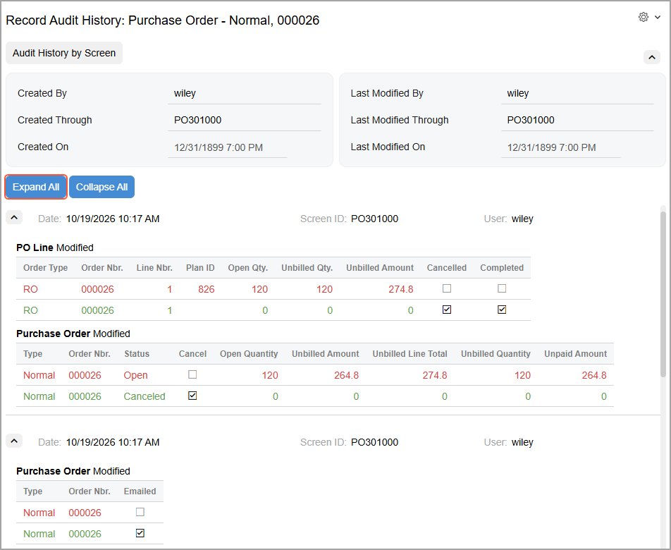
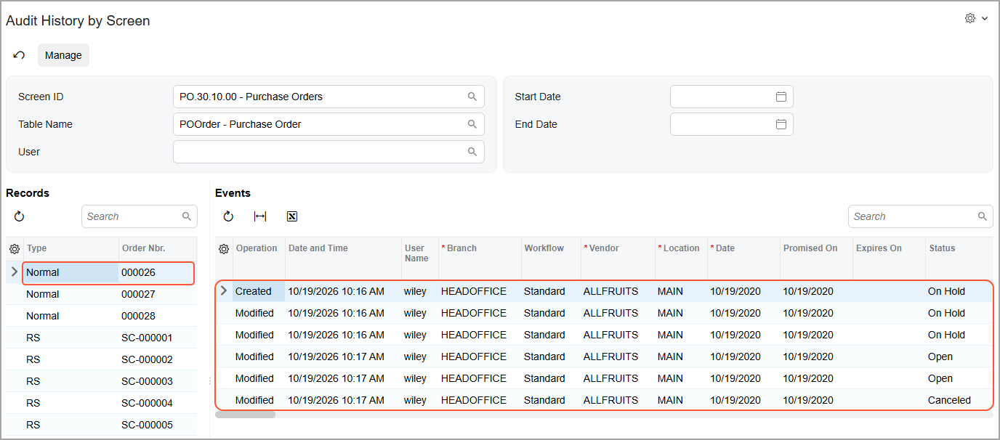
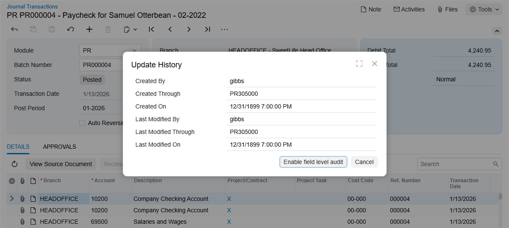

# Field-Level Auditing: Process Activity {#_91832d3f-4067-43b9-a8f3-cc78dbf34801 .task}

The following activity will walk you through the process of reviewing audit trails.

**Attention:** This activity is based on the *U100* dataset. If you are using another dataset or if any system settings have been changed in *U100*, these changes can affect the workflow of the activity and the results of the processing. To avoid issues, restore the *U100* dataset to its initial state.

## Story { .section}

Suppose that the corporate controller of the SweetLife Fruits &amp; Jams company, Jasmine Reece, has decided to review an audit trail for a recently canceled purchase order. The corporate controller would like to review the audit trail for the order directly from the [Purchase Orders](PO_30_10_00.md) \(PO301000\) form, as well as changes to the record on the [Audit History by Screen](SM_20_55_30.md) \(SM205530\) inquiry form.

## Configuration Overview {#section_tz4_djx_cnb .section}

In the *U100* dataset, for the purposes of this activity, the following tasks have been performed:

-   On the [Enable/Disable Features](CS_10_00_00.md) \(CS100000\) form, the *Field-Level Audit* feature has been enabled.
-   On the [User Roles](SM_20_10_05.md) \(SM201005\) form, the *Audit History Access* role has been configured. The role provides complete access to the [Audit History by Screen](SM_20_55_30.md) \(SM205530\) inquiry form. For details on similar configuration of a role, see [User Roles: To Configure a Role with Granular Access](User_Roles_To_Configure_Granular_Role.md).
-   On the [Users](SM_20_10_10.md) \(SM201010\) form, the *Field-Level Audit* and *Audit History Access* roles have been assigned to Jasmine Reece \(with the username *reece*\), who is the company's corporate controller.
-   Field-level auditing has been configured for the [Purchase Orders](PO_30_10_00.md) \(PO301000\) form.

## Process Overview { .section}

You will use the [Purchase Orders](PO_30_10_00.md) \(PO301000\) form to view the *000026* purchase order. With this record selected on the form, you will click **Settings** &gt; **Audit History** to open the [Record Audit History](SM_20_55_40.md) \(SM205540\) form in a new tab, where you can see the list of changes made to the selected record.

Then you will open the [Audit History by Screen](SM_20_55_30.md) \(SM205530\) inquiry form and view the audit trails recorded for the changes made to the records on the [Purchase Orders](PO_30_10_00.md) \(PO301000\) form.

Also, you will view general information about a journal transaction by using the **Audit History** command on the [Journal Transactions](GL_30_10_00.md) \(GL301000\) form, for which auditing has not been configured.

## System Preparation { .section}

Before you start performing the steps of this activity, sign in to a company with the *U100* dataset preloaded. You should sign in as a corporate controller with the *reece* username and *123* password.

## Step 1: Reviewing the Audit History for a Particular Record { .section}

To review the audit history for the *000026* purchase order, do the following:

1.  Open the [Purchase Orders](PO_30_10_00.md) \(PO301000\) form.
2.  In the **Order Nbr.** box, select the *000026* order.
3.  On the form title bar, click **Settings** &gt; **Audit History**.

    The [Record Audit History](SM_20_55_40.md) \(SM205540\) form for *Purchase Order - Normal, 000026* opens.

4.  Review the audit history for the order \(shown below\). Click **Expand All** to review the details of the changes.

    

You have reviewed the audit history for the particular purchase order.

## Step 2: Reviewing the Audit History for Multiple Records { .section}

To review the audit history for changes made to multiple purchase orders, do the following:

1.  While you’re still on the [Record Audit History](SM_20_55_40.md) \(SM205540\) form, click **Audit History for Screen** on the form toolbar.
2.  On the [Audit History by Screen](SM_20_55_30.md) \(SM205530\) inquiry form, which opens, notice that *PO.30.10.00* is selected in the **Screen ID** box.
3.  In the **Start Date** and **End Date** boxes, clear the selected dates to view all historical records.
4.  In the **Records** table, select a record and review its changes in the **Events** table, as shown below.

    

You have reviewed the audit history for multiple purchase orders.

## Step 3: Reviewing General Information About a Record { .section}

To review general information for a record on a form for which auditing has not been configured, do the following:

1.  Open the [Journal Transactions](GL_30_10_00.md) \(GL301000\) form. Auditing has not been configured for this form in the *U100* dataset.
2.  In the **Batch Number** box, select any available batch.
3.  On the form title bar, click **Settings** &gt; **Audit History**.
4.  Review general information about the selected batch in the **Update History** dialog box, which opens, as shown below.

    

You have reviewed general information about a record.

**Parent topic:**[Managing Field-Level Auditing](../UserGuide/SA_Managing_Field_Level_Auditing_Mapref.md)

