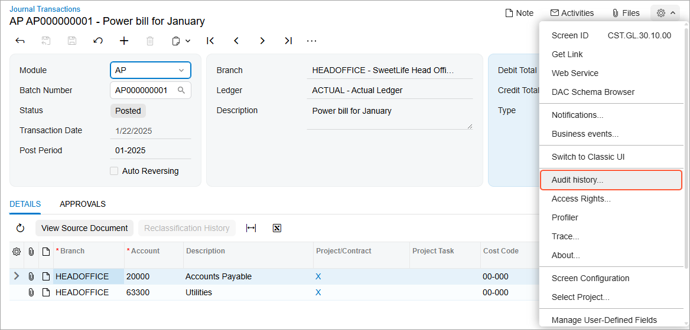

# Field-Level Auditing: General Information {#_3963c624-94ce-4f5b-b849-caa28e75260b .concept}

The development of automatic data processing has made it necessary for companies to consider protecting sensitive information. In certain highly regulated industries, these companies must implement auditing to address identity-management concerns related to compliance issues. Regulations such as Sarbanes-Oxley \(SOX\) Act, the Health Insurance Portability and Accountability Act \(HIPAA\), and the Payment Card Industry Data Security Standard \(PCI DSS\) all have extensive requirements on the auditing of user identity and access to system resources.

By using the field-level auditing functionality, which provides auditing at the level of actual fields \(that is, UI elements\) on particular forms for particular records, you can monitor and record user actions on Acumatica ERP forms as they are recorded in the system. The audit trail holds records of every change users have made on the monitored forms, such as changes to documents or transactions and their properties, modifications to customer accounts or employee records, and changes in security policies. You can also see who made the changes and when they took place.

**Attention:** The functionality is available if the *Field-Level Audit* feature is enabled on the [Enable/Disable Features](CS_10_00_00.md) \(CS100000\) form.

## Learning Objectives { .section}

In this chapter, you will learn how to do the following:

-   Configure users’ access to the field-level auditing capabilities according to their job descriptions
-   Configure the level of detail to be audited for a specific form
-   Turn on and off auditing for a specific form
-   Review the audit trail for a specific record

## Applicable Scenarios { .section}

You use field-level auditing in the following cases:

-   Your company must comply with auditing regulations and needs to implement corresponding auditing procedures.
-   Your company wants to ensure accountability and the ability to track user actions in the system.

## Configuration of Access to Field-Level Auditing Functionality { .section}

User access to field-level auditing should be configured to support business processes without exposing the company to undue risks. The audit trails may contain sensitive information, so only authorized users should have access to this functionality. As you plan the configuration of this access, we recommend that you consider the following user scenarios:

-   A user configures, turns on, and turns off auditing of the needed forms. Also, the user periodically views the list of forms for which auditing is configured and checks whether auditing is turned on for each form. To be able to perform these operations, the user should have access to the [Audit](SM_20_55_10.md) \(SM205510\) form.
-   A user views the complete audit trail for all audited forms. To view this audit trail, the user should have access to the [Audit History by Screen](SM_20_55_30.md) \(SM205530\) inquiry form.
-   A user views the audit trail for a particular record directly from the audited form, to which the user needs to have access. The predefined *Field-Level Audit* role should be assigned to this user, which causes the **Audit History** command on the **Settings** menu to become available to the user. The user can open any audited form, select a record created by using the form, and click **Settings** &gt; **Audit History** to open the [Record Audit History](SM_20_55_40.md) \(SM205540\) form and view the audit trail for the selected record.

**Tip:** The predefined *Administrator* role has complete access to all of the forms mentioned in these user scenarios.

You can take different approaches in configuring user access to the functionality. For example, you can cover all three scenarios by copying the predefined *Field-Level Audit* role and adding access to the mentioned above forms to the copied role.

Alternatively, you can create a role that will cover only viewing the complete audit trail. You can then use this role in combination with the *Field-Level Audit* role to give a user the ability to view the audit trail from an audited form and the complete audit trail on the [Audit History by Screen](SM_20_55_30.md) inquiry form. The configuring and enabling of auditing functionality, with this approach, will be done by a user with the predefined *Administrator* role.

For details on the planning of access configuration, see [User Roles: Planning of Access Configuration](User_Roles_Planning_Concept.md).

## Forms That Support Auditing { .section}

Field-level auditing is configured on a per-form basis. A form supports this auditing if the **Audit History** menu command is available on the **Settings** menu, as demonstrated in the following screenshot. If the **Audit History** command is not shown, the selected form does not support field-level auditing.

## Setup of Auditing of a Form { .section}

You use the [Audit](SM_20_55_10.md) \(SM205510\) form to configure auditing for a particular form. On this form, you can configure the following levels of auditing granularity:

-   Auditing of all fields from all database tables associated with the form: You select the *All Fields* option in the **Show Fields** box on the form and then select all the tables listed in the **Tables** pane.
-   Auditing of only the database fields that are available on the user interface from all database tables associated with the form: You select the *UI Fields* option in the **Show Fields** box on the form and then select all the tables listed in the **Tables** pane.
-   Auditing of specific database fields from particular tables associated with the form: You select the needed tables from the list on the **Tables** pane, and then for each table, you select the needed fields from the list on the **Fields** pane. You can narrow the list of fields to those that are available on user interface by selecting the *UI Fields* option in the **Show Fields** box.

**Tip:** To view the list of fields for a particular table, you set focus to the line with the table name on the **Tables** pane, and then the system displays the list of table fields in the **Fields** pane. By default, if a table is selected, then all its fields are selected for auditing.

You can view the list of forms for which auditing is configured on the Audit \(SM2055PL\) form. For any audited form, you can quickly navigate to the [Audit](SM_20_55_10.md) \(SM205510\) form, where you can turn on or off the auditing of particular database tables and fields associated with the form.

## Turning On and Off of Auditing of a Form { .section}

After the form auditing is configured, you can turn on and off auditing of the form by selecting or clearing the **Active** check box on the [Audit](SM_20_55_10.md) \(SM205510\) form.

When you turn on the auditing, every time a user makes changes to a record associated with the form and clicks **Save**, a record is added to the audit trail the system maintains for the form. This record contains the details of the modification, including who modified the document, what changes were made, and when the changes occurred.

When you turn off the auditing of the form, the monitoring of the changes is turned off, but the configuration of the auditing remains without changes.

## Viewing of an Audit Trail { .section}

When auditing is turned on for a form, you can select a record and view its audit trail—that is, the changes made to the record—directly from the form by clicking **Tools** &gt; **Audit History** on the form title bar. This opens the [Audit History by Screen](SM_20_55_30.md) \(SM205530\) form on a new tab, where you can see the audit trail for the selected record. You can click the arrow icon to view the detailed data of the modification. For each change, you can see who modified the record and when, what form was used, when the modification took place, and what changes were made.

**Tip:** You can click **Expand All** to view the details of all modifications or click **Collapse All** to hide these details. Also, you can use the browser functionality to search for a specific word or phrase on the screen or to print the screen.

On the [Audit History by Screen](SM_20_55_30.md) inquiry form, you can view a full audit trail for the records of the form. That is, you can view all the changes made to the records of the audited form since auditing was turned on for the form. You can filter the modifications that you are viewing by user, by database table associated with the form, and by date range.

## Viewing of General Information About a Record { .section}

If the currently opened form supports field-level auditing but auditing was not configured or is turned off for the form, you can still view some information in the **Update History** dialog box, which opens when the user clicks **Tools** &gt; **Audit History** on the form title bar. This dialog box does not show an audit trail; it provides only general information about the creation and the last modification of the selected record.

If you have access to the [Audit](SM_20_55_10.md) \(SM205510\) form, you will see the **Enable Field Level Audit** button in the **Update History** dialog box. You can click this button to navigate to the [Audit](SM_20_55_10.md) form, where you can configure and turn on auditing for the currently opened form.

**Parent topic:**[Managing Field-Level Auditing](../UserGuide/SA_Managing_Field_Level_Auditing_Mapref.md)

