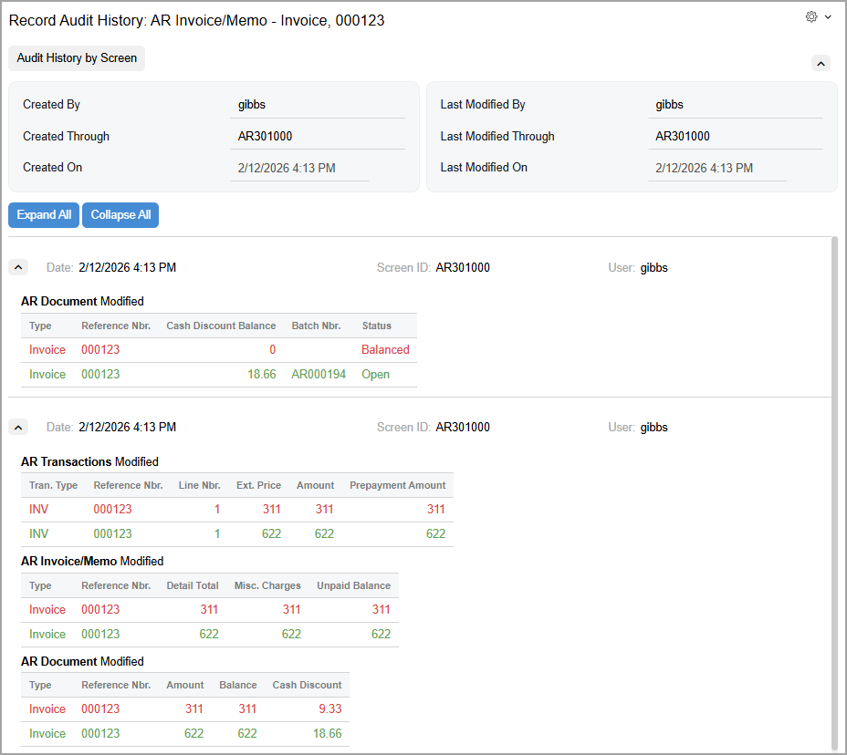

# Field-Level Auditing: Implementation Activity {#_d9cf9476-a4c1-4b3b-9745-72540ac8e869 .task}

In the following implementation activity, you will learn how to configure and enable auditing for a form.

**Attention:** This activity is based on the *U100* dataset. If you are using another dataset or if any system settings have been changed in *U100*, these changes can affect the workflow of the activity and the results of the processing. To avoid issues, restore the *U100* dataset to its initial state.

## Story { .section}

Suppose that the corporate controller of the SweetLife Fruits &amp; Jams company has requested that you, a system administrator, set up the auditing of changes made by users to the fields displayed on the [Invoices and Memos](AR_30_10_00.md) \(AR301000\) form.

## Configuration Overview { .section}

In the *U100* dataset, for the purposes of this activity, the following tasks have been performed:

-   On the [Enable/Disable Features](CS_10_00_00.md) \(CS100000\) form, the *Field-Level Audit* feature has been enabled.
-   On the [User Roles](SM_20_10_05.md) \(SM201005\) form, the *Audit History Access* role has been configured. The role provides complete access to the [Audit History by Screen](SM_20_55_30.md) \(SM205530\) inquiry form. For details on similar configuration of a role, see [User Roles: To Configure a Role with Granular Access](User_Roles_To_Configure_Granular_Role.md).

## Process Overview { .section}

You will use the [Audit](SM_20_55_10.md) \(SM205510\) form to configure and turn on the auditing of the fields visible on the interface of the [Invoices and Memos](AR_30_10_00.md) \(AR301000\) form.

Also, on the Audit \(SM2055PL\) inquiry form, you will review the list of forms with auditing configured; you will then turn off the auditing for the [Invoices and Memos](AR_30_10_00.md) form.

## System Preparation { .section}

Before you start configuring auditing of a form, sign in to a company with the *U100* dataset preloaded. You should sign in as a system administrator with the *gibbs* username and *123* password.

## Step 1: Configuring and Turning On Auditing for a Form { .section}

To configure and turn on audit for the [Invoices and Memos](AR_30_10_00.md) \(AR301000\) form, do the following:

1.  On the [Audit](SM_20_55_10.md) \(SM205510\) form, add a new record.
2.  In the **Screen Name** box in the Summary area, select *Invoices and Memos*.
3.  In the **Show Fields** box, select the *UI Fields* option.
4.  In the **Description** box, type `Auditing changes made to invoices and memos`.
5.  In the **Tables** pane, select the check box in the **Active** column for each table in the list.

    **Tip:** The number of tables associated with the form may exceed the capacity of the screen. The actual list of forms may take multiple pages. To navigate between pages, you use the navigation buttons located in the right corner of the table footer.

6.  In the Summary area of the form, select the **Active** check box to turn on the auditing of the form.
7.  On the form toolbar, click **Save**.

**Tip:** To make sure that the audit configuration has been implemented, sign out of the system and sign in again.

You have configured and activated the auditing for the [Invoices and Memos](AR_30_10_00.md) form.

## Step 2: Providing the User with Access to Audit History { .section}

To provide access to audit history for the *gibbs* user account, do the following:

1.  Open the [User Roles](SM_20_10_05.md) \(SM201005\) form.
2.  In the **Role Name** box, select *Audit History Access*.
3.  On the **Membership** tab, click **Add Row** and select *gibbs* in the added row.
4.  On the form toolbar, click **Save**.

## Step 3: Making Changes to Be Audited { .section}

To make changes to be audited on the [Invoices and Memos](AR_30_10_00.md) \(AR301000\) form, do the following:

1.  On the [Invoices and Memos](AR_30_10_00.md) form, add a new record.
2.  In the Summary area, specify the following settings:
    -   **Customer**: *HMBAKERY*
    -   **Terms**: *310N30*
3.  On the **Details** tab, click **Add Row**, and in the added row, specify `311` in the **Ext. Price** column.
4.  On the form toolbar, click **Remove Hold**.
5.  On the form toolbar, click **Save**.
6.  Modify the invoice as follows:
    1.  On the More menu, click **Hold**.
    2.  In the **Ext. Price** column of the only row, type `622`.
    3.  On the form toolbar, click **Remove Hold**, and then click **Release** to release the invoice.

## Step 4: Reviewing User Actions on the Invoices and Memos Form {#section_hsv_ksr_4pb .section}

To review the auditing of changes for the invoice on the [Invoices and Memos](AR_30_10_00.md) \(AR301000\) form, do the following:

1.  While remaining on the [Invoices and Memos](AR_30_10_00.md) \(AR301000\) form, on the form title bar, click **Settings** &gt; **Audit History**.
2.  On the [Record Audit History](SM_20_55_40.md) \(SM205540\) form, which opens, review the audit history for the invoice \(as shown in the following screenshot\).

## Step 5: Turning Off Auditing for a Form { .section}

To turn off auditing for the [Invoices and Memos](AR_30_10_00.md) \(AR301000\) form, do the following:

1.  Open the Audit \(SM2055PL\) inquiry form.
2.  In the list of audited forms, double-click the record with *Invoices and Memos* in the **Screen Name** column.
3.  On the [Audit](SM_20_55_10.md) \(SM205510\) form, which opens, clear the **Active** check box in the Summary area.
4.  On the form toolbar, click **Save**.

You have turned off auditing for the [Invoices and Memos](AR_30_10_00.md) form.

**Parent topic:**[Managing Field-Level Auditing](../UserGuide/SA_Managing_Field_Level_Auditing_Mapref.md)

