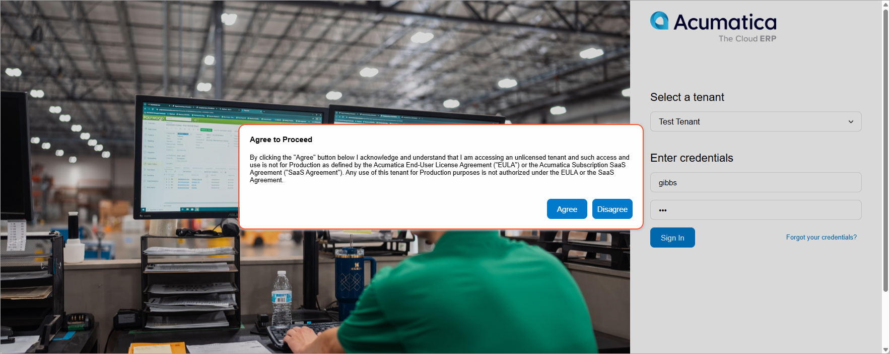

# Tenants: General Information {#_dd966afb-b1d1-4e7d-85d7-5d5fc61a44a3 .concept}

In Acumatica ERP, a single instance of the application can serve multiple tenants, which represent separate companies. When you create an application instance, you create at least one tenant. Multiple tenants can use the same application instance, with each having completely isolated data. The application looks identical to all tenants, but each tenant has exclusive access to only its data.

In this topic, you will learn how to work with the tenants by using the web interface of Acumatica ERP.

**Attention:** This topic provides information about managing tenants that have been created on a licensed instance. For details on trial and license modes, see [Preparing an Instance: Activation and Licensing](../ImplementationGuide/config_SA_Prep_Instance_for_Implem_Instance_Activation_and_Licensing.md).

## Learning Objectives { .section}

In this chapter, you will learn how to do the following:

-   Create a tenant for testing purposes
-   Copy an existing tenant for testing purposes
-   Convert a production tenant to a test tenant
-   Delete a tenant

## Applicable Scenarios { .section}

You create a new tenant or multiple tenants in the following cases:

-   When you are an implementation consultant and your client has businesses in different countries and thus needs companies with different base currencies. In this case, you create multiple production tenants: one for each company that uses a particular base currency.
-   When you are an implementation consultant and your client runs separate lines of business that have different structures of their charts of accounts and preferences that cannot be shared, but also needs consolidated financial information. In this case, you create multiple production tenants for each business line and a tenant to be used for the consolidation.
-   When you are an implementation consultant who has been tasked by your client with making some significant configuration changes or performing an irreversible operation. In this scenario, you should perform the required changes in a test environment—that is, a sandbox \(an instance of Acumatica ERP that has no production tenants\) with a test tenant that contains the full or partial data of the tenant in which the changes will occur. If you have applied the changes to the test tenant successfully, only then you should apply them to your live tenant.
-   When you are a system administrator, and you have been asked to provide a learning environment for a new employee. The new hire needs to be trained to perform all operations on the test tenant without affecting the live tenant.

## The System Tenant { .section}

When you install Acumatica ERP, it creates the System tenant \(which has a **Tenant ID** of *1*\) automatically on the [Tenants](SM_20_35_20.md) \(SM203520\) form.

The System tenant contains the predefined system data, such as roles, numbering sequences, and the wiki-based documentation. The system data is used by all tenants of the same application instance.

By default, the System tenant is hidden on all end-user forms. All other user-created tenants inherit the initial configuration and system data from the System tenant. That is, all the data available in the System tenant is visible to other tenants in the same database. During an application update or upgrade, all the data available in the System tenant is replaced, while the data created by users in user-created tenants remains unchanged.

A snapshot created for a user-defined tenant includes all custom data available in the database for the tenant account, but does not include any data contained in the System tenant. When a snapshot is being restored in the same database or another database, it uses the system data from the System tenant available in that database.

## Active and Test Tenants { .section}

You can use the [Tenant List](SM_20_35_30.md) \(SM203530\) form to view the list of tenants and their statuses \(which can be *Active*, *Test Tenant*, or *Unlicensed*\). Also, you can use the [Tenants](SM_20_35_20.md) \(SM203520\) form to add and manage a particular tenant and the [Delete Snapshots and Tenants](SM_50_30_00.md) \(SM503000\) form to delete tenants.

Active tenants are tenants that have the *Active* status and are used in the production environment. Your license determines the number of active tenants you can add to the instance, the number of concurrent users allowed, and the set of features you can activate for the instance.

Test tenants are tenants that have the *Test Tenant* status. Test tenants are used to set up test environments that can be used for training purposes or for testing the system before performing potentially hazardous operations.

**Attention:** Due to technical limitations, you can have a maximum of 127 tenants on an Acumatica ERP instance. This includes all types of tenants, irrespective of their statuses.

By default, a newly created tenant is assigned the *Active* status if the creation of this tenant is allowed according to the applied license. When you exceed the limit of tenants for your license, the system starts creating tenants with the *Unlicensed* status. In this case, if you need an instance for testing purposes, you need to convert an active or unlicensed tenant to a test one by using the **Change to Test Tenant** command on the More menu of the [Tenants](SM_20_35_20.md) form.

**Tip:** If you are working with an unlicensed instance of Acumatica ERP, you can create only tenants with the *Test Tenant* status. The system applies the limitations of trial mode to these tenants. For details, see [Preparing an Instance: Activation and Licensing](../ImplementationGuide/config_SA_Prep_Instance_for_Implem_Instance_Activation_and_Licensing.md).

## Limitations to a Test Tenant on a Licensed Instance {#section_pmf_4sz_4sb .section}

Regardless of the type of license you have, test tenants do not count toward the maximum number of tenants that your license allows. However, the technical limitation regarding the maximum number of tenants \(described in the previous section\) still applies.

Test tenants have the following limitations:

-   The available features are limited by the license applied to the instance.
-   A test tenant cannot be converted back to an active tenant.
-   The watermark is added to all printed forms and reports.
-   An informational message: *You are currently using a test tenant that is not intended for production use.* is displayed at the bottom of the Acumatica ERP screen for entire time you are signed in to Acumatica ERP.

Also, a user will need to confirm their understanding of the limitations of a test tenant each time the user signs in to the tenant, as demonstrated in the following screenshot.

## Tenant Creation { .section}

When you install the Acumatica ERP application, you create at least one tenant. You can create more tenants by using the Acumatica ERP Configuration wizard, or directly from the Acumatica ERP application by using the [Tenants](SM_20_35_20.md) \(SM203520\) form.

**Tip:** We recommend that before you create the second tenant \(excluding the System tenant\) and all subsequent tenants, you make sure that you have enough free space in the Acumatica ERP database. You can use the **View Space Usage** command on the More menu of the [Tenants](../Shared/../UserGuide/SM_20_35_20.md) \(SM203520\) form to open the [Space Usage](../Shared/../UserGuide/SM_20_35_25.md) \(SM203525\) form and review the available space.

On the [Tenants](SM_20_35_20.md) form, you can create an empty tenant or copy another already-configured tenant \(for example, a production tenant\). To create a new empty tenant, you click **Add New Record** on the form toolbar. To copy a tenant, click **Copy Tenant** on the More menu.

**Attention:** To avoid data corruption while copying a tenant, you should activate maintenance mode on the [Apply Updates](SM_20_35_10.md)\(SM203510\) form and deactivate it after you copy the tenant.

Alternatively, you can initiate the creation of a tenant by clicking the **Insert Tenant** button on the form toolbar of the [Tenant List](SM_20_35_30.md) \(SM203530\) form.

After the system adds the second non-System tenant, it signs you out automatically and switches to multitenant mode. It opens the Sign-In page with the updated list of tenants available. You can sign in to an already-configured tenant and copy the tenant data to the new one or restore a snapshot for the new tenant. Alternatively, you can sign in to the new tenant and configure it from scratch.

With the system in multitenant mode, it will not sign you out every time you add a new tenant. You will remain on the [Tenants](SM_20_35_20.md) form with the new tenant selected in the **Tenant ID** box. You can copy the data from other tenants or restore a snapshot for the new tenant right away.

## Tenant Deletion { .section}

Sometimes, copying data from other tenants or restoring a snapshot may fail due to different reasons. The failure may result into corruption of the tenant. The system will display a corresponding warning for such tenants next to the **Tenant ID** box on the [Tenants](SM_20_35_20.md) form.

You can delete corrupted or unnecessary tenants on the [Delete Snapshots and Tenants](SM_50_30_00.md) \(SM503000\) form. If you have two available non-System tenants and delete one of them, the system signs you out automatically after the deletion and switches to single-tenant mode.

## Tenant Users and the First Sign-In { .section}

When you create a tenant by using the web interface, you cannot specify a dataset to be inserted for the tenant as you can do when using the Acumatica ERP Configuration wizard. The creates a tenant with the data from the System tenant and adds a user with the same credentials as the user you used to create the tenant. You can sign in to the new tenant with the *admin* user account, which comes from the System tenant, or with the user that you used to create the tenant.

To quickly add data to the new tenant, you can restore a snapshot with the needed data without signing in the new tenant. After the snapshot is restored, you can sign in by using the credentials of any user added by the snapshot.

If you create a tenant by copying a configured tenant \(for example, a production tenant\)—that is, if you click **Copy Tenant** on the More menu of the [Tenants](SM_20_35_20.md) \(SM203520\) form—the system inserts its configuration settings and entered data into the destination tenant that you select. In this case, all users of the source tenant will have access to the destination tenant until you delete these users or change their passwords in the destination tenant.

You can review the list of the users who have access to a tenant on the **Users** tab of the [Tenants](SM_20_35_20.md) form.

## Order of Tenants on the Sign-In Page { .section}

The system displays the list of available tenants on the Sign-In page in the same order as in the list displayed on the [Tenant List](SM_20_35_30.md) \(SM203530\) form. To change the order of the tenants on this form, you click the tenant you want to move and use the **Move Up** and **Move Down** buttons on the form toolbar.

## Creation of a Test Environment { .section}

To create an environment to be used for testing or learning purposes, you create a tenant either by copying your production tenant or creating a new empty tenant. We strongly recommend that you explicitly state the purpose of the test tenant in the **Login Name** box of the [Tenants](SM_20_35_20.md) \(SM203520\) form, so that your users will not confuse it with the production tenants. The name specified in this box is displayed in the list of tenants on the Sign-In page.

**Tip:** If you restore a snapshot created from a tenant with the *Active* status, or if you copy such a tenant to another tenant with the *Test Tenant* status, the system will not change the status of the destination tenant.

Then you convert the newly created tenant to the test one. If the tenant has no data, you can configure it from scratch or restore a snapshot of an existing tenant to the new tenant.

## Recommendations for the Creation of Tenants with Similar Configuration { .section}

If you need to create multiple related tenants with similar configurations, first configure the most typical one \(which you will use as a prototype\). At each stage of implementation, create a snapshot that includes the full data of the prototype tenant. If the tenants represent related businesses, you can enter the business accounts that are used by more than one tenant and add them to another snapshot, which can be used for each tenant.

When you create a snapshot, it appears on the list of available snapshots for the tenant on the **Snapshots** tab of the [Tenants](SM_20_35_20.md) \(SM203520\) form. Snapshots of a specific tenant, by default, are visible to \(and can be restored in\) only this tenant. However, if needed, you can change the visibility of the snapshots to allow these snapshots to be visible to \(and restored in\) other tenants in the same database.

When you create another related tenant, select the snapshot to be used as a template for the new tenant by following these guidelines:

-   Select a snapshot of a later stage of implementation if the new tenant is very similar to the prototype.
-   Select a snapshot that features an earlier implementation stage if the new tenant is similar to the prototype only to some extent \(to include only the configuration settings that are present in the new tenant\).

**Parent topic:**[Managing Tenants by Using the Web Interface](../UserGuide/SA_Managing_Tenants_Using_Web_Mapref.md)

