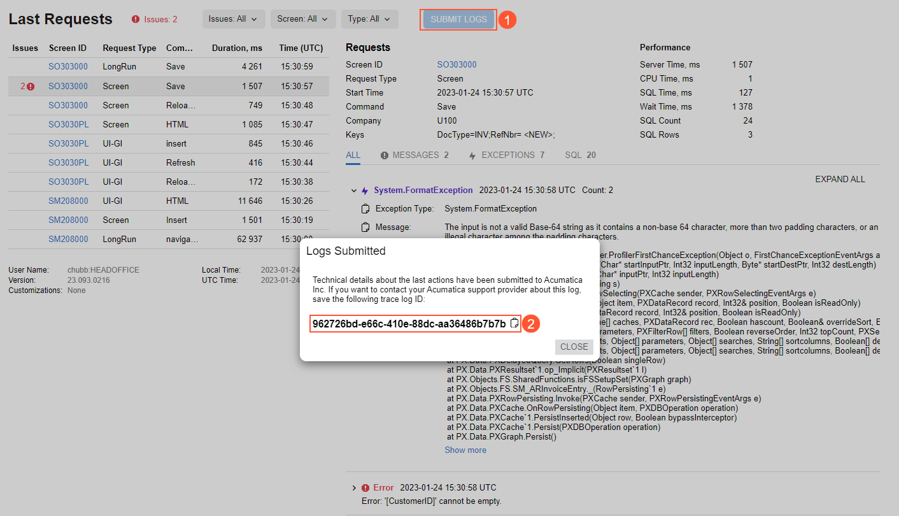

# System Health: General Information {#_aaac1b6a-6d0d-4da9-a512-c056c2a7e3ec .concept}

You use the [System Monitor](SM_20_15_30.md) \(SM201530\) form for monitoring the current operational data and statistics of Acumatica ERP, as well as for investigating any potential or existing performance issues.

If Acumatica ERP is used on the premises of your company or in your own data center, you can evaluate the limitations of the environment in which the system is operating with the data that is shown on this form.

## Learning Objectives { .section}

In this chapter, you will learn how to do the following:

-   Monitor processes that are currently running, and discover and analyze any threads that are currently frozen or no longer responding
-   Review the list of active users
-   Track memory and CPU utilization
-   Analyze a log of system events
-   Create a memory dump
-   Monitor the statuses of push notifications and business event queues
-   Use the [Request Profiler](SM_20_50_70.md) \(SM205070\) form
-   Use the Developer Tools of the browser

## Applicable Scenarios { .section}

You monitor system health in the following cases:

-   Monitoring system health is a part of your regular duties.
-   Users of the system have reported that Acumatica ERP performance has been slow.
-   Users of the system have reported that some tasks in Acumatica ERP have failed to complete. For example, scheduled operations have failed, or at least one record has not been processed successfully.
-   Choose the proper license tier. You can review historical resource consumption data to determine whether you need to upgrade to a higher tier that allows greater resource usage.

## Monitoring of Running Processes { .section}

On the **Running Processes** tab of the [System Monitor](../Shared/../UserGuide/SM_20_15_30.md) \(SM201530\) form, you can monitor all batch processing operations that are currently being performed in the system, such as the release of multiple transactions at once, the preparation of dunning letters, the generation of a report, the creation of a tenant snapshot, or the use of an import or export scenario. Your server may be slow because of a large number of these operations running simultaneously.

By default, the table displays only the processes of the current user. To view the processes run by all users, you select the **Show All Users** check box above the table.

You can navigate to the form where a user has launched a process by selecting the process in the table and clicking **View Screen** on the table toolbar. The system navigates to the form, where you can stop the operation or review any errors that have occurred.

On the **Running Processes** tab, you can abort any process that is running by clicking the row with the process and clicking **Abort** on the table toolbar.

For long operations, Acumatica ERP runs threads. You can discover and analyze the threads that are currently frozen or no longer responding by clicking **Active Threads** on the table toolbar and viewing details in the pop-up panel. If there is at least one active thread, the panel contains information about the currently running threads.

## Review of the List of Active Users { .section}

You use the **Active Users** tab of the [System Monitor](SM_20_15_30.md) \(SM201530\) form to review the list of currently active users. In the **Login Type** box, you can filter users by the way they have accessed the system. By default, *All* is selected, so the system lists users who have signed in by using either of the available methods. You can instead select one of the following:

-   *User Interface*: The table lists only users that have signed in by using their username and password on the Acumatica ERP Sign-In page, through the mobile application, or through the single sign-on page if SSO with Google or Microsoft Account has been set up.
-   *API*: The table lists only users that are client applications that have signed in by using the OAuth 2.0 mechanism of authorization for applications, or by using the sign-in method of the contract-based SOAP API, contract-based REST API, or screen-based SOAP API.

If you click a row with a user in the list and click **View User** on the table toolbar, the system navigates to the [Users](SM_20_10_10.md) \(SM201010\) form so that you can view information about the selected user.

## Tracking of Resource Usage {#section_nq4_fc1_23c .section}

On the **Resource Monitoring** tab of the [System Monitor](SM_20_15_30.md) \(SM201530\) form, you can see current system resource usage and usage from previous days. Use this tab to check the system status and find out what’s causing high resource use. You can also see when the system reaches license limits and decide if you need to upgrade your license. For more information, see [System Health: Resource Monitoring](SA_Monitoring_System_Health_Resource_Monitoring_Concept.md).

## Analysis of the System Event Log { .section}

You use the **System Events** tab of the [System Monitor](SM_20_15_30.md) \(SM201530\) form to analyze the log of system events. The tab lists log records for multiple system events. You can explore the log for errors, warnings, or operations that consume excessive resources. For details, see [System Health: System Event Log](SA_Monitoring_System_Health_System_Events_Concept.md).

## Creation of a Memory Dump { .section}

You use the **Running Processes** tab of the [System Monitor](SM_20_15_30.md) \(SM201530\) form to start the process of creating a memory dump. Upon successful creation, the memory dump is saved on the server that runs your Acumatica ERP instance. For details, see [System Health: To Create a Memory Dump](SA_Monitoring_System_Health_To_Create_Memory_Dump.md).

In SaaS environments, the first memory dump can be any size, but subsequent dumps created on the same day should not exceed 12 GB.

**Important:** In an out-of-the-box system, system administrators \(that is, user accounts to which the *Administrator* role has been assigned\) have access to the [System Monitor](SM_20_15_30.md) \(SM201530\) form. If another user needs to create a memory dump, a system administrator must give the user the access rights to access this form first.

## Monitoring of System Queues { .section}

You use the [System Queue Monitor](SM_30_20_10.md) \(SM302010\) form to monitor the statuses of the push notification, business event, and commerce queues. By using this form, you can clear the queues and restart dispatchers for the selected type of queue. On this form, you can also turn on notifications about the growth of the system queue, which are sent when a threshold is reached. These notifications can be sent by email, via SMS messages, or through mobile push notifications.

## Use of the Request Profiler Form { .section}

The [Request Profiler](SM_20_50_70.md) \(SM205070\) form is an embedded tool that you can use to troubleshoot performance-related issues in Acumatica ERP or an Acumatica Framework-based application. For details, see [System Health: Request Profiler](SA_Monitoring_System_Health_Request_Profiler_Concept.md).

## Use of the Developer Tools { .section}

Each browser has a set of web development and debugging tools called Developer Tools. You can use these browser Developer Tools to see all performance metrics of a request-response cycle. For details, see [System Health: To Monitor Performance](SA_Monitoring_System_Health_To_Monitor_Performance.md).

## Submission of Performance Logs to Acumatica {#section_nxd_fcz_qsb .section}

In Acumatica ERP, you can enable the collection of the diagnostic information and the submission of it to Acumatica by selecting the **Send Diagnostics &amp; Usage Data to Acumatica** check box on the [Site Preferences](SM_20_05_05.md) \(SM200505\) form. With the check box selected, the diagnostic information is collected and sent to Acumatica. The collected data is used to improve the customer experience, as well as to enhance the products and services of Acumatica. This data transmission takes place in the background without affecting current tasks or the performance of Acumatica ERP instance.

Also, for licensed instances where the collection of diagnostic information is enabled, a user who is experiencing a performance issue can make the system collect more detailed information about the last ten actions.

This user opens the **Acumatica Trace** page by clicking **Settings** &gt; **Trace** on the title bar of the form on which the issue is occurring. On the toolbar of the page, the user clicks **Submit Logs** \(see Item 1 in the following screenshot\). The system collects messages, SQL requests, and exceptions for the user's last ten actions and marks this collection with a unique tag. The system sends the information to Acumatica and displays the tag to the user so that the user can save it \(Item 2\).

**Note:** Every time the user clicks **Submit Logs** \(as long as any user has not invoked the process in the past 30 minutes\), the system creates a mini-dump of running processes and adds it to the instance folder.

If you decide to report the issue to the Acumatica ERP support provider of your company, you can specify the tag in the support request. The tag will help the support team to identify the diagnostic information related to the case.

**Parent topic:**[Monitoring System Health](../UserGuide/SA_Monitoring_System_Health_Mapref.md)

