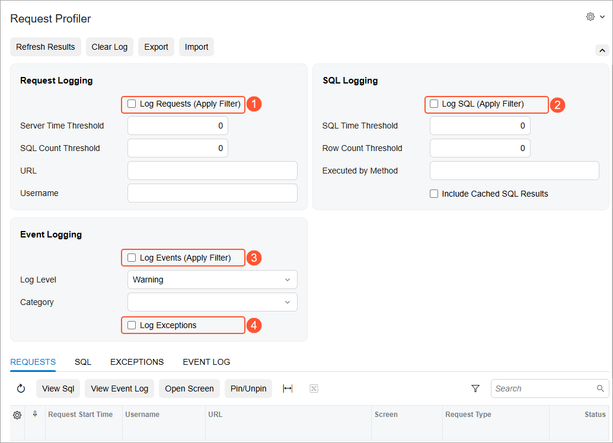
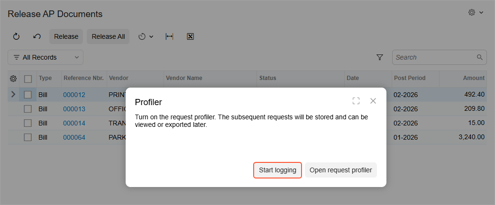
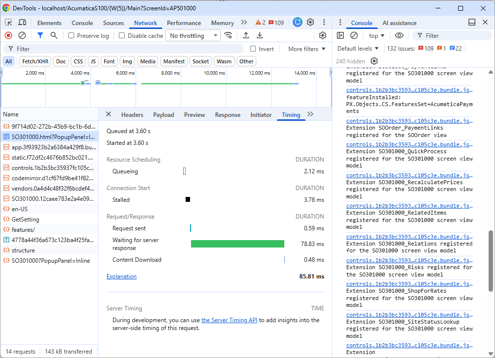

# System Health: Request Profiler {#_4b2b51fa-eae3-4102-b1f2-d7ee96145174 .concept}

The [Request Profiler](SM_20_50_70.md) \(SM205070\) form is an embedded tool that you can use to troubleshoot performance-related issues in Acumatica ERP or an Acumatica Framework-based application.

You use the [Request Profiler](SM_20_50_70.md) form to do the following:

-   Monitor the time and memory needed for any URL request performed in Acumatica ERP
-   Analyze the time needed for any SQL query of the selected URL request
-   Obtain information about the exceptions that have occurred in the Acumatica ERP instance, and view its traces

## Default Monitoring { .section}

You select the following check boxes on the [Request Profiler](SM_20_50_70.md) \(SM205070\) form, which is shown below, to start logging specific system events:

1.  **Log Requests \(Apply Filter\)**
2.  **Log SQL \(Apply Filter\)**
3.  **Log Events \(Apply Filter\)**
4.  **Log Exceptions**



You may choose not to perform manual tuning of requirements and to leave these default settings on the [Request Profiler](SM_20_50_70.md) form. If the default settings are selected, the system logs a request if it meets any of the following criteria:

-   The request has a server time of more than 20 seconds, and the request type \(which is shown in the **Request Type** column on the **Requests** tab\) is *Screen*, *UI*, *UI-GI*, or *UI-Reports*.
-   The request is of any type with a server time of more than 60 seconds.
-   The execution of the request has caused any of the following exceptions:
    -   `NullReferenceException`
    -   `ThreadAbortException`
    -   `ArgumentNullException`
    -   `ArgumentOutOfRangeException`
    -   `IndexOutOfRangeException`

If the default settings are specified, the logged information is displayed on the **Requests**, **SQL**, and **Exceptions** tabs; the **Event Log** tab remains empty.

You can instead change the settings in the Summary area of the [Request Profiler](SM_20_50_70.md) form to configure the logging requirements more precisely.

**Attention:** The `ProfilerDataSizeLimit` parameter of the `Web.config` file limits the size of data used to store the logs of the request profiler. If you do not specify a value for this parameter, the system applies the default limit of 200 MB. If the data limit is exceeded, the logging is disabled until you clear the logs. For example, the following configuration of this parameter limits the store capacity to 100 MB.

```
key= "ProfilerDataSizeLimit" value= "100MB"
```

## Troubleshooting of a Particular Process { .section}

If a particular process, such as the release or import of a document, takes more time than usual, you can troubleshoot the process by turning on the logging of URL requests, SQL queries, exceptions, and warnings and errors; this is done directly on the form where the process is initiated.

To turn on the logging, you click **Settings** &gt; **Profiler** on the form title bar and click **Start Logging** in the **Profiler** dialog box \(see the following screenshot\).



The [Request Profiler](SM_20_50_70.md) \(SM205070\) form starts logging URL requests, SQL queries, exceptions, and warnings and errors.

You then reproduce the issue and click **Stop and Export** in the **Profiler** dialog box. \(You can close the **Profiler** dialog box, reproduce the issue in the current tab of the browser, and then reopen the dialog box; alternatively, while leaving the **Profiler** dialog box open, you can reproduce the issue in another tab of the browser, and proceed in the tab where the **Profiler** dialog box is open.\) The [Request Profiler](SM_20_50_70.md) \(SM205070\) form returns to the default monitoring and exports a ZIP archive with the log files that contain information in JSON format about the URL requests, SQL queries, and stack trace.

**Tip:** If you have turned on the logging in the **Profiler** dialog box, the [Request Profiler](SM_20_50_70.md) \(SM205070\) form automatically returns to the default monitoring when the current user's session is closed or after 30 minutes of logging.

You can import the ZIP archive to another Acumatica ERP instance by clicking **Import** on the form toolbar of the [Request Profiler](SM_20_50_70.md) \(SM205070\) form and then reviewing the logged information.

## Analysis of URL Requests { .section}

In the **Request Logging** section of the [Request Profiler](SM_20_50_70.md) \(SM205070\) form, you can turn on the monitoring of URL requests by selecting the **Log Requests \(Apply Filter\)** check box. If only specific URL requests should be monitored, you can specify additional filtering criteria by using the other settings of this section in addition to selecting the check box. For example, to monitor only the long URL requests that need more than 1000 milliseconds to run, enter `1000` in the **Server Time Threshold** box of this section. To monitor URL requests with 500 or more SQL requests, enter `500` in the **SQL Count Threshold** box of this section.

The system displays the list of the logged requests on the **Requests** tab of the [Request Profiler](SM_20_50_70.md) form. You can work with logged requests on this tab as follows:

-   Review detailed information about the SQL queries within a particular URL request: To do this, you select the request in the table and then click **View SQL** on the table toolbar.
-   Review detailed information about the events that occurred within a particular URL request: You do this by selecting the request in the table and then clicking **View Event Log** on the table toolbar.
-   Open the Acumatica ERP form specified in the **URL** column of the selected request: You do this by selecting a particular request in the table and then clicking **Open Screen** on the table toolbar.
-   Pin a particular request to keep it for further review: To do this, you select the request to be pinned on this tab and then click **Pin/Unpin** on the table toolbar. If you clear the log by clicking **Clear Log** on the form toolbar, the pinned requests remain in the list, while the other requests are cleared.
-   Export all requests from the **Requests** tab to an Excel file: To do this, click **Export to Excel** on the table toolbar.

On the **Requests** tab, you can see only the completed requests. To view the requests that are currently executing, you can open the **Requests in Progress** tab of the [System Monitor](SM_20_15_30.md) \(SM201530\) form. For the requests in progress, the same information is available as the information for the completed request on the **Requests** tab of the [Request Profiler](SM_20_50_70.md) form.

Also, you can see all performance metrics related to a request-response cycle in a single and familiar place, such as the Developer Tools of the browser. For example, in Google Chrome, by using the Chrome Developer Tools, you can view the timing of Acumatica ERP processes. On the **Network** tab of Chrome Developer Tools, after you select an Acumatica ERP form, the **Timing** tab of the panel contains the time-related data of the server, as shown in the following screenshot.



## Analysis of SQL Queries { .section}

If in the Summary area of the [Request Profiler](SM_20_50_70.md) \(SM205070\) form, the **Log Requests \(Apply Filter\)** check box is selected in the **Request Logging** section, then you can also turn on the monitoring of SQL queries within the monitored URL requests. To do this, you select the **Log SQL \(Apply Filter\)** check box in the **SQL Logging** section.

If only specific SQL queries should be monitored, you can specify additional requirements by using the filtering settings of this section. For example, if the **Include Cached SQL Results** check box is selected, the system will include in the log SQL queries that obtain results from a query cache \(that is, not from the database\). If a keyword \(such as a method name\) is specified in the **Executed by Method** box, the system will include in the log only the SQL queries for which the stack trace includes this keyword.

CAUTION:

We recommend that you activate the logging of SQL queries by selecting the **Log SQL \(Apply Filter\)** check box for only a limited period, because leaving this check box selected can degrade system performance.

The system displays the list of the logged SQL queries on the **SQL** tab of the form. On this tab, you can review the logged SQL queries that comply with the specified filters. The same SQL query may be triggered by multiple URL requests with different parameters. The table displays aggregated information for each query.

When you click a link in the **Statement ID** column for an SQL query listed on this tab, the system opens the **SQL Details** dialog box with detailed information about each execution of the SQL query.

You can export all SQL queries from the **SQL** tab to an Excel file by clicking **Export to Excel** on the table toolbar.

You can also analyze SQL queries in depth on the SQL Analysis \(SM405000\) inquiry form. You can use this form to review all information about executed SQL queries, export data to an Excel file, and build pivot tables and diagrams based on this data. The **All Records** tab of the form displays all information about executed SQL queries. For each record in the table, you can view SQL details and stack traces on the side panels.

On the **Pivot** tab of the inquiry form, for each URL request, you can review detailed information about the execution of SQL requests, such as the following:

-   The total number of SQL requests
-   The text of SQL requests
-   The number of executions of each SQL request
-   The percentage of the URL request time that the execution of SQL request takes

## Analysis of Exceptions { .section}

By selecting the **Log Exceptions** check box in the **Event Logging** section of the [Request Profiler](SM_20_50_70.md) \(SM205070\) form, you turn on the logging of exceptions. The system displays the list of the logged exceptions on the **Exceptions** tab of the form. On this tab, you can review the list of exceptions that have occurred during the processing of requests.

When you click an exception on this tab and then click **View Exception Details** on the table toolbar, the system opens the **View Exception Details** dialog box with detailed information about the selected exception.

You can export all exceptions from the **Exceptions** tab to an Excel file by clicking **Export to Excel** on the table toolbar.

## Analysis of Events { .section}

By selecting the **Log Events \(Apply Filter\)** check box in the **Event Logging** section of the Summary area of the [Request Profiler](SM_20_50_70.md) \(SM205070\) form, you can turn on the logging of events. You can specify a specific severity level of events in the **Log Level** box. \(By default, *Warning* is selected, but this setting is not applied unless the **Log Events \(Apply Filter\)** check box is selected.\) You can filter the events that the system should log by category by selecting one option or multiple options in the **Category** box. The system displays the list of the logged events on the **Event Log** tab of the form. By using this tab, you can review the list of events that occurred during request processing.

**Attention:** We recommend that you activate the logging of events by selecting the **Log Events \(Apply Filter\)** check box for only a limited period, because leaving this check box selected can degrade system performance.

When you click an event on the tab and then click **View Event Details** on the table toolbar, the system opens the **View Event Details** dialog box with detailed information about the selected event. You can export all events from the **Event Log** tab to an Excel file by clicking **Export to Excel** on the table toolbar.

## Cluster Mode { .section}

The [Request Profiler](SM_20_50_70.md) \(SM205070\) form works in cluster mode. When you run the profiler on a cluster, it launches on all nodes of the cluster. The profiler settings apply to each cluster node.

To specify the identifier of the cluster node, you can use one of the following approaches:

-   In the appSettings tag of the `web.config` file of the node, specify a string value for the ClusterNodeId attribute, such as the following.

    ``` {#codeblock_gfc_3dd_4gc}
    <add key="ClusterNodeId" value="MyClusterNodeName" />
    ```

-   Create the `...\App_Data\WebsiteHeaders.txt` file, which contains the identifier in the application folder of the node.
-   Do not specify the identifier; the system will automatically create a GUID for the cluster node.

If you need to identify a cluster node for the URL request on the [Request Profiler](SM_20_50_70.md) \(SM205070\) form, use the **Headers** column \(which is hidden by default\) of the **Requests** tab. In cluster mode, the column contains the GUID or the identifier of the cluster node.

## Logging of Events for Ecommerce Connector {#_c5e02424-9cbe-4f76-87cd-86ad2d163041 .section}

To turn on the logging of events for ecommerce connector, you specify the following settings on the [Request Profiler](SM_20_50_70.md) \(SM205070\) form:

-   **Log Requests \(Apply Filter\)**: Selected
-   **Log Events \(Apply Filter\)**: Selected
-   **Log Level**: *Verbose*
-   **Category**: *Commerce*

**Attention:** We recommend that you activate the logging of events by selecting the **Log Events \(Apply Filter\)** check box for only a limited period, because leaving this check box selected can degrade system performance.

**Parent topic:**[Monitoring System Health](../UserGuide/SA_Monitoring_System_Health_Mapref.md)

