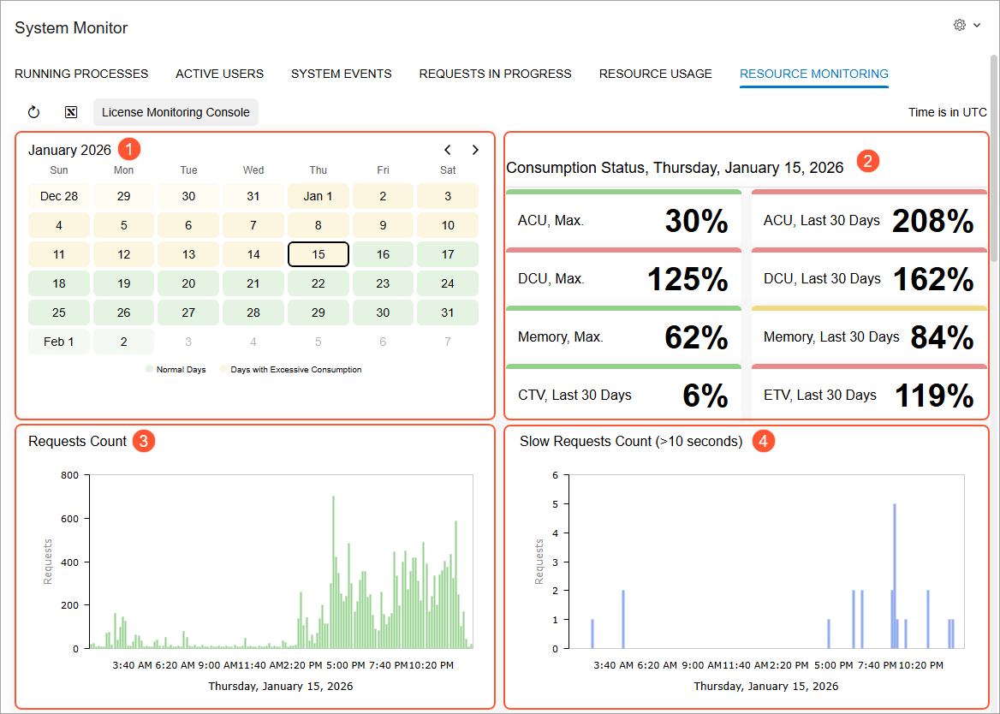
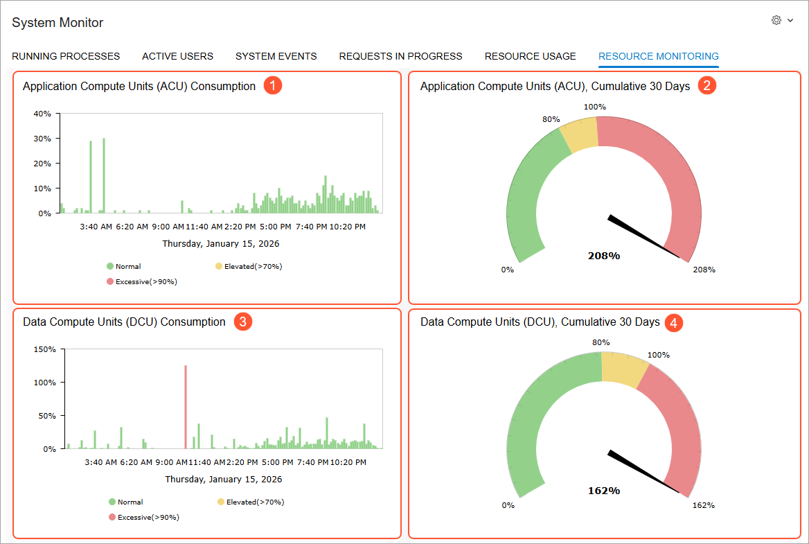
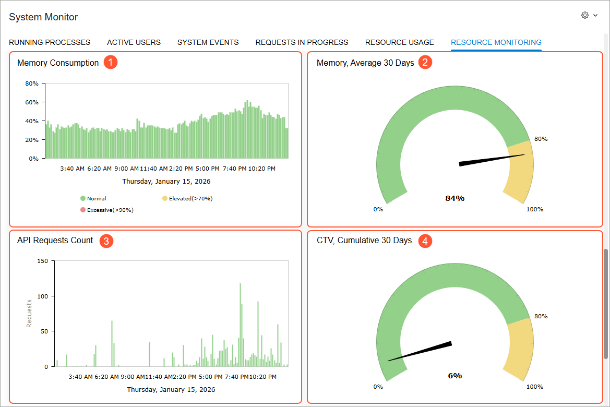

# System Health: Resource Monitoring {#_e7ad5206-8b6d-4b3b-ad18-a8a0ec4e6d20 .concept}

The **Resource Monitoring** tab of the [System Monitor](SM_20_15_30.md) \(SM201530\) form shows you how system resources are being used both currently and on previous days. You can use this tab to review the system’s status, identify potential causes of high resource consumption, and monitor how close you are to your license limits. This information can help you decide whether to upgrade your license.

## Metric Collection {#section_snx_y5b_c3c .section}

The system tracks performance metrics—such as CPU, SQL, memory, and request counts—for every HTTP request. It groups this data into 10-minute intervals, stores it temporarily, and then creates daily summaries. The system maintains data across three time horizons:

-   Real-time: The system records raw metrics as each HTTP request runs.
-   Within the day: Every 10 minutes, starting at 00:10 UTC, the system aggregates data for the past 24 hours into temporary tables.
-   Historical: The system compresses daily data and stores it for long-term analysis.

## Resource Usage Monitoring {#section_rmg_n31_23c .section}

On the **Resource Monitoring** tab of the [System Monitor](SM_20_15_30.md) \(SM201530\) form, you can view the current and recent system resource usage.

The percentages shown in the **Resource Monitoring** tab reflect how much of your recommended consumption you are using, based on your current license tier.

**Tip:** You can click **License and Constraints** on the tab toolbar to view your recommended consumption on the [License Monitoring Console](SM_60_40_00.md) \(SM604000\) form.

**The Calendar, Summary, and Request Widgets**

The calendar widget \(Item 1 below\) shows the overall resource consumption for the last 30 days—including days with normal consumption and days with excessive consumption. You can click a date to display its detailed resource consumption statistics in the other widgets.

The **Consumption Status, &lt;Selected\_Date&gt;** widget \(Item 2\) displays a summary of key resource metrics—each of which is a scorecard widget you can click to view a related chart or meter. You'll find the following scorecards:

-   Application compute units \(ACU\): The maximum cumulative consumption for the chosen date and the cumulative consumption for the last 30 days
-   Data compute units \(DCU\): The maximum cumulative consumption for the chosen date and the cumulative consumption for the last 30 days
-   Memory: The maximum average consumption for the chosen date and the average consumption for the last 30 days
-   Commercial transaction volume \(CTV\): The cumulative consumption for the last 30 days
-   ERP transaction volume \(ETV\): The cumulative consumption for the last 30 days

The **Requests Count** chart \(Item 3\) shows the number of requests during the selected date.

The **Slow Requests Count \(&gt;10 seconds\)** chart \(Item 4\) shows the number of requests that took longer than 10 seconds to complete.

**The ACU and DCU Widgets**

By using the next group of widgets, you can look more closely at ACU and DCU consumption. The **Application Compute Units \(ACU\) Consumption** chart \(Item 1 below\) displays the computing time used to process resource requests and tasks during the selected date. The **Application Compute Units \(ACU\), Cumulative 30 Days** meter \(Item 2\) indicates the cumulative CPU usage for the last 30 days.

The **Data Compute Units \(DCU\) Consumption** chart \(Item 3\) shows the amount of time required for SQL queries during the selected date, including both query processing time and query wait time. The **Data Compute Units \(DCU\), Cumulative 30 Days** meter \(Item 4\) indicates the cumulative SQL usage for the last 30 days.

You can click any of these widgets to open it in a new window. In that window, you can click option buttons to view the data overall \(the default setting\) or by tenant, screen \(form\), request type, or user.

**The Remaining Widgets**

In the **Memory Consumption** chart \(Item 1 below\), you can view the amount of memory consumed by the system during the selected date. The **Memory, Average 30 Days** meter \(Item 2\) indicates the system’s average memory consumption for the last 30 days.

The **API Requests Count** chart \(Item 3\) displays the number of API requests performed during the selected date. You can click this chart to open it in a new window, where you can click option buttons to view the data overall \(the default setting\) or by tenant, screen \(form\), or user.

The **CTV, Cumulative 30 Days** meter \(Item 4\) shows the cumulative volume of commercial transactions for the last 30 days.

Similarly, the **ETV, Cumulative 30 Days** meter indicates the cumulative number of times Acumatica ERP objects were created or modified during the last 30 days.

**Parent topic:**[Monitoring System Health](../UserGuide/SA_Monitoring_System_Health_Mapref.md)

